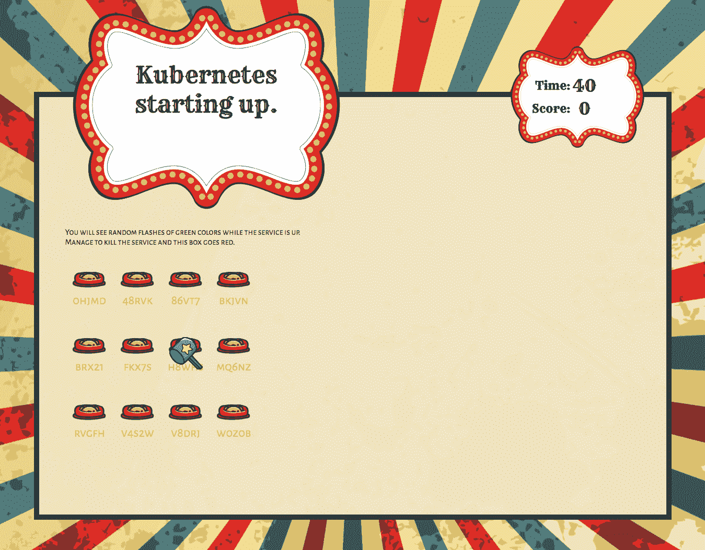

# 本周在谷歌云——“应用引擎 Java 8，更好的感知 API，Kubernetes 1.7，全民培训，而不是热狗”

> 原文：<https://medium.com/google-cloud/this-week-in-google-cloud-app-engine-java-8-better-perception-apis-kubernetes-1-7-79f99c311ce?source=collection_archive---------0----------------------->

本周没有新的数据中心发布，但我们有大量新的软件版本，而不是新的混凝土或新的硬件:

*   [Google **App 引擎标准**现支持 **Java 8**](https://goo.gl/fSaZwV) **。这个测试版包括 Jetty 9、Servlet 3.1，不再有白名单了！**
*   [引入云**数据流洗牌**](http://goo.gl/7Sx9xg) 。数据分析管道性能提升高达 5 倍。
*   [企业身份与**云身份**和**云资源管理器**](http://goo.gl/vJg4L9) 。直接从控制台配置和管理用户和组。
*   [云机器学习感知服务更新](http://goo.gl/GGM4Ab)。**视频智能 API** 现在对所有人开放(测试版),而**视觉 API** 得到了一个大大改进的模型。

在 CNCF 的土地上， [**Kubernetes 1.7** 已经带着安全加固、有状态应用更新和可扩展性](http://goo.gl/nR9PXS)登陆。GKE 1.7 将很快推出。

我们在 Coursera 上推出了新的**谷歌云课程(下一次课程将于 7 月 10 日开始) :**

*   [谷歌云平台上的数据工程](http://goo.gl/dmvqMt)
*   [使用谷歌云平台进行架构设计](http://goo.gl/fasFD6)

Romin [讨论](http://goo.gl/aFjADZ)这些新的 Coursera 课程，并分享从哪里开始的建议。一定要去参观 cloud.google.com/training。

类似地，谷歌云平台**上的**正在世界各地进行为期一天的免费培训。以下是即将推出的几款:

*   [伦敦](http://goo.gl/VtCNtS)——7 月 12 日、13 日、14 日
*   APAC:雅加达—7 月 4 日/新加坡—7 月 6 日/吉隆坡—7 月 11 日/香港—7 月 13 日
*   [北美](http://goo.gl/E4cvim):温哥华—7 月 11 日/旧金山—7 月 13 日/芝加哥—7 月 19 日/亚特兰大—8 月 9 日/加州威尼斯—8 月 16 日/加州欧文—8 月 17 日

本周的 [**GCP 播客** (#0083)](http://goo.gl/ADr1qm) 与迈克·汉伯格和威尔·柯伦讨论**公共数据集**。这里有七个免费的 [**科学数据 codelabs**](http://goo.gl/saSmX4) 使用各种公共数据集来解决现实世界的科学问题。

来自“提示和技巧”部门:

*   [推文风暴的库贝克技巧&招数](http://goo.gl/PMUAcq)(twitter.com)
*   [如何在最新的 Java 8 App Engine 标准上使用 Objenesis 或 Spring](http://goo.gl/1u9QbZ)(blog . tremblay . pro)
*   [在免费层上运行的开源应用程序使用自定义域 Go 导入路径](http://goo.gl/jVqwWA)(github.com)

来自“操作方法”部门:

*   谷歌(谷歌博客)的 [**版本 API**](http://goo.gl/o7jRGD)
*   解决方案指南:[使用**云物联网核心**](http://goo.gl/6rFNgY) 构建车联网应用(cloud.google.com)
*   用 Firebase 和 NLP 建立一个实时的 Twitter 情绪仪表板(medium.com)
*   作为一名可靠性工程师需要自信，下面是谷歌的 CRE 如何解决这个问题
*   马提亚斯·费斯接手[剖析一个 ML 项目并将其映射到 GCP 产品](http://goo.gl/Wuv7ry)(slideshare.net)
*   [Qubit 如何利用谷歌云平台对流数据进行大规模重复数据删除](http://goo.gl/p4g1E5)。**每秒删除超过 50 万条信息**……(谷歌博客)
*   使用 Terraform 管理 GCP 项目
*   [**HBO 的硅谷如何打造《不是热狗》**](http://goo.gl/7sUDje) 用移动 TensorFlow，Keras&React Native(hackernoon.com)

来自“合作伙伴和开源项目”部门:

*   Nutanix 和谷歌云联手简化混合云
*   [K8GUARD，库贝内斯](http://goo.gl/sLAE8D)的守护天使。由目标开源(target.github.io)
*   【blog.jetbrains.com】在谷歌云中运行团队城市 CI
*   [bigrquery 0.4.0 已发布](http://goo.gl/j25bQF)(blog.rstudio.org)

来自“构建演示”部门:

*   [打地鼠:Kubernetes 集群打地鼠游戏](http://goo.gl/m6ea5H)(medium.com)
*   [区块链和云扳手:如何工作？](http://goo.gl/6HBHqV)(lemag.sfeir.com)

来自“后退”部门:

*   [“在我们被机器施了魔法的世界里。一个旧的计算机动态再造技术。还有更多"](http://goo.gl/gZBUwE) (medium.com)。人工智能和人工智能将使我们对世界有全新的理解。
*   [“谷歌把自己的未来押在一款软件上”](http://goo.gl/YcMKF2)(technologyreview.com)

最后，本周的截图是[打地鼠](http://goo.gl/m6ea5H):Kubernetes 集群打地鼠游戏。

这星期到此为止！

-亚历克西斯