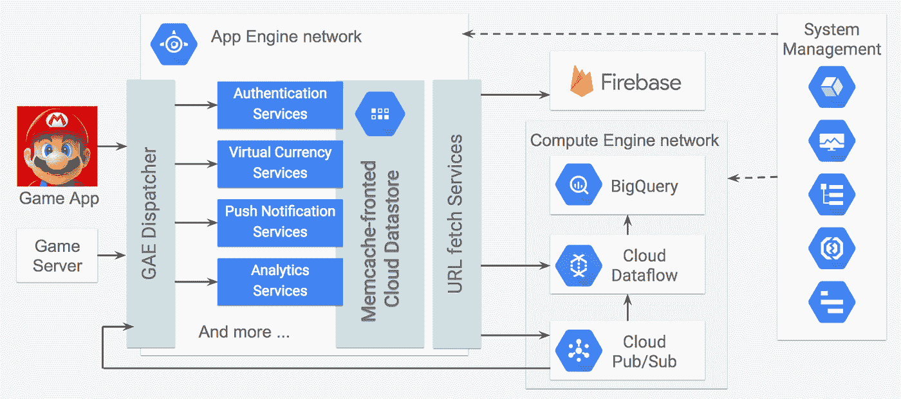

# 本周在 Google Cloud——“Cloud data proc 1.2，GCP 上运行的超级马里奥，5 星 Cloud Spanner，以及 beta 版的云外壳代码编辑器”

> 原文：<https://medium.com/google-cloud/this-week-in-google-cloud-cloud-dataproc-1-2-8f5ccfabe02?source=collection_archive---------2----------------------->

随着 [1.2 发布，Cloud Dataproc](http://goo.gl/19tA6u) 现在更快了，并提供了 Apache Spark 和 Apache Hadoop 的最新版本。

[云壳的代码编辑器现在处于测试阶段](http://goo.gl/GMvWhF)。严肃的代码编辑和浏览器中的终端感觉非常强大。

来自“顾客对 GCP 的最佳评价”部门:

*   4 天内在 150 个国家有 4000 万次下载？那将是谷歌应用引擎上的[超级马里奥 Run 发布！](http://goo.gl/hURsg3)
*   [see nit 如何使用谷歌云平台和 Couchbase](http://goo.gl/Xf8rRe) 为视频协作平台提供动力。

Infoworld 对 Google Cloud Spanner 的评价是 5 颗星。[了解原因](http://goo.gl/4Prhwy)(infoworld.com)

来自“引擎盖下及其制造方法”部分:

*   [计算发动机启动时间的三个步骤](http://goo.gl/Ucnc3h)
*   [Google 容器构建器，第 2 部分:多步骤构建](http://goo.gl/34BpZF)(YouTube.com)
*   [为网格计算工作负载运行具有云数据流的外部(C++)库](http://goo.gl/WeqKsu)
*   [使用 API 的 iOS 对话 app。人工智能和谷歌云视觉、翻译和语音 API](http://goo.gl/SWGKPQ)

没有数据就没有机器学习，没有现代化的组织就没有数据。阅读本[首席信息官数据分析和机器学习指南](http://goo.gl/s2gw46)中的更多内容。

来自“基督教青年会”部门:

*   [文件夹现已普遍上市](http://goo.gl/QEqu9d)
*   凯尔西·海托华(github.com)的 Kubernetes (1.7+)初始化器
*   [使用谷歌云平台的 Pivotal Cloud Foundry](http://goo.gl/YutXrd)(Pivotal . io)
*   [Pivotal 云原生路演](http://goo.gl/DRSdB2)(还剩下 8 个城市，也许附近有一个？)
*   [2017 年让我们加密和谷歌应用引擎](http://goo.gl/gRb167)(medium.com)

gcppodcast.com GCP 播客第 87 集与乔纳森·查姆讨论客户工程师

来自“GCP 新闻”部门:

*   谷歌称去年其大型云交易增加了两倍(recode.net)
*   这就是任天堂在谷歌身上下大赌注将超级马里奥带到 iPhone 上的原因(businessinsider.com)

本周的图片摘自《GCP 邮报》的[超级马里奥赛跑](http://goo.gl/hURsg3):

这星期到此为止！
——亚历克西斯