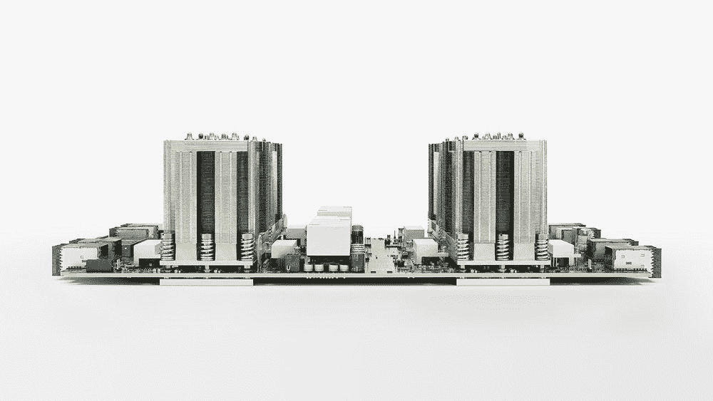

# 本周在 Google Cloud —“云扳手触及 GA、云 TPU 和云物联网核心”

> 原文：<https://medium.com/google-cloud/this-week-in-google-cloud-cloud-spanner-hits-ga-cloud-tpu-and-cloud-iot-core-a80540332072?source=collection_archive---------2----------------------->

这是非常忙碌的一周，希望你已经看到了以下一些公告，但在我们开始之前，让我先引用一下谷歌人工智能和机器学习首席科学家费的话:

> *“基本上机器快，准确&笨，人类慢，不精确&高明:”*

现在来看重要的产品发布-

正如之前宣布的， [**云扳手正式上市(GA)**](http://goo.gl/9fufUd) ，从而增加了它最重要的特性，SLA。这里有一个甜蜜而简短的云扳手[介绍视频](http://goo.gl/j1K37L)以及一系列[操作指南](http://goo.gl/73P54l)。

谷歌宣布 [**云 TPUs**](http://goo.gl/rpkrvx) ，TPU 去年宣布的新一代。这一次，它们针对培训和服务进行了优化，并将很快在 Compute Engine 中提供。这里有一个[简短的演示](http://goo.gl/baOGB4)。

留在机器学习上，谷歌也公布了 [TensorFlow 研究云](http://goo.gl/x7c64L)。

向 GCP 家族介绍另一位新成员: [**谷歌云物联网核心**](http://goo.gl/ICx1el) ，这是一项完全托管的服务，具有全球 MQTT 端点来管理和保护您的物联网设备。这是产品经理 Indranil 的视频介绍。

最后，在公告部分，除了每月 1TB 的免费查询，Google [**BigQuery 现在提供 10GB 的免费存储空间**](http://goo.gl/T95WMk) ，这样你就可以开始免费查询自己的数据了。

上周也是**谷歌 I/O** 周，所以这里有**几个与 GCP 相关的视频**:

*   [使用 Android Things 和谷歌云平台构建企业物联网](http://goo.gl/Kz1Gse)
*   [在 Android 上使用 Google Cloud 和 TensorFlow 的事情](http://goo.gl/6iXCTU)
*   [利用 Firebase 和谷歌云平台构建现代应用](http://goo.gl/bfXPKx)
*   [张量流前沿](http://goo.gl/yh4WdV)
*   [机器学习 API 举例](http://goo.gl/2VRxOW)
*   [云扳手 101:谷歌的关键任务关系数据库](http://goo.gl/Hy2yB3)
*   [导航谷歌云平台:新 GCP 用户指南](http://goo.gl/K8jb7g)

其他相关新闻:

*   [新的医疗保健和人口数据集现已在谷歌大查询中可用](http://goo.gl/AIgVJ6)(cloud.google.com)
*   [快抽签！已经在 github](http://goo.gl/VfDIWo)(github.com)上开源了 5000 万张图纸
*   Apache Beam 的第一个稳定版本已经发布(beam.apache.org)
*   [Coursera——面向自动气象站专业人员的谷歌云平台基础](http://goo.gl/mEXF1h)(coursera.org)
*   [使用谷歌云扳手衡量社交媒体对股市的影响](http://goo.gl/BjDHNy)(chmarny.com)
*   谷歌扳手是一个带有 API 核心的数据库【apievangelist.com 
*   谷歌计算引擎上的混沌猴子(medium.com)
*   [火情云功能](http://goo.gl/3Tsmrf)(howtofirebase.com)

媒体和分析师:

*   [谷歌新平台将云服务与物联网整合](http://goo.gl/vDBPaM) (thenewstack.io)
*   [在 I/O 之前，谷歌云平台增加新的物联网托管服务，发布云扳手](http://goo.gl/9vkjPm)(geekwire.com)
*   [谷歌新的物联网核心服务帮助企业管理其物联网数据和设备](http://goo.gl/o6xZ4B)(techcrunch.com)
*   [谷歌最新的平台游戏是人工智能，而且它已经赢了](http://goo.gl/9EHPKc)(theverge.com)
*   [谷歌在其云平台中加入托管物联网服务](http://goo.gl/LHi1Iw)(forbes.com)
*   谷歌的新 TPU 将加速人工智能训练(itworld.com)
*   【bloomberg.com】谷歌将通过云提供新的人工智能“超级计算机”芯片
*   无聊的谷歌(stratechery.com)
*   SAP 计划与谷歌云平台进行更多整合(zdnet.com)

本周图片是最新公布的[云 TPU](http://goo.gl/rpkrvx) :

这星期到此为止！

-亚历克西斯