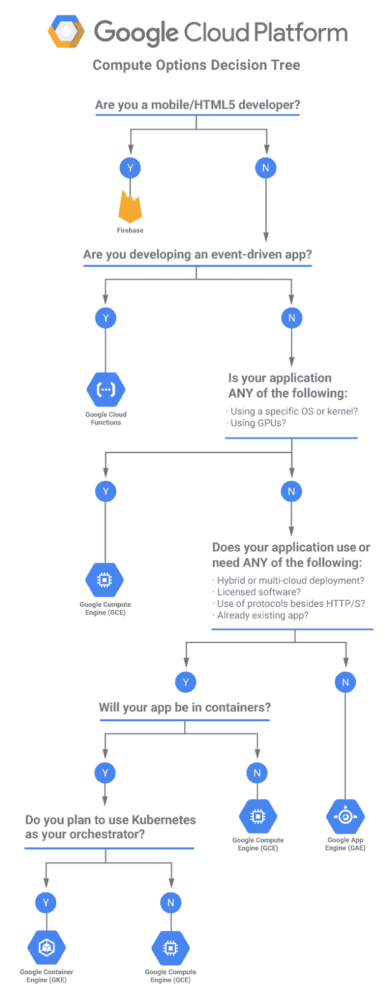

# 本周在谷歌云——“云 VPC 的独特功能和另一个决策树”

> 原文：<https://medium.com/google-cloud/this-week-in-google-cloud-cloud-vpcs-seriously-unique-features-and-another-decision-tree-3886566cf1cf?source=collection_archive---------1----------------------->

你以前听说过，谷歌的网络速度快，性能高，全球化。查看**云 VPC** (虚拟专用云)如何也可共享、可扩展，以及一个实例如何跨越多个区域— [*“虚拟专用云再想象”*](http://goo.gl/gSSt1e) 了解更多详细信息。

如果你喜欢几周前的[存储/数据库决策树](http://goo.gl/s05irU)，你也会喜欢“[选择 GCP 的**正确计算选项:决策树**](http://goo.gl/UVKV7s)”。

"[在**使用 HyperLogLog++的 BigQuery 中更快地计算唯一性**](http://goo.gl/1jXuPj) "讨论了当速度比精确计数更重要时，BigQuery 如何使用 HyperLogLog 算法的实现来进行基数估计。

源和汇如何支持 [**云数据流**中的一次处理](http://goo.gl/PkFwzC)。这是“云数据流中的一次性处理”系列的第三部分，也是最后一部分。

来自“最近 GCP 公告的技术报道”部门:

*   谷歌应用引擎获得全面的 Java 8 支持【programmableweb.com 
*   [扳手:成为 SQL 系统](http://goo.gl/H9bPgK)(blog.acolyer.org)
*   [谷歌云负载平衡器设置调整和观察](http://goo.gl/omLJu9)(medium.com)
*   [谷歌更新视频学习和视觉机器学习 API](http://goo.gl/PnQvPj)(programmableweb.com)
*   [谷歌吹捧云物联网核心在分析联网汽车数据方面的价值](http://goo.gl/AHc2RB)(eweek.com)

完成这个列表是一个更加通用的片段，关于谷歌如何致力于和参与 GCP 开源:**[**谷歌如何将开源变成其云平台的一个关键区别点**](http://goo.gl/RX6mVh)**(forbes.com)****

****罗明·伊拉尼幸运地参加了今年的谷歌 I/O，并获得了价值 700 美元的 GCP 积分。以下是他建议你应该做的(这也适用于来自[cloud.google.com/free](https://goo.gl/7jmPA9)的 300 美元免费试用):*[***你有 700 美元的 GCP 信用额度…现在该怎么办？***](http://goo.gl/CE87Tx)*(rominirani.com)******

******来自“基督教青年会”部门:******

*   ******[添加、删除或更新支付方式](http://goo.gl/xWGQ4i)(也包括全球接受的信用卡)******
*   ******[Dataproc 区域端点](http://goo.gl/wUdvyu)******

******来自“Bigtable 和 BigQuery 合作伙伴和客户评价最佳”部门:******

*   ******[你可能不应该使用 DynamoDB](http://goo.gl/wtYzYA)(syslog.ravelin.com)
    你永远猜不到当 Ravelin 在 Google Cloud Bigtable 上抛出 100 倍于其峰值吞吐量的数据时发生了什么…******
*   ******[我们如何在零宕机的情况下将历史数据从 MySQL 迁移到 Bigtable](http://goo.gl/Q7EsMV)(fastly.com)******
*   ******【medium.com】*如何通过用两个 UNNEST()操作替换一个自连接来提高 BigQuery 查询 31x 的速度【我的修改后的查询在第 1 级计费中运行了 12 秒，而不是在第 8 级计费中需要 380 秒才能完成的查询】*******

******决策树造就伟大的[本周图片](http://goo.gl/UVKV7s):******

************

******这星期到此为止！亚历克西斯******