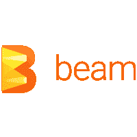

# 本周在谷歌云中——“数据流 2.0，Spinnaker 1.0，塑造 Istio 的未来”

> 原文：<https://medium.com/google-cloud/this-week-in-google-cloud-dataflow-2-0-spinnaker-1-0-and-shaping-istios-future-f6a767bdb743?source=collection_archive---------0----------------------->

本周，来自“我可以信赖的新发布的 bits”部门:

[**云数据流 2.0** SDK goes GA](http://goo.gl/NnIsU9) 。这是 Google 为 GCP 重新发布的 Apache Beam 2.0，它包括 Java 和 Python 语言的 SDK。它现在提供了 BigQuery、云数据存储、TensorFlow TFRecord 和 Avro 格式的连接器，以及可以在云数据流 Java 上运行的社区贡献的 Beam 连接器——JMS、JDBC、MongoDB 和亚马逊 Kinesis。

[**大三角帆 1.0** 在这里](http://goo.gl/AgGvNf)。在 GCP 播客 (#00080)的最新[集中，与产品经理和首席开发人员 Christopher Sanson 和 Steven Kim 的对话中，讨论了这种开源、多云部署、持续交付平台。自从网飞开始这个项目以来，这个社区已经发展成为一个非常活跃的社区。](http://goo.gl/Zpvlk8)

来自国际基督教青年会部门:

*   [谷歌和 Ansible 工程师管理 GCP 基础设施](http://goo.gl/KwLlQQ)(YouTube 视频短片，系列第一部)
*   [在 Firebase 主机上提供具有云功能的动态内容](http://goo.gl/d1pBSG)(将 HTTPS 云功能连接到您的 Firebase 主机应用程序)
*   [更改实例的服务帐户和访问范围](http://goo.gl/LkmgPU)(是的，您现在可以这样做了！)
*   [通过入口设置 HTTP 负载平衡](http://goo.gl/Pdo3JQ)(通过这个新的 Kubernetes 入口教程，在 GKE 上实现更好的负载平衡)

来自“最佳实践”部门:

*   [为生产准备容器引擎环境](http://goo.gl/0aFGj5)。安全可靠地将工作负载纳入 Google Container Engine 的蓝图和方法。里面有很多最佳实践。
*   [Apache Hadoop 和 Spark 成功的最快途径:在云原生架构上使用作业范围的集群](http://goo.gl/okauF9) (Cloud Dataproc)
*   [实时关联数千个金融时间序列流](http://goo.gl/qQyh5d)(云数据流)

来自“帮助社区塑造 Istio 的未来”:

*   [帮助我们确定 Istio 项目的优先级](http://goo.gl/Hiwl9N)
*   [gRPC/Istio 社区日](http://goo.gl/I3zsfk)(6 月 26 日，加利福尼亚州桑尼维尔)

在其他地方，互联网上的谷歌云平台:

*   [谷歌云平台 Vs 亚马逊网络服务](http://goo.gl/JRPCQa) ( [开发到](http://dev.to/))
*   [云视觉 API——我们如何提高 80%的效率？](http://goo.gl/HVMlcs) ( [blog.justride.in](http://blog.justride.in/) )
*   [使用谷歌大查询与 R](http://goo.gl/JIp5Kq)([thinktostart.com](http://thinktostart.com/))
*   [谷歌云功能入门](http://goo.gl/N37Gdk)([programmableweb.com](http://programmableweb.com/))
*   [谷歌容器构建器简介](http://goo.gl/agycP7)([medium.com](/))
*   [谷歌用新的云功能加速客户数据处理](http://goo.gl/E1PT8r)([venturebeat.com](http://venturebeat.com/))
*   [在评估大数据价值时，要考虑经济性，而不是特性](http://goo.gl/EpCaHE)([esg-global.com](http://esg-global.com/))。与本地 Hadoop 集群相比，BigQuery 客户在 3 年内节省了 88.1 万至 270 万美元。
*   [Play by Play: Google 云平台，Windows/。净](http://goo.gl/FVQEMS) (90 分钟课程)([pluralsight.com](http://pluralsight.com/))

本周截图是 Apache Beam 的 logo，突出了一个事实 [Cloud Dataflow 2.0 SDK](http://goo.gl/NnIsU9) 现在是 Google 为 GCP 重新发布 Apache Beam 2.0:

这星期到此为止！

-亚历克西斯