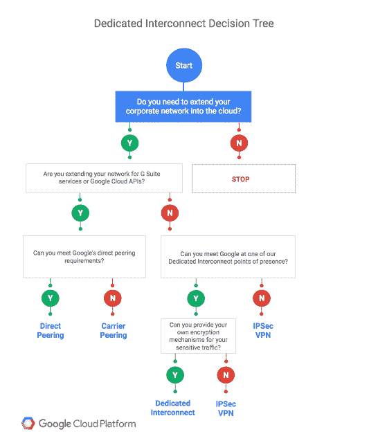

# 本周在 Google Cloud —“与 GCP 的专用互连，更好的 GCE 自动化，以及空闲 Dataproc 集群的自动删除”

> 原文：<https://medium.com/google-cloud/this-week-in-google-cloud-dedicated-interconnect-to-gcp-better-gce-automation-and-auto-93728eef864c?source=collection_archive---------1----------------------->

在过去的一周里，谷歌宣布了**专用互联**(15 个大都市地区的 35 个位置)，这是对最近[网络服务等级宣布](http://goo.gl/9FrRHr)的一个很好的补充，以及针对 GDE 托管实例组的**更新程序**:

*   [宣布专用互联:您快速、私有地进入谷歌云](http://goo.gl/fRhNcn)
*   [了解计算引擎的新托管实例组更新程序](http://goo.gl/1jQ8NL)

来自“GCP 发生了太多事”部门:

*   [保护 Kubernetes 集群网络](http://goo.gl/t6JegZ)(medium.com)
*   [实用功能分布式编程，在 App Engine 上使用 Python](http://goo.gl/FZQhU6)(medium.com)
*   [谷歌云功能综合指南](http://goo.gl/WQy5JH) (divu.in)
*   [谷歌云的 CDN 有多好？](http://goo.gl/6g8i18)(medium.com)
*   [谷歌云扳手:金融服务的下一个大变革？](http://goo.gl/GmuxCB)(finextra.com)
*   在云软件大战中，中间层向 theinformation.com 的 T21 低头

来自国际基督教青年会部门:

*   [Dataproc 集群计划删除](http://goo.gl/dnBhfc) (GCP 文档)。这是你自找的，现在还有另一种省钱的方法。
*   面向 AWS 专业人员的 Google 云平台概述(新课程)[视频介绍](http://goo.gl/szxRZx)、[课程描述](http://goo.gl/GSK6jc)
*   如何在 BigQuery 中处理你的商业数据(“不管你喜不喜欢，电子表格在许多商业运作中扮演着不可否认的角色”)(谷歌博客)

来自不断发展且极具洞察力的“我们的客户和用户最了解 GCP”部门:

*   [我们为什么迁移到 Firebase 和 GCP: Smash.gg](http://goo.gl/XME8jU) (电子竞技平台)(谷歌博客)
*   [追踪者穿越云层的旅程](http://goo.gl/jcn78t)(pivotaltracker.com GCP PCF)
*   关于 Twizoo 如何决定在 Kubernetes 上全押的小故事(twizoo.com)
*   【Waze 如何使用 Spinnaker 管理的管道模板和基础设施作为代码来驯服生产混乱(谷歌博客)

在过去的一周里，有很多新的与 GCP 相关的多媒体内容。都是音频格式:

*   谷歌云&Kubernetes(thecloudcast.net)
*   gcppodcast.com GCP 播客第 93 集

…以及直接来自上周 youtube.com GDD 欧洲活动的视频

*   [谷歌云平台的基础:一次导游](http://goo.gl/4Gj9EV)(一次与刚到 GCP 的朋友分享的好机会)
*   [容器、Kubernetes 和谷歌云](http://goo.gl/WErpYa)(包含 Flixbus 客户案例)
*   [零到 App:用 Firebase 现场编码一个通用翻译器](http://goo.gl/pNwRPN)
*   [ML API 示例](http://goo.gl/GDGqeJ)
*   [deep mind 简介](http://goo.gl/6B4Btg)
*   [谷歌云物联网核心技术深度挖掘](http://goo.gl/2gnHR4)

本周图片是，因为现在你知道我们喜欢决策树，[“专用互连适合你吗？”](http://goo.gl/fRhNcn):

这星期到此为止！亚历克西斯