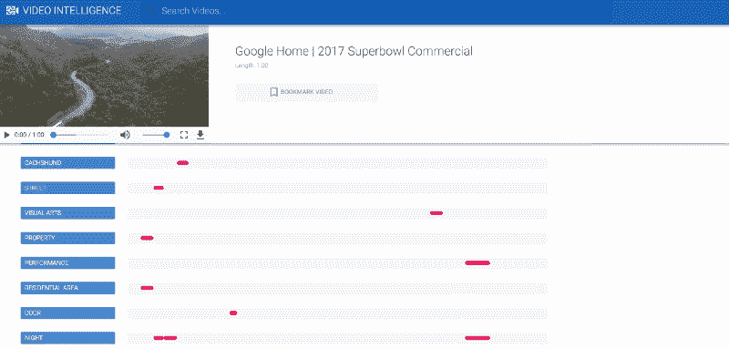

# 本周在 Google Cloud —“部署管理器、云 IAP、Ruby 和视频 API 演示源代码”

> 原文：<https://medium.com/google-cloud/this-week-in-google-cloud-deployment-manager-cloud-iap-ruby-and-video-api-demo-source-code-e7e5eef01fa0?source=collection_archive---------0----------------------->

本周还有更多关于**部署经理**的介绍，这次是为了 [**自动化 GCP 项目创建**](https://goo.gl/bUFs3z) 。这包括设置计费、IAM、启用 API 等等。

[**云存储的发布/订阅通知**](https://goo.gl/6wqpHW) 目前处于测试阶段，集成了云功能，开放了数据管道架构。

对于身边的红宝石爱好者来说，艾捷拉有一个 [**状态的红宝石，GCP 有**](https://goo.gl/pOJE34) 。这包括 App Engine flex 现在如何支持前 1000 个 Ruby 库、不同版本的 Ruby 和 Rails，以及现在提供新的 GCP gem。

Cloud Next’17 上发布的云**身份感知代理**将在[这篇文章](https://goo.gl/U46HGz)中详细讨论。它通过定义简单的访问策略而不是设置 VPN，提供了一种保护 HTTPs web 应用程序的简单方法。这项技术基于谷歌广泛使用的 BeyondCorp，在之前发表的一篇论文中有详细介绍。

**视频智能 API** 在 Cloud Next’17 上发布，并在当天#1 主题演讲结束时演示。下面是这个漂亮的**演示的 [**源代码**](https://goo.gl/M9vjx9) 。**

**通过配置 Firebase analytics (mobile)和 Google Analytics 360 (web)来使用 **BigQuery** 可以跟踪用户在网络和移动设备上的行为**，这将在这篇[非常详细的帖子](https://goo.gl/sLJiNd)中讨论。

谷歌研究博客上有大量的机器学习和张量流:

*   [介绍 TF-seq 2 seq](https://goo.gl/zP0jY6):tensor flow 中开源的序列对序列框架。
*   [联邦学习](https://goo.gl/QgJ1Z5):没有集中训练数据的协同机器学习。

本周的 [**GCP 播客第** #72](https://goo.gl/VhbFlA) 集是与卢克·斯通关于客户可靠性工程( **CRE** )的讨论。

互联网上的 GCP:

*   [在谷歌云平台上实现#无服务器](https://goo.gl/YPmyp0)(medium.com)
*   [Kubernetes 为容器本地存储做好准备](https://goo.gl/jDNDTz) (thenewstack.io)
*   【whatsthebigdata.com】谷歌招募人工智能和社区开发赢得云战争
*   [监控谷歌计算引擎指标](https://goo.gl/tAVcfD)(datadoghq.com)
*   来自地球另一端的低语和大疑问(shinesolutions.com)

本周的截图摘自 [Sara Robinson 的帖子](https://goo.gl/M9vjx9)在 Next’17:

这星期到此为止！

-亚历克西斯