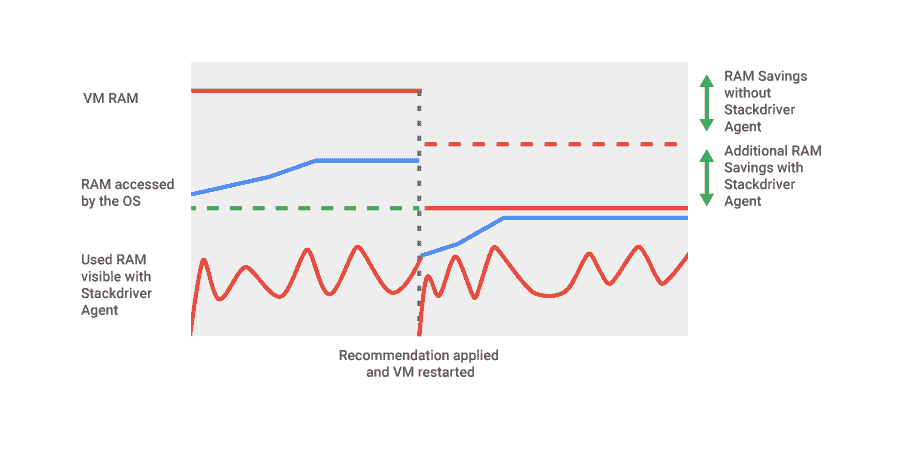

# 本周在 Google Cloud —“端点、gRPC、websockets 和一些合理调整”

> 原文：<https://medium.com/google-cloud/this-week-in-google-cloud-endpoints-grpc-websockets-and-some-rightsizing-cda27793c8d2?source=collection_archive---------0----------------------->

# 以防你错过(ICYMI)

*   谷歌云发布在**Medium.com**——[medium.com/google-cloud](https://goo.gl/cGPTtL)。远不止这个每周摘要中的内容。
*   cloud.google.com/community/tutorials**社区教程**——[T7。请求新的教程或编写并提交您自己的教程(流程是基于 github 的)。](https://goo.gl/8JA4wi)

# 在谷歌云博客上

*   [使用 Google Cloud **端点和 AWS Lambda**](http://goo.gl/VkPdh1) 实现多云
*   [HTTP(S)**负载平衡器**现在支持 **WebSockets** 。](http://goo.gl/CPqbCW)透明地
*   [用谷歌云**端点**](http://goo.gl/n3KxSN) 管理你的**gRPC**API。一个 API 多种格式 gRPC 和 JSON-HTTP/1.1 带云端点。
*   [如何使用 Google **Data Studio 和 BigQuery**](http://goo.gl/J757QD) 构建 BI 仪表盘
*   [将您的数据仓库迁移到 Google **BigQuery**](http://goo.gl/bKy6AZ) 的五大技巧
*   [使用**堆栈驱动程序**代理](http://goo.gl/aDhRLP)提供更好的**虚拟机调整**建议
*   [如何在 GCP](http://goo.gl/OAcWSn) 上**保护渲染工作负载**

# 互联网上的 GCP

*   [用三个简单的步骤解释机器学习](http://goo.gl/kbZt48) (mcohen.io)
*   [教程:配合 Spring Boot、JPA、Hibernate 使用谷歌云扳手](http://goo.gl/GngL13) (olavloite.github.io)
*   [用 Kubernetes 扩展专用游戏服务器:第 1 部分——装箱和部署](http://goo.gl/UB2BpP)(compoundtheory.com)
*   [在谷歌云壳里试试 gRPC Swift](http://goo.gl/Y6oCBn)(github.com)
*   [YeSQL？扳手如何改变工具箱](http://goo.gl/77UPlf)(medium.com)
*   [从应用引擎应用](http://goo.gl/F9U1jX) (amygdala.github.io)运行云数据流作业
*   【YouTube.com 开源合作:Terraform 和 GCP

# 新闻和其他与 GCP 有关的内容

*   【geekwire.com，谷歌云的黛安·格林认为它在五年内“很有可能”超越 AWS
*   Hadoop 之外的缓存:纽约时报如何拥抱新技术
*   [谷歌旨在抢走媒体行业的亚马逊云客户](http://goo.gl/i7o4AT)(cnbc.com)
*   [谷歌将 Zync 云媒体渲染价格下调高达 31%](http://goo.gl/8cKpA3)(venturebeat.com)
*   GCP 的云铸造厂— [英国慈善机构 Comic Relief 如何在红鼻子日的七个小时内处理了数百万英镑](http://goo.gl/ZDB1GW)
*   谷歌真正的 Kubernetes 魔力在于社区，而不是代码(techrepublic.com)

最后，本周的截图摘自[“合理调整建议”帖子](http://goo.gl/aDhRLP):

这星期到此为止！

-亚历克西斯