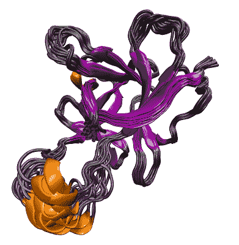

# 本周在谷歌云上——“GKE 1.7 在这里，伦敦呼叫，传输设备，以及大大改善的 TCP 拥塞控制”

> 原文：<https://medium.com/google-cloud/this-week-in-google-cloud-gke-1-7-f51f9877c990?source=collection_archive---------0----------------------->

过去几周的谷歌云平台新闻包括:

*   位于伦敦的新[数据中心运行您的应用程序并存储您的数据](http://goo.gl/FHrqvs)，这一切都符合谷歌对 GCP 通用数据保护条例(GDPR)的承诺。欧盟还有三个地区也快到了！
*   在 [Kubernetes 1.7 发布后不到几周，容器引擎](http://goo.gl/zDRgKy)现在运行这个新版本，并专注于更好的有状态应用支持、更多的安全特性和对混合部署的网络支持。其他功能包括 alpha GPU 支持、节点的自动修复和自动升级、新的集群自动扩展策略以及更新的管理 UI。看看吧！
*   [传输设备](http://goo.gl/P7CSkw)，一种压缩容量高达 1pb 的机架式高容量存储设备，现已推出测试版。
*   本着让 GCP 客户获得谷歌为其用户使用的相同技术的精神，我们给你 [TCP BBR 拥塞控制](http://goo.gl/ffhy3d)，这项技术记录在去年 12 月的一篇技术文章中。

继续“网络就是计算机”部分:

*   [谷歌如何重塑互联网](http://goo.gl/vXkxPV)([nextplatform.com](http://nextplatform.com/))
*   [区域绩效问题](http://goo.gl/Y6eXM8)([youtube.com](http://youtube.com/))
*   [网络性能分析工具](http://goo.gl/qjwcBY)([youtube.com](http://youtube.com/))

本周的大数据新闻涵盖了 Apache Airflow、Dataflow、BigQuery，以及基因组学和我们最新的数据工程 Coursera 课程:

*   [通过动态再平衡消除落伍者&云数据流中的自动缩放](http://goo.gl/W2dxst)([infoq.com](http://infoq.com/)视频)
*   【播客】[阿帕奇 Beam 的下一步是什么？由来自谷歌](http://goo.gl/hmXDGf)([talend.com](http://talend.com/)播客)的弗朗西斯·佩里主演
*   [如何使用 Apache air flow](http://goo.gl/4iQrWY)(【cloud.google.com】T2)为 BigQuery 聚合数据
*   使用 R 和 Google BigQuery，第 2 部分(存储和检索数据帧)([cloud.google.com](http://cloud.google.com/))
*   [DNA 序列比对云服务](http://goo.gl/3tF9r4)([medium.com](/))
*   [谷歌云平台上的数据工程:Coursera 课程](http://goo.gl/S28z8X)([medium.com](/))

来自“集装箱、Kubernetes”部门:

*   [谷歌容器构建器第 1 部分(云滚动更新)](http://goo.gl/zvCHBC)([youtube.com](http://youtube.com/))
*   伊斯迪奥和库贝内特斯—凯尔西·海托华([youtube.com](http://youtube.com/))
*   [Kubernetes:理解豆荚与容器(蒂姆·霍金)](http://goo.gl/sGkBii)([speakerdeck.com](http://speakerdeck.com/))
*   [开放集装箱倡议(OCI)发布集装箱标准 v 1.0](http://goo.gl/j48hbo)([opencontainers.org](http://opencontainers.org/))
*   Linux 基金会对 Kubernetes 的免费介绍([edx.org](http://edx.org/))

来自“我们与合作伙伴一起变得更强大、更聪明”部门:

*   [与谷歌云平台上的 Kubernetes 和 Nutanix](http://goo.gl/U3Nwj7)**([cloudplatform.googleblog.com](http://cloudplatform.googleblog.com/))进行混合**
*   **[我们如何与 Citrix 合作交付基于云的桌面应用](http://goo.gl/kBQm25) (blog.google)**
*   **[宣布 Rackspace 托管谷歌云平台](http://goo.gl/AGz7x5)(【blog.rackspace.com】T2)**

**来自“顾客和用户对 GCP 的最佳评价”部门:**

*   **[利用 GCP 进行海量药物发现虚拟筛选](http://goo.gl/H3W9tz)(硅疗法)([googleblog.com](http://googleblog.com/))。可抢占的 GCE 实例的另一个强有力的例子。**
*   **[谷歌不是亚马逊。在一个没有服务器的世界里节省大量开支](http://goo.gl/qJwRV7)([3wks.com.au](http://3wks.com.au/))。CFO 循环的一个案例。**
*   **[从 AWS 到 GCP，TABLEAPP 架构故事](http://goo.gl/769xqF)([slideshare.com](http://slideshare.com/))。GKE 和成本分析。**
*   **[BQ:推动移动创新](http://goo.gl/9freNq)(有 GKE、BigQuery、云 SQL &更多)([cloud.google.com](http://cloud.google.com/))**
*   **[使用谷歌云和 OpenTSDB](http://goo.gl/wi5JWp)([blog . Greta . io](http://blog.greta.io/))进行实时数据处理。不胜枚举，查看[架构图](http://goo.gl/pdKiMC)。**
*   **[从卡夫卡到 BigQuery:数十亿日常事件流媒体指南](http://goo.gl/ohk1gy)([medium.com](/))。比较通过批处理和流式 API 加载到 BigQuery 的数据。**
*   **[将图钉的数据基础设施迁移到谷歌云平台](http://goo.gl/kvEA1y)([cloud.google.com](http://cloud.google.com/))。从需要 1h+才能完成的查询，到云存储+云 Dataproc (Spark) + BigQuery。**
*   **《纽约时报》为谷歌应用引擎开发的 go-kit 服务器马文现在已经开源([github.com](http://github.com/))**

**从“如果没有机器学习更新，每周回顾会是什么样的？”部门:**

*   **[Facets:机器学习训练数据的开源可视化工具](http://goo.gl/nR2rTM)(【opensource.googleblog.com】T2)**
*   **[宣布我们机器学习创业大赛](http://goo.gl/reaUUE)的获胜者**
*   **[在 TensorFlow 中构建自己的神经机器翻译系统](http://goo.gl/jLZiK6)([research.googleblog.com](http://research.googleblog.com/))**

**来自“基督教青年会”部门:**

*   **[如何在 5 分钟内上手云扳手](http://goo.gl/cYXPhk)([cloudplatform.googleblog.com](http://cloudplatform.googleblog.com/))**
*   **[帮助保护你的谷歌云服务账户密钥的安全](http://goo.gl/UFbp82)([cloudplatform.googleblog.com](http://cloudplatform.googleblog.com/))**
*   **[在云中使用集群进行大规模技术计算](http://goo.gl/MQF4A2)([cloud.google.com](http://cloud.google.com/)**
*   **[NOAA 全球地面天气数据概要](http://goo.gl/mhmpS8)([cloud.google.com](http://cloud.google.com/))**
*   **[用 Kubernetes 扩展专用游戏服务器:第二部分——管理 CPU 和内存](http://goo.gl/DEgqQb)([compoundtheory.com](http://compoundtheory.com/))**
*   **[BigQuery Mate chrome 扩展](http://goo.gl/bMYUuF)为用户界面增加一些额外的功能(作者米哈伊尔·伯利安)([chrome.google.com](http://chrome.google.com/))**
*   **[现在通用:现在，上凡云](http://goo.gl/hSEmJo)([zeit.co](http://zeit.co/))**
*   **Catatumbo 2.2.0 (云数据存储的持久性框架)现在是最终版本( [catatumbo.io](http://catatumbo.io/) )**

**如果你最近没有赶上 **GCP 播客**，你可能错过了三集非常精彩的节目:**

*   **[#86 Broad Institute 与 Lukas Karlsson 和 Mike Altarace 的白金客户](http://goo.gl/9Xxaq7)**
*   **[#85 伊斯蒂奥与瓦伦·塔尔瓦和斯文·莫森](http://goo.gl/c5N9gE)**
*   **[#84 关于卡格尔的一切](http://goo.gl/tK233p)**

**本周的图片据说是蛋白质靶标动态特性的一个例子，摘自上面的[硅治疗故事:](http://goo.gl/H3W9tz)**

****

**这星期到此为止！**

**-亚历克西斯**