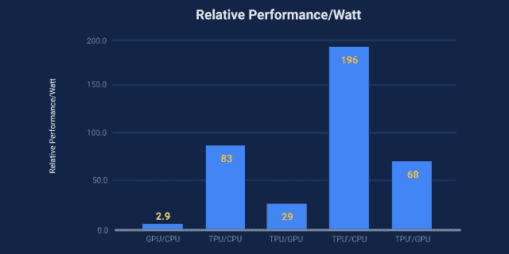

# 本周在谷歌云中——“GKE、TPU 和麋鹿”

> 原文：<https://medium.com/google-cloud/this-week-in-google-cloud-gke-tpu-elk-f234e74e9ea2?source=collection_archive---------0----------------------->

除了 **Kubernetes 1.6(。x)** 全球可用，Google [**容器引擎(GKE)** 现在支持这个最新版本](https://goo.gl/Zz6ixu)。这个新版本带有[完全管理的节点](https://goo.gl/UBwlCm)和[容器优化的操作系统](https://goo.gl/LTSJE4)，现在已经普遍提供。

谷歌发布了一篇关于在性能和能效方面与 GPU 和 CPU 进行比较的论文。这一点在 nextplatform.com 的文章中也有讨论，并导致了一些[谷歌不必建造的数据中心(wired.com)。](https://goo.gl/0s4Dlg)

谷歌和 Elastic 已经宣布 [**管理 Elasticsearch 和 GCP 的 Kibana**](https://goo.gl/bkvxXN)。这意味着最新弹性软件的完全托管和管理版本，包括来自源代码支持的商业特性。

在过去的一周里，GCP 有了更多的新闻:

*   [**云启动器**现在有了新的虚拟机解决方案，自带许可证(BYOL)和新的独立 SaaS 解决方案](https://goo.gl/cmQ2Mn)。
*   [云**翻译 API** 进入 GA](https://goo.gl/UQ6Vh9) (多语种)
*   [增加 **Firebase 实时数据库**并发限制](https://goo.gl/UKaIG7)
*   [**Firebase 的云函数—热门样本**](https://goo.gl/PXzLJg)
*   [**Jelastic**Google 云平台上的私有 PaaS](https://goo.gl/Yh8oLK)
*   [谷歌**云 IAM** 面向 AWS 用户](https://goo.gl/nAVvJb)
*   [深呼吸:用机器学习防止愤怒邮件](https://goo.gl/pYlYML)
*   [使用 **R 配合 Google BigQuery**](https://goo.gl/blkHUi)
*   [具有有界负载的一致散列法](https://goo.gl/7AejQs)
*   [谷歌投资**靛蓝海底电缆**改善东南亚云基础设施](https://goo.gl/NtfwjR)
*   [**Espresso** 通过将 SDN 扩展到公共互联网，使谷歌云更快、更可用、更具成本效益](https://goo.gl/8P88e4)

***GCP 在互联网上的其他地方……***

***应用开发***

*   [谷歌容器生成器最酷的特性](https://goo.gl/Xv8tud)(medium.com)
*   [谷歌云功能入门【medium.com ](https://goo.gl/P0X259)
*   [JHipster、Kubernetes 和 Google Cloud SQL](https://goo.gl/8uNSyv)(JHipster . github . io)
*   为谷歌主页打造你的第一个行动(medium.com)
*   在谷歌云上构建一个无服务器的围棋应用(medium.com)

**大数据&机器学习 **

*   [Wootric &谷歌云:使用自然语言处理(NLP)分析定性反馈](https://goo.gl/cFyQSp)(wootric.com)
*   [Google big query 的商业智能性能基准](https://goo.gl/dJxWjx)(atscale.com)
*   [如何使用 BigQuery 进行大规模 SEO](https://goo.gl/H55Yh5)(moz.com)
*   [啤酒、机器人和广播:公司开始在云中使用人工智能](https://goo.gl/Nyjc4K)(bloomberg.com)

**GCP 播客**

*   [#70 无人机 CI，Brad Rydzewksi 和 Jessie Frazelle](https://goo.gl/QILO6c)
*   [#71 云国玉峰机器学习引擎](https://goo.gl/v8IbeR)

本周截图摘自[“量化 TPU 的性能，我们的第一个机器学习芯片”](https://goo.gl/CXEcS6)

这星期到此为止！

-亚历克西斯