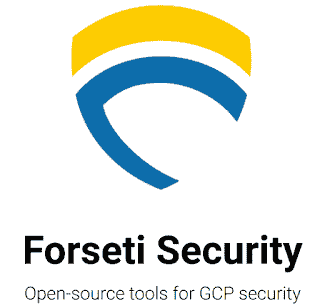

# 本周在谷歌云-“你好，应用引擎的 SSL，强化你的桶，介绍凡赛堤”

> 原文：<https://medium.com/google-cloud/this-week-in-google-cloud-hallo-frankfurt-ssl-for-app-engine-hardening-your-buckets-and-7e2d173a37bd?source=collection_archive---------2----------------------->

欢迎来到欧洲-西方 3！一个新的德国 GCP 区现在开放，有三个区和许多服务。

最好的顾客可能是那些对社区也有贡献的人。介绍[凡赛堤，一个新的开源社区，由 Spotify 和谷歌创建，托管 GCP 安全工具](http://goo.gl/yiUUXv)。另见 [Spotify 的 take](http://goo.gl/g7VnJD) 。

说到安全性，这里有 [4 个步骤来加固你的云存储桶](http://goo.gl/LcvwAZ)。大多数人会认为默认行为非常安全，但是能够强化它是非常重要的。

对于一些老用户来说，这是一个漫长的过程，但现在[用于谷歌应用引擎的托管 SSL](http://goo.gl/8cFqsn)已经为每个人提供，使他们的应用和网络更加安全。

本周有大量如何操作的帖子:

*   [在谷歌云机器学习引擎上使用 TensorFlow 对象检测模型进行预测](http://goo.gl/pbbjNy)(谷歌博客)
*   [如何使用 ButterCMS 这样的无头 CMS 在 Google App Engine 上建立一个网站](http://goo.gl/QQrK4j) (Google 博客)
*   [在谷歌云平台上安装和使用 Apache air flow](http://goo.gl/BB3mV)(lemag.sfeir.com)
*   [开始使用谷歌云平台 API](http://goo.gl/z15BQH)(“缺失教程”系列)(medium.com)
*   [在 Kubernetes/Container 引擎上部署 ASP.NET 核心应用](http://goo.gl/GwCSH4)(medium.com)
*   使用云函数外壳(模拟所有类型的函数触发器)(Firebase 文档)
*   [Kubernetes 艰难解释](http://goo.gl/AVoVzd) —第一章谷歌云平台(container-solutions.com GCP)的先决条件

来自国际基督教青年会部门:

*   [张量流数据集和估值器简介](http://goo.gl/hJoXeV)(谷歌博客)
*   标记密钥[—goo.gl/1Wu4mX](https://goo.gl/1Wu4mX)(谷歌文档)
*   [HTTPS 负载平衡器——使用多个 SSL 证书](http://goo.gl/fzVufA)(谷歌文档)
*   [用动态路由模式](http://goo.gl/8xE2Xb)确定哪些子网对云路由器可见(谷歌文档)
*   [将一系列 IP 地址作为别名分配给虚拟机的主网络接口](http://goo.gl/eLS7x8)(谷歌文档)
*   [51 个公共数据集和计数](http://goo.gl/Y3k9gT)(谷歌云控制台启动器)
*   Catatumbo(用于云数据存储的开源 ORM 框架)[版本 2.3.0 现已推出](http://goo.gl/BV6qbT) (catatumbo.io)
*   [我拿到了一张黄金入场券:我在谷歌第一年学到的 API](http://goo.gl/TyNP9L)(medium.com)

来自“顾客对 GCP 的最佳评价”部门:

*   [斯伦贝谢选择 GCP 交付新的石油和天然气技术平台](http://goo.gl/1gVu5T)(谷歌博客)
*   [Carousell 运营在线分类广告市场，支持 GCP](http://goo.gl/XGtfSP)(cloud.google.com)数百万的 mau

来自“我最喜欢音频和视频”部门:

*   [云播#312 — Istio 路由&负载均衡](http://goo.gl/e6jYag)(thecloudcast.net)
*   蒂诺·特雷什科和乔丹·蒂加尼(gcppodcast.com)在 GCP 播客第 94 集《引擎盖下的大质询》
*   [BigQuery:用于分析的托管存储](http://goo.gl/n68AVF)(Jordan Tigani)(atscale conference . com)

本周图片是[凡赛堤](http://goo.gl/yiUUXv)标志:

这星期到此为止！

-亚历克西斯