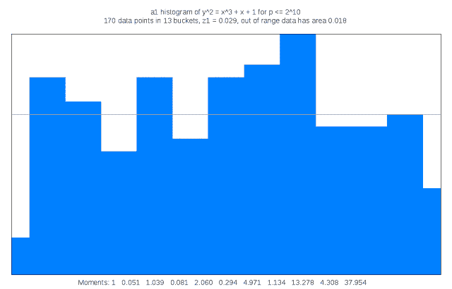

# 本周在 Google Cloud —“分布式跟踪 Go、云语音 API、220k 内核和下一个 17 Rewind”

> 原文：<https://medium.com/google-cloud/this-week-in-google-cloud-insiders-2017-week-16-distributed-tracing-for-go-cloud-speech-api-27d1cc0443d4?source=collection_archive---------1----------------------->

您会如何处理 220，000 个核心的计算引擎可抢占虚拟机？这位麻省理工学院的首席研究科学家用它们来探索猜想的一般化。

继上周的云身份感知代理(Cloud IAP)介绍之后，现在有一个详细的[【入门】](https://goo.gl/jKyTjm)片段，它很好地补充了罗明·伊拉尼的[早期教程](https://goo.gl/lTpRJ4)。

受 Dapper 启发的分布式 Go 跟踪现在通过 Stackdriver Trace 和一个新的 Go 跟踪包提供。点击阅读所有相关内容[。](https://goo.gl/U1S1s4)

[云语音 API 现已正式推出](https://goo.gl/QJ9hE6)，有超过 80 种语言和实时流或批处理模式的变体。

一份[新解决方案指南](https://goo.gl/Iw1MFx)概述了使用云数据流为 Tensorflow 工作负载提供无服务器基础架构。

可以从你的 CI/CD 环境中用 Terraform 创建一个 GCP 项目。

错过了 3 月的下一届 17？不想看 YouTube 上所有 200 个录制的会话？[下一个‘17 倒带可以帮忙](https://goo.gl/4wAbd5)。

本周的 [GCP 播客(#00073)](https://goo.gl/PvxLQT) 与 Bret McGowen 一起探讨无服务器和云功能。

过去一周网上关于 GCP 的其他文章包括:

*   [谷歌投资新建连接新加波和澳洲的海底电缆](https://goo.gl/1U91Ix)(techcrunch.com)
*   [关于多云权衡和开放的悖论【redmonk.com，](https://goo.gl/7SKWi0)
*   [Bitmovin 如何在云和本地使用 Kubernetes 进行多阶段金丝雀部署](https://goo.gl/eYBrck) (blog.kubernetes.io)
*   构建你的基础设施，不要微观管理它(medium.com)
*   谷歌的新芯片是量子计算霸主地位的垫脚石(technologyreview.com)

本周快照是在计算引擎(410 亿个数据点)上[探索亏格为 3 的超椭圆曲线时发现的有趣的 Sato-Tate 分布之一](https://goo.gl/Yw7zMW)

