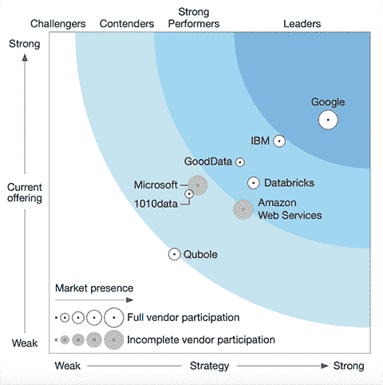

# 本周在谷歌云中——“一切都与用户和合作伙伴有关”

> 原文：<https://medium.com/google-cloud/this-week-in-google-cloud-its-all-about-users-and-partners-5a5c57057536?source=collection_archive---------0----------------------->

回顾回来了，这里有近一个月的 GCP 新闻，有大量的客户故事(Box、WePay、fast ly……)和合作伙伴公告(包括 Elastic)，这些都让我非常高兴。

来自“新闻和公告”部门:

*   [针对按需和 GCE 可抢占实例的本地固态硬盘降价](http://goo.gl/mTmhLv)(谷歌博客)
*   [通过 Google Cloud Dataproc 作业 id 和标签更容易与 Apache Spark 和 Hadoop 集成](http://goo.gl/TRUpPn) (Google 博客)
*   [更新了云语音 API，拥有长达 3 小时的音频，单词级时间戳& 30 种新语言品种](http://goo.gl/xoELGX)(谷歌博客)
*   [云 SQL for PostgreSQL 更新了新的扩展](http://goo.gl/Saj3mo)(谷歌博客)
*   [弹性云在谷歌云平台上的测试版发布](http://goo.gl/QRsPzn)(elastic.co)
*   [介绍工作流，云生物信息学的新标准](http://goo.gl/wcY1V2) (DNAstack)
*   [亚马逊网络服务加入云计算原生计算基金会成为白金会员](http://goo.gl/np5Xhb) (cncf.io)

来自我最喜欢的“GCP 用户说得最好”部门:

*   [现在你可以清楚地看到:盒子里的智能图像识别](http://goo.gl/SScQGA)(blog.box.com)
*   [Aucnet 如何利用 TensorFlow 将他们的 IT 工程师转变为机器学习工程师](http://goo.gl/ZBcYdW)(谷歌博客)
*   [我们如何通过替换 Mixpanel w/ BigQuery，data flow&K8s](http://goo.gl/xtzDgo)(blog.doit-intl.com)每年节省超过 24 万美元
*   (githubengineering.com 的)T21
*   [WePay 如何通过 GCP 和 Apache Kafka 使用流分析进行实时欺诈检测](http://goo.gl/8yA8sx)(谷歌博客)
*   [转向谷歌云](http://goo.gl/a3z3LU)(丹·拉特纳@ medium.com)
*   [剪纸软件通过谷歌云平台](http://goo.gl/CtNFrw)(谷歌网站)提供基于云的印刷分析产品
*   如何用 BigQuery 快速分析实时流日志
*   [Traveloka 在谷歌云平台上的流媒体分析之旅](http://goo.gl/Y5isrd)(谷歌博客)
*   【metamarkets.com，借助 AWS 和 GCP 实现云计算:大规模经验教训

来自“库伯内特斯& GKE”部门:

*   [保护 Kubernetes 集群网络](http://goo.gl/DVnsYK) (ahmet.im)
*   [使用 Kubernetes 的异构部署模式](http://goo.gl/VpM6TH) (GCP 解决方案)
*   [medium.com GKE 的“cluster-ipv4-cidr”标志](http://goo.gl/ciZrLs)
*   凯尔西·海托华的《库伯内特上的流浪者》教程(github.com)

来自大数据部门:

*   当艺术遇到大数据:分析 BigQuery 中 Met 收藏的 20 万件物品—[goo.gl/tr3nS2](https://goo.gl/tr3nS2)(谷歌博客)
*   最著名的 reddit 账户
*   [ETL、ELT 和 UPM，使用 Google BigQuery 进行数据仓库存储](http://goo.gl/tcvsXr)(talend.com)
*   Google BigQuery — ESG 经济价值审计白皮书【esg-global.com 

来自“Tensorflow & ML”部门:

*   [分布式张量流和工程工作的隐藏层](http://goo.gl/N2rNVS)(谷歌博客)
*   [使用贝叶斯优化的云机器学习引擎中超参数调整](http://goo.gl/8eJpWH)(谷歌博客)
*   [Tensorflow 1.3.0 在这里](http://goo.gl/zZdCxo)(github.com)
*   DeepMind 和暴雪开放星际争霸 2 作为人工智能研究环境(deepmind.com)

来自“我也在休假，可能会错过这个”部门:

*   [云扳手:真实时间和外部一致性](http://goo.gl/fTeW3M)(谷歌网站)
*   [基于云计算数据流服务的洗牌](http://goo.gl/ETh44C)(谷歌博客)
*   [剖析 GCP 的负载平衡器](http://goo.gl/GzHcLh)(柯尔特·麦克安利斯@ Medium.com)
*   【youtube.com 结合 CDN +负载均衡提升性能
*   JBD 的优秀[《SRE 模式》](http://goo.gl/YP3TP3)(medium.com)
*   [一种轻量级的方式来检查授予你的云平台云存储桶的 IAM 权限](http://goo.gl/Ku3fgt)(medium.com)
*   [使用 Google Cloud IAM 认证 hashi corp Vault](http://goo.gl/TrPdhf)(opensource.googleblog.com)
*   [本地构建器在本地运行 Google Cloud Container Builder 构建](http://goo.gl/3svMrG)，允许更快的调试、更少的供应商锁定，并集成到本地构建和测试工作流中(github.com)
*   [了解谷歌计算引擎以及如何使用它——Refcardz](http://goo.gl/K24PwF)(dzone.com)
*   [pubsub-to-bigquery](http://goo.gl/NqcNjo) :高度可配置的 Google Cloud 数据流管道，将数据从 Pub/Sub(github.com)写入 Google BigQuery 表
*   [如何使用云机器学习 API 构建对话式应用，第 2 部分](http://goo.gl/FyNEUu)(谷歌博客)
*   [云壳及其基于 Orion 的文本编辑器在云中开发](http://goo.gl/9eTQoh)(glaforge.appspot.com)
*   SIGGRAPH 2017 上的谷歌云平台(谷歌博客)
*   [2017 年 Firebase 开发峰会在阿姆斯特丹召开！](http://goo.gl/3BLfRA) (Firebase 博客)
*   [谷歌奖励发现应用引擎数据泄露漏洞的学生 1 万美元](http://goo.gl/eL6Y4W)(zdnet.com)
*   谷歌云平台的注释历史

来自“我们不喜欢吹牛，但是…”部门:

*   弗雷斯特研究公司称谷歌云是洞察平台即服务的领导者
*   从大数据和人工智能开始，谷歌云正在赢得客户
*   [谷歌云平台获得数据存储动力](http://goo.gl/9A8tw1)(enterprisestorageforum.com)

最近的 GCP 播客片段:

*   [#88 库本内特 1.7 与蒂姆·霍金](http://goo.gl/qkctCy)
*   [#89 英雄实验室与阿里木·贾费尔和莫·菲鲁兹](http://goo.gl/FfrjXd)
*   [#90 OCTO 与格雷格·德米齐里](http://goo.gl/3pdcMr)

本周图片是 Forrester 的最新洞察平台即服务浪潮[,其中突出了 Google Cloud 作为无可争议的领导者:](http://goo.gl/dFUSRN)

这星期到此为止！

-亚历克西斯