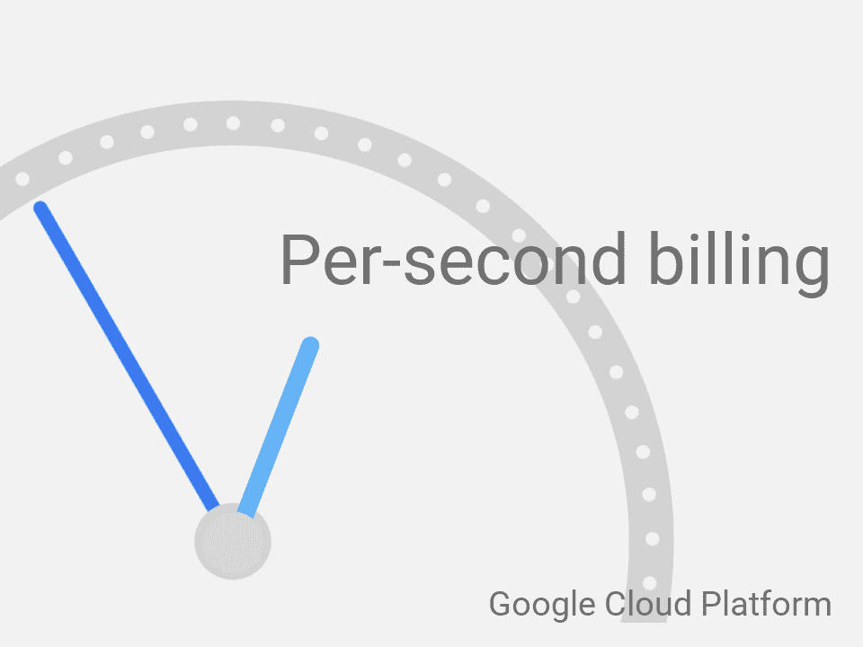

# 本周在谷歌云——“每秒计费？搞定了。还有:# Java 8 gae # k8s 18 # Abseil # nested virt # cloud IOT……”

> 原文：<https://medium.com/google-cloud/this-week-in-google-cloud-per-second-billing-743ccec52479?source=collection_archive---------1----------------------->

本周，GCP 发布公告的步伐显然没有放缓:

*   “[延长**秒计费**在谷歌云](http://goo.gl/ZcfQ52)”(谷歌博客)。立即生效！请务必阅读“ [**”承诺的谷歌计算引擎使用折扣**](http://goo.gl/R4zSLd)【谷歌博客】。因为有效的云定价不仅仅是粒度计费。
*   [**Java 8 on App Engine 标准**环境现已普遍提供](http://goo.gl/fSaZwV)。再见白名单，你好 OpenJDK/Jetty！
*   "[谷歌容器引擎— **Kubernetes 1.8** 利用了为容器构建的云](http://goo.gl/1wMRWJ)(谷歌博客)。另见开源博客[公告](http://goo.gl/PsdJK9) (blog.kubernetes.io)和[与 docker](http://goo.gl/UwXb8g)(blog . docker . com)的关系。
*   “[宣布**云物联网核心**公测版](http://goo.gl/i4d69j)”(谷歌博客)，所有人都可以使用添加的新功能。
*   "[为 Google 计算引擎](http://goo.gl/cna6zx)引入**嵌套虚拟化**"因为我们都想更深入！适用于所有 Linux 计算引擎虚拟机(Google 博客)
*   [通过 **Data Studio 社区连接器**](http://goo.gl/VS2m4m) 访问您的所有数据。已经有 50 多个连接器可用(谷歌博客)
*   [**PHP 7.1**for Google**App Engine**一般都有](http://goo.gl/A2u63B)。使用 Composer 启用任何稳定的 PHP 扩展(Google 博客)
*   “介绍 **Abseil** ，一个新的公共图书馆项目”——goo.gl/9sWM3h(谷歌博客)。Google 运行的基础和高度优化的 C++和 Python 库。
*   “[现在直播:**云架构师认证在线实践考试**](http://goo.gl/Ce7jYR)”(谷歌博客)
*   [欢迎 **Bitium** 来到谷歌云](http://goo.gl/EFt5Ed)。

然而，更多的公告，这一次是与**合作伙伴**:

*   "[谷歌云平台上的 SAP 新认证和更多](http://goo.gl/Sy7L1j)"(谷歌博客)。也请查看 GCP SAP HANA 入门视频(YouTube . com)。
*   [通过项目 Calico 和 Tigera](http://goo.gl/f5ZmKu) 引入对 Google 容器引擎的网络策略支持。轻松指定集群中允许的连接(Google 博客)
*   “[宣布 Elastic Cloud 在谷歌云平台(GCP)上正式发布，提供更多托管 Elasticsearch 的选项](http://goo.gl/MhmYyP)”(elastic.co)
*   不是公告，但仍然是非常有用的东西——“[GCP 播客#96 Avere](http://goo.gl/JpXNDj) 与戴夫·埃利奥特和斯科特·杰肖内克”(gcppodcast.com)
*   “[无限数据和即时交互可视化的美丽新世界](http://goo.gl/NyWe4G)”(zoomdata.com)

来自我最喜欢的“ **GCP 用户**最会说平台”部门:

*   我们如何在 GCP 和云扳手上建立一个全新的银行:闪耀(谷歌博客)
*   [Google Cloud Data prep——数据处理变得更简单](http://goo.gl/h8jx2Q)(medium.com)
*   [ad cash——每月 1 万亿次 HTTP 请求](http://goo.gl/ayQcVn)(highscalability.com)

来自“工作方式”部门:

*   [深度学习的基因组血统推断](http://goo.gl/734gyq)(谷歌博客)。也在 github 上提供了详细的操作方法。
*   [通过云语音使音频可搜索](http://goo.gl/2zsoAo)(medium.com)
*   “如何在 20 分钟内在谷歌云上创建一个口袋妖怪 Twitter 聊天机器人”——[视频](http://goo.gl/BX1b6M)和 [github](http://goo.gl/YEhwMH) 。

来自“不是正式的白皮书，但非常接近”部门:

*   "[为什么 SQL 打败了 NoSQL，这对数据的未来意味着什么](http://goo.gl/4Uj6F3)"(blog . scale . com)。我们称之为 NewSQL。#扳手。
*   "[流 SQL 的基础](http://goo.gl/xEMZpF)"来自最近纽约 Strata 大会(slides.google.com)的演讲

来自国际基督教青年会部门:

*   [GA] [验证计算引擎实例的身份](http://goo.gl/6UWKaJ) (GCP 文档)
*   【测试版】[云数据流区域端点](http://goo.gl/5HEQUG) (GCP 文档)
*   了解 IAM 自定义角色 (GCP 文档)

本周图为“按秒计费”[公告](http://goo.gl/ZcfQ52):

这星期到此为止！