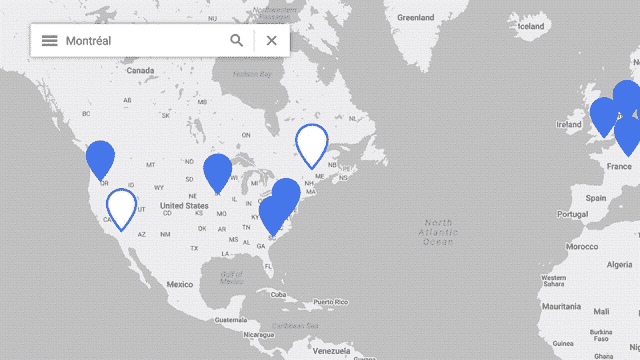
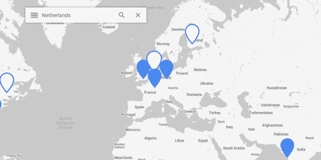

# 本周在谷歌云平台——“每季度 10 亿美元，两个新地区，以及 WordPress @ Google”

> 原文：<https://medium.com/google-cloud/this-week-in-google-cloud-platform-1-billion-per-quarter-two-new-regions-and-wordpress-63b34a6fc50a?source=collection_archive---------1----------------------->

在过去的一周里，谷歌已经开始披露其云收入，并且“ [( *谷歌)称其云现在每季度带来 10 亿美元的收入【cnbc.com*](http://goo.gl/D93LFX)

与此同时，两个新数据中心的投资并没有放缓:

*   [谷歌云平台在荷兰开设区域](http://goo.gl/GVr3sn)(谷歌博客)
*   [GCP 抵达加拿大，启动蒙特利尔地区](http://goo.gl/qQthgn)(谷歌博客)

在安全方面，以下是每周更新:

*   [使用云 IAM 自定义角色的细粒度安全性](http://goo.gl/GrqU6c)(谷歌博客)
*   [使用凡赛堤来确保你的谷歌 Kubernetes 引擎集群更新了“Meltdown”和“Spectre”](http://goo.gl/BbbDta)(谷歌博客)
*   [用户账户、授权和密码管理的 12 个最佳实践](http://goo.gl/XBVLm6)(谷歌博客)

假设每个人都把安全放在第一位，成本可能紧随其后，这意味着罗明·伊拉尼的这篇详细文章对许多人来说会很有用——“控制和了解你的成本的*】”(rominirani.com)*

*#marketplace: [Orbitera 和 MobileIron 联手，让在云中买卖应用变得更加容易](http://goo.gl/TuoHLg)(谷歌博客)*

*来自“BigQuery 仍然很棒”部门:*

*   *如何在 BigQuery 中实时处理气象卫星数据(谷歌博客)*
*   *[在 Kaggle 上学习使用 Python 分析巨大的 BigQuery 数据集](http://goo.gl/rpgygi)(medium.com)*
*   *[BigQuery 性能提示:搜索文本的速度提高了 8 倍—“越低()越慢”](http://goo.gl/ERyWk7)(medium.com)*

*如果你喜欢。NET 应用向云的迁移是一个接受云原生原则的机会，这里有一篇关于白皮书和 github 回购的文章*

*如果你对 Kubernetes 的历史、它的发布节奏、SIGs 以及更多内容感兴趣，我会鼓励你去读一读有据可查的“ [*《跟上 Kubernetes*](http://goo.gl/Ji9CQ8) 的全职工作》，它涵盖了软件和项目(gravitational.com)*

*本周的 GCP 播客(第 112 集)是与 percy.io 创作者 Mike Fotinakis 的[对话。](https://goo.gl/aUyWNB)*

*来自“战壕里的 Istio”部门:*

*   *Istio 0.5 发布(github.com)*
*   *[消费外部 Web 服务](http://goo.gl/Be3c6H) (istio.io)*

*来自“如果你错过了(ICYMI)”部门:*

*   *基于现有实例创建实例模板 (GCP 文档)*
*   *[Beta] [基于堆栈驱动程序监控指标的扩展](http://goo.gl/Q5kAjQ) (GCP 文档)*
*   *(我们正在招聘！)(medinathoughts.com)*
*   *[粒子——谷歌云平台集成](http://goo.gl/sSVmey) (particle.io)*
*   *[Apache Beam 降低大数据处理技术的准入门槛](http://goo.gl/63a24j)(oreilly.com)*

*本周的图片展示了我们在蒙特利尔和荷兰的两个新数据中心:*

****

*这星期到此为止！亚历克西斯*