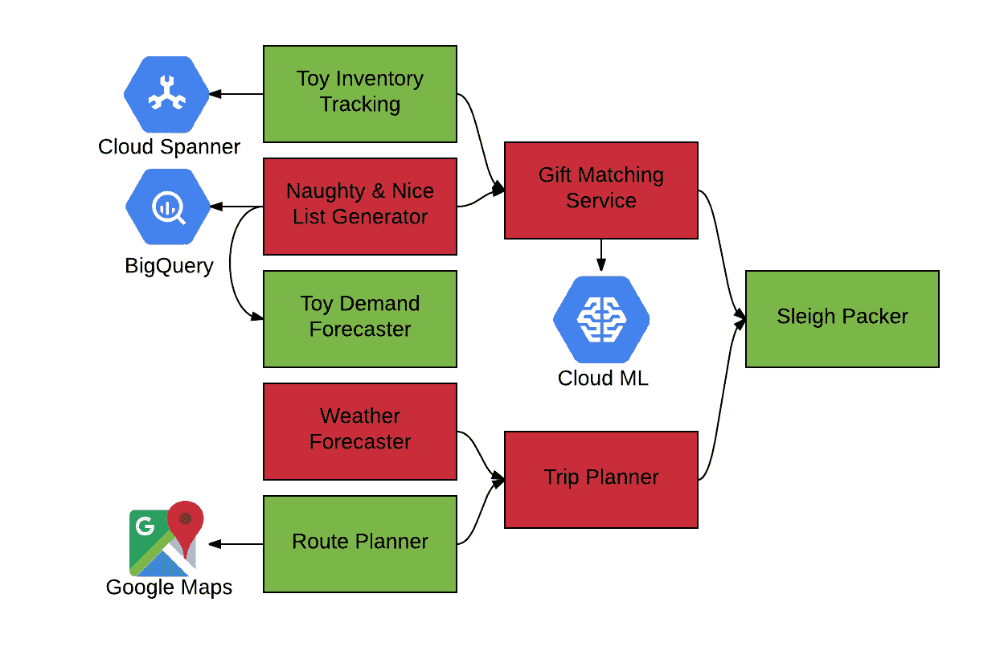

# 本周在谷歌云平台——“一份北极报告，谁对我的 GKE 做了什么，以及 2018 年成吨的篮球数据”

> 原文：<https://medium.com/google-cloud/this-week-in-google-cloud-platform-a-north-pole-report-who-did-what-to-my-gke-and-tons-of-d82f84d11aa9?source=collection_archive---------4----------------------->

我谨代表谷歌云的所有人，祝大家 2018 年快乐、健康、成功！无论您是休长假还是有足够的时间庆祝新年，您都有机会从来自北极的报道开始，了解两周的 GCP 新闻— *"* [*来自北极运营部的问候！所有系统启动！*](http://goo.gl/fPKQym)*(谷歌博客)。*

*来自“是的，您不在时，我们有一些公告和新闻”部门:*

*   *[NCAA 与谷歌云合作](http://goo.gl/RXVrrp)(谷歌博客)# big query # Cloud spanner # data lab # m engine # data flow*
*   *Kubernetes 引擎云审计日志记录简介— [谁在何时何地对您的 GKE 集群做了什么？](http://goo.gl/Whvm7Q)(谷歌博客)*
*   *[谷歌助手 SDK——新语言、API 更新和设备动作](http://goo.gl/S8QYqy)(谷歌博客)*
*   *[介绍 kube flow——一个为 Kubernetes](http://goo.gl/mYDgZT)(blog . Kubernetes . io)构建的可组合、可移植、可扩展的 ML 堆栈*
*   *[TensorFlow 1.4 中的新功能:将 Keras 模型转换为 tensor flow 估算器](http://goo.gl/s2sjgr) (Google 博客)*

*来自“2017 年回顾与 2018 年展望”部门:*

*   *多好的一年啊！2017 年谷歌云平台 (GCP 博客)#基础设施#安全#开放#创新*
*   *[Firebase 年终总结大汇演！](http://goo.gl/FWuGDE) (Firebase 博客)*
*   *[一年的云性能图谱](http://goo.gl/bk4D5F)(谷歌博客)# Top5 #性能提示*
*   *[谷歌云平台技术基础设施负责人(Urs Holzle)谈云的未来](http://goo.gl/UyUtnN)(cloud.withgoogle.com)#历史#安全#未来*
*   *萨姆·拉姆奇谈论谷歌云的开发者经验*

*来自“你可能会学到一两件事，并与你的朋友和同事分享”部分:*

*   *在 GCP 上开发优秀应用的开发者工具包*
*   *谷歌计算引擎入门:所有指南的指南*
*   *【news.ycombinator.com】[打破关于 BigQuery](http://goo.gl/rjHUyb) (谷歌博客)和[黑客新闻](http://goo.gl/8FbVBa)的神话*

*来自“直接来自谷歌的精心制作的解决方案”部门:*

*   *[机器学习数据集中敏感数据的考虑事项](http://goo.gl/b1hiJ3)(谷歌文档)*
*   *[通过无服务器机器学习提高服务台的效率](http://goo.gl/E5WMk5)(谷歌博客)*

*来自“以防你错过(ICYMI)”部门:*

*   *【Beta】[云 Dataproc 最小 CPU 平台](http://goo.gl/jHdJrA)*
*   *[GA] [云 Dataproc 优雅退役](http://goo.gl/DQEcgM)*
*   *[GA] [云 Dataproc 单节点集群](http://goo.gl/W6vceG)*
*   *[GA]堆栈驱动程序错误报告解决状态— [查看错误](http://goo.gl/JvrLFQ)、[管理错误](http://goo.gl/3VRvqc)*
*   *私有 VIP 的协议转发(又名目标实例)。使用单个目标实例部署服务，不进行负载平衡，并将其扩展到多个实例，而无需更改 VIP 的 IP 地址。*
*   *【GA】[云 ML 引擎—在线预测 GA](http://goo.gl/Tndk4X) 。将训练有素的机器学习模型应用到世界任何地方的应用和服务器上！*
*   *【GA】[云 Bigtable 在东京地区可用](http://goo.gl/voGVBJ)*
*   *GCR 现在允许用户推拉清单和 OCI 图片*

*来自“称之为人工智能、人工智能或深度学习，它在 2017 年取得了巨大的进步”部门:*

*   *[2017 年人工智能与深度学习——一年回顾](http://goo.gl/73TCtt)(wildml.com)*
*   *[谷歌视频智能——近实时识别演员](http://goo.gl/qnP8Px)(springml.com)*

*最近加入 GCP 开发者权益团队的前 Docker 工程师 David Gageot 发布了几个帖子:*

*   *[谷歌云壳教程](http://goo.gl/LCxA6E)*
*   *[扫描 Docker 镜像中的漏洞](http://goo.gl/i2hWsQ)*

*来自“客户和合作伙伴让我惊喜不断”部门:*

*   *【github.com 谷歌云平台上的 Pivotal Cloud Foundry quick start*
*   *[PowerfulSeal，Kubernetes 集群的强大测试工具](http://goo.gl/MTtBo2)(github.com)彭博*
*   *[整合 12 天——谷歌云平台](http://goo.gl/dFm6zL) (blog.sentry.io)*
*   *[从众多项目中脱颖而出:在 Catalant](http://goo.gl/qTRXBa) (谷歌博客)使用詹金斯、GCP 项目和服务账户*
*   *[学会可靠地操作 Kubernetes](http://goo.gl/GGJ6tg)(stripe.com)*

*来自“您可能会发现有用的几篇文章”部分:*

*   *[认识 Spinnaker:终极多云部署工具](http://goo.gl/1AjC3M) (thenewstack.io)*
*   *[谷歌云平台的秘方:现在是它的时间](http://goo.gl/E9GwSL)(infoworld.com)*
*   *【Kubernetes 避免 OpenStack 式炒作循环的 7 种方式 (thenewstack.io)*

*来自“medium.com 上 GCP 文章的几个深度剖析”部门:*

*   *[了解 kubernetes 网络:入口](http://goo.gl/bzJjNU)*
*   *[给安全管理员的 12 份礼物](http://goo.gl/2RbzbB)*
*   *[Kubernetes 负载测试云功能](http://goo.gl/DDZRyp)*

*最后， [GCP 小贴士(@gcptips)](http://goo.gl/eAA6CP) 假期保持强势，看看吧！*

*本周图片来自[北极报道](http://goo.gl/fPKQym):*

**

*扣好安全带，奔向 2018 年！*