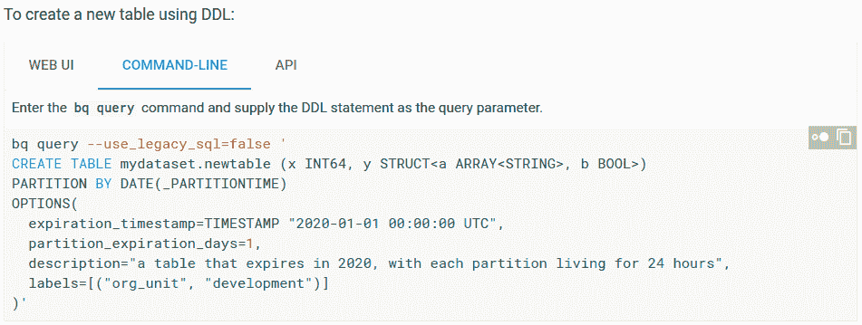

# 本周在谷歌云平台——“AutoML all things，OpenCensus，以及更多海底电缆”

> 原文：<https://medium.com/google-cloud/this-week-in-google-cloud-platform-automl-all-the-things-opencensus-and-more-subsea-cables-975bcae32ad3?source=collection_archive---------2----------------------->

如果你仔细听的话，你应该已经听说过 AutoML。谷歌现在推出了“ [*Cloud AutoML:让每个企业都可以使用人工智能*](http://goo.gl/V2iSaE) ”。GCP 现在正在提供机器学习方法的梯度。也看看这个 GCP [的播客采访](http://goo.gl/zdE7pE)。

Google 开源博客介绍了“ [*OpenCensus:一个统计数据收集和分布式追踪框架*](http://goo.gl/Z1JVrY) ”。OpenCensus 目前支持 Prometheus、SignalFx、Stackdriver 和 Zipkin。

谷歌投资了多少海底电缆，这对 GCP 用户有什么影响？在“ [*利用新区域和海底电缆扩展我们的全球基础设施*](http://goo.gl/f4UPdK) 中寻找答案

来自“以防你错过(ICYMI)”部门:

*   [防止虚拟机意外删除](http://goo.gl/o2xMdY)
*   云扳手[ADO.NET 图书馆现已投入生产](http://goo.gl/sfgZgQ)
*   【开源】[容器结构测试:Docker 图像的单元测试](http://goo.gl/2WZMtz)
*   【发布说明】[云数据处理器:新的区域，永久固态硬盘启动盘，以及更多](http://goo.gl/fjymzY)
*   【AI 奇遇记】 [Datalab:云中笔记本](http://goo.gl/XpkyYX)

来自“BigQuery DDL 和调度”部门:

*   [BigQuery 数据定义语言](http://goo.gl/jgXySz)支持已经登陆测试版(来自 [BigQuery 发布说明](http://goo.gl/FS3rqU))
*   如何用 Dataprep 调度一个 BigQuery ETL 作业[(medium.com)](http://goo.gl/gAKKSi)
*   [调度 BigQuery 作业:这次使用云存储&云功能](http://goo.gl/iVBqSq)(shinesolutions.com)

来自“神奇的 GCP 客户增加开源价值”部门:

*   Scio 是用于 Apache Beam 和 Google Cloud Dataflow 的 Scala API，它有一个由 Spotify 提供的 [Alpha 0.5 版本](http://goo.gl/KV5nPg) (github.com)，对输入的 BigQuery 读取速度提高了 2 倍
*   利用奥卡多科技公司的 GCP 人口普查分析你的 BigQuery 使用情况
*   与 Kubeless 和 Istio(engineering.bitnami.com)的[无服务器服务网](http://goo.gl/ZKXdhy)

来自“操作方法和实践”部门:

*   【解决方案】[在 Kubernetes 引擎中运行专用游戏服务器:教程](http://goo.gl/cmPXUT)
*   【解决方案】[使用 Concourse](http://goo.gl/zixwR7) 在 Kubernetes 引擎上连续交付舵图
*   [解决方案] [通过全局负载平衡优化应用容量](http://goo.gl/qfD5tP)。同样以[教程格式](http://goo.gl/CyL7gv)。
*   [我用谷歌产品和 API 入侵 Firebase 的冬天](http://goo.gl/vbkxFm)(medium.com)
*   [如何在 CodePen](http://goo.gl/kzg7Nq) (blog.codepen.io)上建立无服务器博客
*   [白皮书:踏上从单片到微服务的旅程](http://goo.gl/Sndrkx)(谷歌博客)。使用 PetShop 并附带 GitHub repo。

来自“您对这些漏洞了解得越多”部分:

*   [GCP 播客#110 马特·林顿和保罗·特纳的 CPU 漏洞安全](http://goo.gl/YeGna9)
*   [一个 22 岁的人如何发现历史上最严重的芯片缺陷](http://goo.gl/Wfxtmf)

本周图片摘自 [BigQuery DDL beta 文档页面](http://goo.gl/jgXySz):

这星期到此为止！亚历克西斯