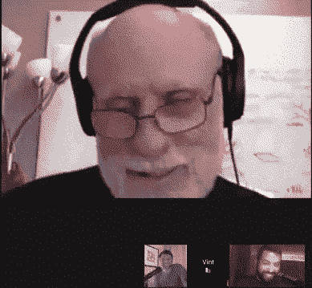

# 本周在谷歌云平台——“更好的 DLP、Ruby love、BigQuery+Stackdriver 和安全性推动云的采用”

> 原文：<https://medium.com/google-cloud/this-week-in-google-cloud-platform-better-dlp-ruby-love-bigquery-stackdriver-and-security-2ebd56b0de0a?source=collection_archive---------0----------------------->

你好谷歌云内部人士，

第 42 周！希望你能找到你一直在寻找的所有答案…

[通过智能日志分析加快 BigQuery 解决方案的开发](http://goo.gl/7o3BxJ)。 **Stackdriver + BigQuery =💕**

[使用**数据丢失防护 API**](http://goo.gl/Jri5VF) 管理敏感数据的新方法。通过分桶、K-匿名和 L-多样性技术提供更多的数据去识别能力。

现在，你可以用 Stackdriver 来监控、调试和记录你的 **Ruby 应用。在过去 18 个月左右的时间里，艾捷拉和其他人已经为 ruby 爱好者取得了很大的进步。**

[事实证明，**安全性推动了云的采用** —而不是相反](http://goo.gl/mVg2os)。分享当前业务和 IT 领导心态的云采用报告。也看看这些[短片和最近的 GCP 安全相关视频](http://goo.gl/mefm3Y)。

[**21 个新的开源解决方案**可从 Google Cloud Launcher](http://goo.gl/Fpz8Zk) 获得。卡夫卡、詹金斯、德鲁巴等等。

来自“在朋友的帮助下四处走走”部门:

*   [选择将大型数据集转移到谷歌云平台的最佳方式](http://goo.gl/RjhwCF)(cloud.google.com)
*   [探索谷歌云数据实验室中的张量流样本](http://goo.gl/Jd2Ckg)(谷歌博客)
*   [利用无服务器和谷歌云功能构建图像识别终端](http://goo.gl/RyzgBc)(serverless.com)
*   [使用谷歌云物联网核心和 mongoseeos](http://goo.gl/6nvZoH)(medium.com)建立气象站
*   [让我们谈谈 Google Home、CircleCI 和 Google Container Engine](http://goo.gl/eavaV4)(medium.com)的部署
*   [App Engine Flex ||容器引擎](http://goo.gl/FW9dzk)？(medium.com)
*   [Istio——服务网络……说什么？！](http://goo.gl/tUnYqx)(谷歌幻灯片)

来自“我们有一段时间没有 Kubernetes 综述”部门:

*   [推出 Kubernetes 软件认证](http://goo.gl/XQBMqK) (blog.kubernetes.io)
*   【blog.docker.com】Docker 平台和莫比项目增加 Kubernetes
*   使用自定义资源定义扩展 Kubernetes 的介绍(medium.com)
*   [Kubernetes 金丝雀部署🐤为凡人](http://goo.gl/zd6WKU)(blog.dockbit.com)
*   [凯尔西的涂鸦教程](http://goo.gl/HbTDRT)(github.com)

来自“顾客对 GCP 的最佳评价”部门:

*   回顾我们从裸机到 GCP 的迁移:哨兵
*   [Spotify 的大数据处理:通往 Scio 之路(第一部分)](http://goo.gl/LfdU8A)(labs.spotify.com)

来自“ICYMI in docs”部门:

*   [云端点配额](http://goo.gl/zdgfg5)
*   [HTTP 云端认证功能教程](http://goo.gl/6LxxEv)
*   [为虚拟机实例指定最低 CPU 平台](http://goo.gl/tvQbkd)

本周的 GCP 播客(#00099)是大卫·伊斯特(gcppodcast.com)关于云功能和 Firebase 托管的对话

来自“并非严格意义上的云相关，但非常酷”部门:

*   谷歌助手中的 WaveNet 启动(deepmind.com)
*   [宣布 AVA:一个用于人类动作理解的精细标记的视频数据集](http://goo.gl/Hee3Hy)(谷歌研究博客)

本周照片宣布了 GCP 播客与温顿·瑟夫的第 100 集。请务必在周三收听([gcppodcast.com](http://gcppodcast.com/))！

这星期到此为止！亚历克西斯