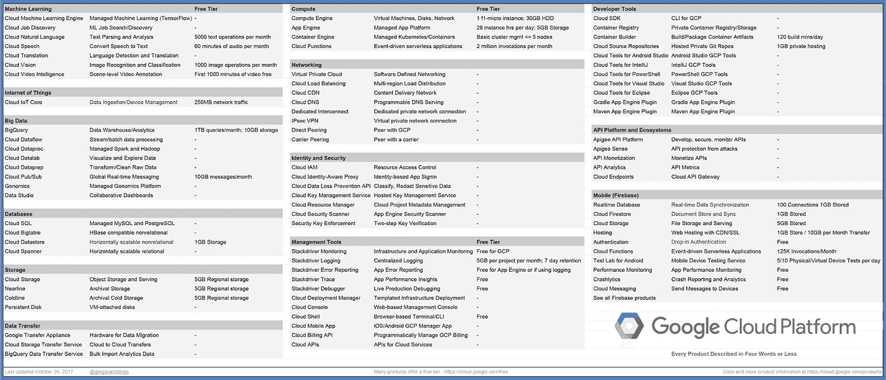

# 本周在谷歌云平台——“思科合作伙伴关系，应用引擎 1.8，100 个 GCP 播客集，以及 4 个字以内的 GCP 产品回归”

> 原文：<https://medium.com/google-cloud/this-week-in-google-cloud-platform-cisco-partnership-go-1-8-2bf1adcbdd1f?source=collection_archive---------0----------------------->

以下是过去一周的产品和合作公告:

首先，继最近的 Java 8 GA 发布之后，本周又发布了另一个应用引擎标准，这次是应用引擎标准的[**Go 1.8 Go GA**](http://goo.gl/D8Ecba)。查看[发布说明](http://goo.gl/H3sg67)。

**思科和谷歌**宣布在新的**开放式混合云解决方案**上建立重要的合作伙伴关系，GCP、Kubernetes、Istio 和 Apigee 都在其中发挥了核心作用。谷歌博客上的大量细节。

**Data Studio** 现在提供[更多的可视化和分析功能](http://goo.gl/q5KjvC)。数据透视表、协调颜色、抽样指示器等等。查看帖子，了解在哪里提交和投票支持 Data Studio 的新功能。

来自“操作方法”部门:

*   [为客户设计 GCP 政策的三种不同解决方案](http://goo.gl/JWhPq7)(企业、创业、教育)(谷歌博客)
*   [给你的 iOS 应用添加计算机视觉](http://goo.gl/jw2HKc)(medium.com)
*   [谷歌云机器学习引擎:聪明人的指南【techrepublic.com ](http://goo.gl/2xfM9e)

来自我最喜欢的“顾客对 GCP 的最佳评价”部分:

*   [我们如何使用 Consul 和 ZeroTier 迁移到谷歌云(零宕机)](http://goo.gl/vEM5fq)(tech.channable.com)
*   [Spotify 的大数据处理:通往 Scio 之路(第二部分)](http://goo.gl/kRyJQQ)(labs.spotify.com)
*   纽约时报— [改善我们的视频体验](http://goo.gl/kPrmHs)(open.nytimes.com)
*   [ECDPM 使用谷歌应用程序和谷歌云平台获得更有效的政策建议](http://goo.gl/uu2Fo5)(cloud.google.com)

来自“自从我们有了一个大查询综述以来已经有一段时间了”部门:

*   [了解你的树:美国林务局(FIA)的数据集现在可以在 BigQuery](http://goo.gl/57T4H6) (谷歌博客)中找到
*   使用 Bokeh 和 BigQuery 创建定制的交互式仪表盘
*   【zulily-tech.com】zu flow-Google big Query 的查询工作流程和时间安排
*   [2017 年谁对开源贡献最大？](http://goo.gl/P5Ms7M)让我们分析 GitHub 的数据，找出答案(当然有 big query)(medium.freecodecamp.org)

更多公告:

*   Halite 帮助学生和开发者在谷歌云平台上竞争构建更好的人工智能
*   [谷歌和 Puppet strike 达成合作协议，旨在简化向云的迁移](http://goo.gl/jb7gwy)(geekwire.com)
*   [宣布 OpenFermion:量子计算机的开源化学包](http://goo.gl/xrvCzp)(谷歌博客)。我们离量子计算越来越近，一步一个脚印。

来自“以防你没有密切注意”部门:

*   对 Kubernetes 版本 1.8.1 的 GKE 支持现已推出，发布说明见[此处](http://goo.gl/S547GF)(cloud.google.com)
*   [谷歌云数据流模板](http://goo.gl/T7xQU1)(cloud.google.com)
*   [cloud.google.com GCP node . js 更新页面](http://goo.gl/oaVrs5)
*   [谷歌云互联文档](http://goo.gl/yqXEsE)(cloud.google.com)
*   [Beta] [租赁单位 API](http://goo.gl/eVNnoZ) (帮助您向客户提供多租户服务)(cloud.google.com)

正如上周宣布的那样， **GCP 播客庆祝了其第 100 集**，其中有[对温顿·瑟夫](http://goo.gl/iGHmpF)(gcppodcast.com)的采访和[关于其顶级剧集的博客文章](http://goo.gl/sh84Ew)(谷歌博客)。

[**用不超过 4 个字描述的 GCP 产品**](http://goo.gl/xsjSvD) 又回来了，现在更新了 Firebase 和自由层信息(medium.com)

本周图片是 Greg Wilson 的[“用不超过 4 个字描述的 GCP 产品”](http://goo.gl/xsjSvD)

这星期到此为止！亚历克西斯