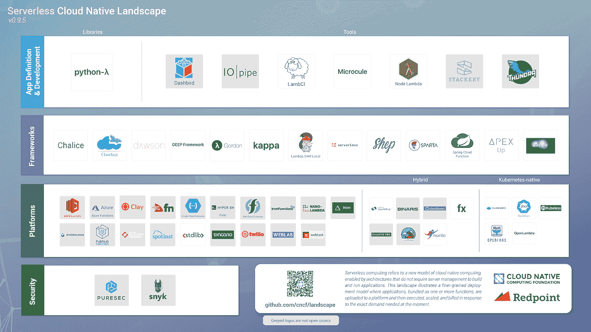

# 本周在谷歌云平台——“云 TPUs，GKE 上的 GPU，96 vCPU，和一个无服务器的景观图”

> 原文：<https://medium.com/google-cloud/this-week-in-google-cloud-platform-cloud-tpus-gpus-on-gke-96-vcpu-and-a-serverless-landscape-2ec95d726e01?source=collection_archive---------0----------------------->

在过去的一周里，GCP 释放了关键的性能驱动因素，有些人会说是游戏规则改变者:

*   【测试版】 [**云 TPU** 机器学习加速器现已推出测试版](http://goo.gl/cfGPtB)(谷歌博客)。通往 TPU 豆荚之路的一个重要里程碑。
*   [GA] [**96 个 vCPU** 计算引擎实例现在已经普遍可用](http://goo.gl/hzycoQ)(谷歌博客)。我想知道，这一切会在哪里结束？
*   Kubernetes 引擎中的[Beta][**GPU 现已在 beta**](http://goo.gl/yXbrZv) (谷歌博客)中提供。" *Kubernetes 引擎应用污染和容忍技术，以确保只有请求 GPU 的 pod 才会被调度到具有 GPU 的节点上，并防止不需要 GPU 的 pod 在其上运行*
*   【Alpha】[充分利用谷歌 **Kubernetes 引擎**与**优先级和抢占**](http://goo.gl/JEgT6B) (谷歌博客)。很快，在生产集群上运行大规模 Hello World 所需的一切都准备就绪了！

与 Kubernetes 呆在一起， [Pivotal Container Service 最近已经达到 GA](http://goo.gl/ay3jty) (pivotal.io)。GCP 与众不同之处在于它与 GKE 教的兼容性。

CNCF 正在考虑无服务器计算(通过其工作组),并发布了一份白皮书和一份景观图。

“ [*在我们的基因中:谷歌云如何帮助远大研究院大幅削减研究成本*](http://goo.gl/WkpnQi) ”(谷歌博客)。你现在可以以每基因组 5 美元(低于 45 美元)的价格运行 germline GATK 最佳实践管道。迄今处理了 76k 个基因组，在 GCP 上存储了 36PB 的数据。

来自我们的“以防您错过(ICYMI)”部门:

*   [谷歌宣布有意收购 Xively](http://goo.gl/BmprS3) (谷歌博客)#IoT
*   [熟能生巧:专业数据工程师实践考试现已上线](http://goo.gl/v6FfFj)(谷歌博客)
*   [介质上的张量流(占位符！)](http://goo.gl/8ixEm3)(medium.com)
*   关于如何创建谷歌云外壳教程的教程(github.com)
*   [Vault 0.9.4 将支持 Google Cloud Spanner 作为高可用性的存储后端！](http://goo.gl/eU5uVP)(github.com)
*   Windows 上的[Istio+Kubernetes](http://goo.gl/YiZt2a)(meteatamel.wordpress.com)
*   “CloudEvents 是一个供应商中立的规范，用于定义事件数据的格式”: [CloudEvents —版本 0.1](http://goo.gl/5Axyxi)(github.com)
*   [Alpha] [基于基于队列的工作负载的扩展](http://goo.gl/fnRQJQ) (Google 文档)
*   [云数据流和 Apache Beam 模板](http://goo.gl/Y433m8)(github.com)

本周的 [GCP 播客(#114)是关于“*机器学习的偏见和公平*](http://goo.gl/XxVXJG)*”*蒂姆尼特·格布鲁和 gcppodcast.com

本周的图片是 [CNCF 的无服务器景观](http://goo.gl/sgrJ8k):

这星期到此为止！亚历克西斯