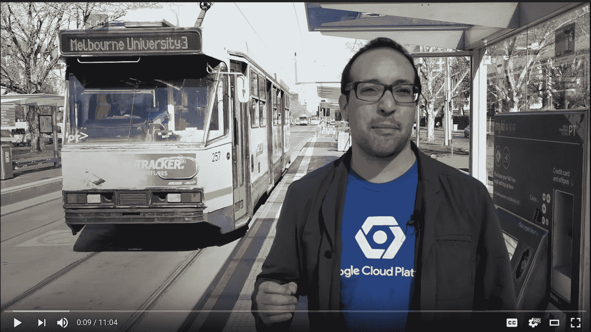

# 本周在谷歌云平台——“data proc HA、TensorFlow 1.5、Kaggle Learn、更好的云壳教程”

> 原文：<https://medium.com/google-cloud/this-week-in-google-cloud-platform-dataproc-ha-tensorflow-1-5-c1fafefcb1f8?source=collection_archive---------0----------------------->

**Cloud Dataproc** 现在提供完全支持的 **HA 集群**(YARN 和 HDFS 都没有 SPOF)以及 SSD 持久磁盘，用于那些具有大量读写的工作负载。在“ [*更新云数据以获得更快的速度和更大的弹性*](http://goo.gl/iUS9Us) ”(谷歌博客)中有完整的细节

[**TensorFlow 1.5** 在此](http://goo.gl/36N3LB)(谷歌博客)。它包括作为预览版的渴望执行，附带 TensorFlow Lite 的开发者预览版，并增强了 GPU 加速。

[**ka ggle Learn**](http://goo.gl/xx6qzS)(kaggle.com)是一项新服务，提供交互式教程笔记本，教授新用户机器学习、深度学习和数据可视化。它使用 Kaggle 内核，只需轻轻一点，就能提供 GCP 托管的 Jupyter 笔记本。

在最近增加的教程功能的基础上，看看云壳现在如何能够将教程直接交付到 GCP 控制台:“ [*云壳教程:集成到云控制台的学习体验*](http://goo.gl/gvG5cX) ”(谷歌博客)

下一个片段有点长，但它涵盖了很多关于通过 UX 赋予人工智能目的的内容:“ [*人工智能的 UX*](http://goo.gl/Aq7ndU)”(design . Google)

来自“全方位最佳实践”部门:

*   良好的数据采样是困难的，这份新白皮书讨论了云数据流中的复合转换-“云数据流中更快采样的关键*”(谷歌博客)*
*   *这里有一个循序渐进的教程，展示如何使用[让我们在谷歌 Kubernetes 引擎集群上加密](http://goo.gl/c2z5Xb)(github.com)*
*   *[GCS 桶的安全建议](http://goo.gl/QrgVwq)(thagomizer.com)*
*   *[使用运行时配置器管理配置变量的谷歌云功能最佳实践](http://goo.gl/LXAsis)(medium.com)*
*   *[gRPC-Go 工程实践](http://goo.gl/Yextww) (grpc.io)*
*   *[用云函数仔细计算谷歌云存储的存储桶大小&Pub/Sub](http://goo.gl/xUZ6hL)(blog.doit-intl.com)*

*来自“以防你错过(ICYMI)”部门:*

*   *[云数据流和电车挑战](http://goo.gl/BqJb5H)(youtube.com)*
*   *谷歌云平台上的[仙丹](http://goo.gl/5bywUL)(cloud.google.com)*
*   *【container-solutions.com 用谷歌 Stackdriver 监控 GKE 的集装箱*
*   *开源心理实验室(deepmind.com)——应用认知心理学的方法来研究受控环境中人工智能体的行为。*
*   *[Chrome 用户体验报告现在包括国家级的见解](http://goo.gl/NMEsdv)(谷歌博客)*
*   *[Spanner R——Google Cloud Spanner REST API 的 Go 客户端](http://goo.gl/ADEz5M)(github.com)*
*   *[Firebase:使用 Admin SDK 将数据迁移到云 Firestore](http://goo.gl/BnEaxw)(medium.com)*

*来自我最喜欢的“顾客对 GCP 的最佳评价”部分:*

*   *[向育碧新的个人游戏助手“山姆”问好](http://goo.gl/1iQuHV)(内含 GCP 自然语言和对话流)(news.ubisoft.com)*
*   *[我们(Incentro)如何利用机器学习 API、云发布/订阅和云功能构建无服务器数字档案](http://goo.gl/bcM5ut)(谷歌博客)*
*   *[万神殿移至谷歌云平台](http://goo.gl/f1gsg8) (pantheon.io)*
*   *[最好的码是无码！使用谷歌云的新自动化服务【shinesolutions.com ](http://goo.gl/QFyuyi)*
*   *[使用谷歌云平台获得 ya 音乐推荐服务！第二部分](http://goo.gl/TkCsGe)(shinesolutions.com)*
*   *[我们如何在 Travix 运行 Kubernetes 引擎](http://goo.gl/iffZ2Z) (travix.io)*
*   *[在谷歌云上运行 Windows](http://goo.gl/HBMe1m)(travix . io)*

*本周的 [GCP 播客第 000111 集](http://goo.gl/oXeCVd)是与 gcppodcast.com GCP 产品管理副总裁萨姆·拉姆奇的对话*

*本周的图片是 Felipe Hoffa 和 Graham Polley 的“[云数据流和电车挑战](http://goo.gl/BqJb5H)”视频:*

**

*这星期到此为止！亚历克西斯*