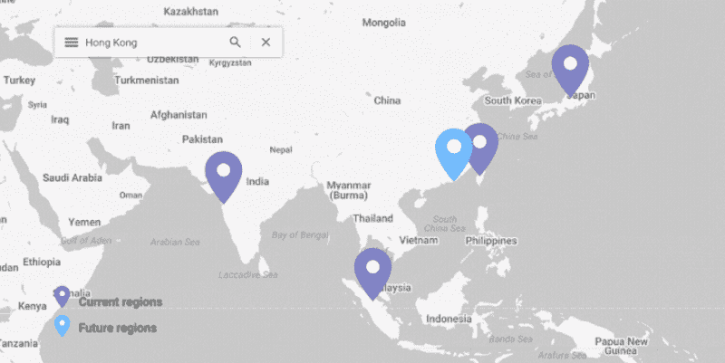

# 本周在谷歌云平台——“GCP 来港，更多 Skylake 用 perf libs，和俄罗斯 Twitter bots 用 Vision API 战斗”

> 原文：<https://medium.com/google-cloud/this-week-in-google-cloud-platform-gcp-coming-to-hong-kong-more-skylake-with-perf-libs-and-67c7026a9c82?source=collection_archive---------1----------------------->

上周的发布主要侧重于推出新的基础架构和性能:

*   [2018 年即将到来:GCP 香港特别行政区](http://goo.gl/TZPhh4)(分三个区)
*   [Skylake 处理器现已在七个地区上市](http://goo.gl/7sYQaS)(也包括价格下降)
*   [GPU 和可抢占的本地固态硬盘价格更低](http://goo.gl/kqWNua)(提醒人们它们有多灵活)
*   [英特尔性能库和 Python 分发版增强了 GCP 上英特尔至强可扩展(‘sky lake’)处理器的性能和可扩展性](http://goo.gl/9HVgLv)

Firebase 团队还宣布了多数据库支持(在单个项目中)

以下是当你的会议开始在 Twitter 上流行时会发生的事情(以及云视觉 API 可以如何帮助):[“Twitter 垃圾机器人:来自俄国的🧡”](http://goo.gl/51kkZZ)(linkedin.com)

Kelsey Hightower 的最新指南[是使用云容器构建器、GitHub 和多个 Kubernetes 集群](http://goo.gl/XfHh7a)(github.com)的端到端部署管道

来自“如果您没有关注关于 medium.com 的 GCP 出版物您可能应该关注”部门:

*   [谷歌的可观察性方法](http://goo.gl/3iBNvM)(medium.com)
*   [使用 Travis CI&Codecov](http://goo.gl/YXYQer)(medium.com)在 Google Kubernetes 引擎(GKE)上运行开发工具的基础设施代码(IaC)
*   [在 medium.com 的 GKE](http://goo.gl/RDm5oo) 使用跨项目的 GCR 图像
*   [使用 Keras 模型构建新张量流数据集和估计量的简单指南](http://goo.gl/YiQeQ7)(medium.com)
*   [Google Cloud Dataprep:由 Google Cloud Dataflow 驱动的电子表格风格的数据争论](http://goo.gl/4rqaBm)(medium.com)
*   美国风力最大的地方是犹他州(medium.com)

来自“您应该了解支持 Spring Boot 应用引擎标准的最新进展”部门:

*   dzone.com GCP 应用引擎:繁忙开发的 Spring Boot 指南
*   谷歌应用引擎上的 Spring Boot 代码实验室(g.co/codelabs)

来自“GCP 用户对 GCP 的最佳评价”部门:

*   【labs.spotify.com】T4
*   [后发制人:转向 GCP 支持电子商务包裹追踪的持续快速增长](http://goo.gl/WB9Qp2)(谷歌网站)

来自“Apache Beam 和云数据流加速”部门:

*   [从 lambda 到 kappa 和数据流范式](http://goo.gl/UVqfNy)(lethain.com)
*   [谷歌云数据流拯救数据迁移](http://goo.gl/3znFmZ)(blog.papercut.com)

来自“以防你错过(ICYMI)”部门:

*   [为区域托管实例组选择区域](http://goo.gl/tDMs91)

上周的 GCP 播客(#000104)涵盖了 GCP 最近的产品之一，目前处于测试阶段——[云数据准备，产品经理埃里克·安德森](http://goo.gl/cKuqkj)。

BigQuery 的工程主管 Jordan Tigani 是本期[软件工程每日一集](http://goo.gl/c1Xyyo)(softwareengineeringdaily.com)的嘉宾

本周图片来自[香港地区公告](http://goo.gl/TZPhh4):

GCP 来港

这星期到此为止！亚历克西斯