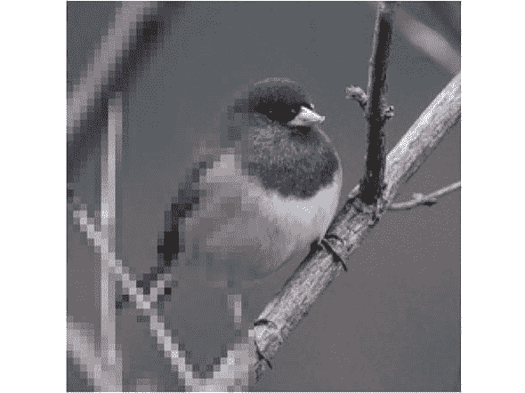

# 本周在谷歌云平台——“GCP 登陆印度，Firebase 峰会，势在必行 TensorFlow & v1.4.0”

> 原文：<https://medium.com/google-cloud/this-week-in-google-cloud-platform-gcp-lands-in-india-firebase-summit-imperative-tensorflow-b4898233fdf9?source=collection_archive---------1----------------------->

本周的大部分公告都是关于拉近 GCP 与你的距离:

*   随着**孟买地区** (谷歌博客)的[发布，GCP 已经抵达印度。这里有三个区域，包括 Skylake CPUs，都以印度卢比计价。](http://goo.gl/yhtRuq)
*   [**专用互联现已正式发布**，还有更多的位置](http://goo.gl/dNqR6x)(谷歌博客)。10 个位于北美，5 个位于 EMEA，7 个位于 APAC。
*   [**仙女座 2.1** (谷歌的软件定义网络堆栈)现在已经将 GCP 的区域内延迟降低了 40%](http://goo.gl/rLVua7) (谷歌博客)

在其他新闻中， **Firebase Dev 峰会**上周来到阿姆斯特丹，并发布了一系列公告，这些公告在本文中都有详细介绍(Crashlytics、A/B 测试和预测):[Firebase Dev 峰会 2017 的新内容](http://goo.gl/zi1LdK) (Firebase 博客)。所有[会议视频](http://goo.gl/6BYrJJ)现在也可获得(youtube.com)

从“从公告到面向所有人的实现的机器学习”部门:

*   [TensorFlow 1.4.0 在这里【github.com ](http://goo.gl/ybHQa4)
*   渴望执行:TensorFlow 的命令式运行定义界面
*   [揭秘 ML:机器学习如何用于语音识别](http://goo.gl/r2AW1S)(谷歌博客)
*   基于人工智能的上采样技术创造出低分辨率图像的高分辨率版本

来自“客户和合作伙伴对 GCP 的最佳评价”部门:

*   详细了解为什么 mabl 选择谷歌云平台(GCP)而不是 AWS(mabl.com)
*   [谷歌云平台上的 S/4HANA:多云好的、坏的、丑陋的](http://goo.gl/NfaAuP)(blogs.sap.com)
*   [GKE 是 Pozible 架构的基石，支持需求高峰&提供性能](http://goo.gl/hAbvK5)(谷歌云网站)

来自“容器编排及其他”部门:

*   [引入对 Google 容器引擎的网络策略支持，由项目 Calico 和 Tigera](http://goo.gl/qAgW1p) (Google 博客)
*   [Kubernetes 最简单的方法](http://goo.gl/YQTAK5)
*   [Istio 在快节奏的直白演示中！](http://goo.gl/Uu9dk5)(youtube.com)

来自“BigQuery 数据集、自动化和数据准备”部门:

*   谷歌专利公共数据集:连接公共、付费和私人专利数据(谷歌博客)。这篇文章提供了几个 BigQuery 示例查询和一些有趣的结果。
*   [使用 Google Apps 脚本调度 BigQuery 作业](http://goo.gl/9YYkQk)(shinesolutions.com)
*   [我对谷歌云数据报告的看法](http://goo.gl/KJYWWT)(medium.com)

GCP 播客[第 101 集涵盖云物联网核心](http://goo.gl/jsVXkJ)并有了新的永久主持人。看看吧！(gcppodcast.com)

本周图片摘自[基于人工智能的上采样文章](http://goo.gl/XtVyjb)(dpreview.com):

这星期到此为止！亚历克西斯