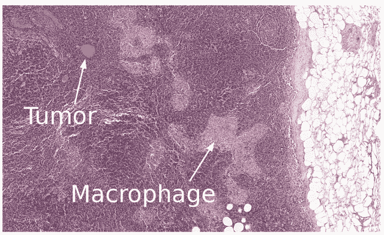

# 本周在谷歌云平台——“GKE 1.9 即将到来，强一致性的案例，杰夫·迪恩关于 2017 年人工智能”

> 原文：<https://medium.com/google-cloud/this-week-in-google-cloud-platform-gke-1-9-5593f7bb5ceb?source=collection_archive---------0----------------------->

了解 Cloud Spanner 如何管理强一致性、可线性化性、一致性、可串行化和最终一致性，以及“ [*为什么您应该尽可能选择强一致性*](http://goo.gl/su3U2U) ”。

12 月中旬发布的 Kubernetes 1.9 将通过早期访问计划在您附近的 GKE 发布。" [*有状态和 ML 工作负载现在在最新版本 1.9*](http://goo.gl/AtgH2y) 的 Google Kubernetes 引擎上运行得更好"(包含加入早期访问的链接)。帖子中还列出了一些 GKE 的特色。我的最爱——硬件加速器增强(GPU)。

由杰夫·迪恩领导的谷歌大脑团队有一个由两部分组成的“2017 年回顾”系列:[第一部分](http://goo.gl/s7XjrL)，和[第二部分](http://goo.gl/1bDxqJ)。多好的一年啊！！

在 Spectre 和 Meltdown 披露一周后，谷歌发布了以下后续帖子:“ [*保护我们的谷歌云客户免受新漏洞的影响，同时不影响性能*](http://goo.gl/16Uy3M) ”

来自我们在 GCP 提供 MongoDB 完全托管服务 Atlas 的朋友:“[*MongoDB Atlas 的新功能:在所有谷歌云平台区域的可用性*](http://goo.gl/KPM3ZT)”(mongodb.com)

来自“通勤者和其他人的播客”部门:

*   gcppodcast.com GCP 播客 [#108 Launchpad 工作室，玛丽卡·康托尔和彼得·诺威格](http://goo.gl/fYtZjD)
*   路易斯·瑞恩的动机(softwareengineeringdaily.com)

来自“以防你错过(ICYMI)”部门:

*   [Beta] [区域 DNS 名称](http://goo.gl/ac73tp)

本周的图片来自[杰夫·迪恩的谷歌大脑回顾帖子#2](http://goo.gl/1bDxqJ) ，它显示了深度学习如何帮助病理学家检测癌症:

这星期到此为止！亚历克西斯