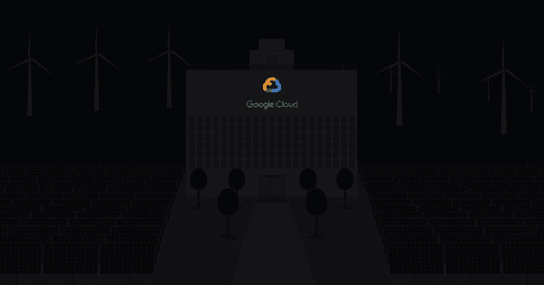

# 本周在谷歌云平台——“GKE 全面更新，G 套件调用 ML APIs，GCE 上的容器，100%可再生能源”

> 原文：<https://medium.com/google-cloud/this-week-in-google-cloud-platform-gke-updates-all-around-g-suite-calling-ml-apis-containers-d6f66b0be2d5?source=collection_archive---------3----------------------->

本周以一些定价新闻开始—“[*削减 Google Kubernetes 引擎*](http://goo.gl/4uB1sc) 上的集群管理费”，接着是针对您的 Kubernetes 集群的安全最佳实践—“[*使用 Kubernetes 引擎 1.8*](http://goo.gl/UaCqZm) *保护容器”“*# RBAC #最少特权#网络政策”。

和 GKE 在一起，我们有全新的 Google Kubernetes 引擎文档，包括新的概述、操作指南和面向任务的目录。告诉我们你的想法！

最后，Coursera 上也提供了[新的 GKE 课程](http://goo.gl/C8QjgK)！

另一方面，并不是每个人都使用 Kubernetes，所以这里有一种新的 VM 级容器部署方法—“[*介绍一种在 Google Compute Engine 虚拟机上部署容器的简单方法*](http://goo.gl/HCdq3C)”# containerooptimizedos # ManagedInstanceGroup。查看这些相关文档:[在虚拟机和托管实例组上部署容器](http://goo.gl/KR6JWG)，以及[配置选项来运行您的容器](http://goo.gl/X6Jw5j)。

桥接 G Suite 和 Cloud ML APIs 是一个常见的用例，也是一个常见的请求，所以这里是“ [*使用 Cloud 自然语言 API 和 Apps 脚本*](http://goo.gl/AFr8j7) *分析 Google 工作表中的文本”。*

来自“TensorFlow 很有趣，但有云更有趣”部门:

*   [在谷歌云平台上使用 Apache Spark 和 tensor flow](http://goo.gl/JnybX1)(谷歌博客)
*   [谷歌云提供了一种统一、简化的方式来执行你的 ML 战略](http://goo.gl/29XzBN)(谷歌博客)# data prep # data flow # data lab # big query # code lab
*   [视频] [无服务器机器学习:谷歌云初学者指南|布雷特·麦高恩&国玉峰](http://goo.gl/yC7Wmp) (acloud.guru)

来自“继续推进机器学习”部门:

*   与 DNN 共同应对共同挑战的新论文:“ [*用 SVCCA*](http://goo.gl/8rxpZV) 解读深度神经网络”(谷歌博客)。
*   弗朗索瓦·乔莱的“[智力爆炸的不可能性](http://goo.gl/nQ4Ghq)”(medium.com)

摘自“GCP 综述中的综述，我们必须更深入”一节:

*   【medium.com】一天一个 GCP 流程图
*   摄取、存储、处理和探索；这里有一个新的 GCP 解决方案:“ [*谷歌云平台上的数据生命周期*](http://goo.gl/kAAkD2) ”(谷歌网站)
*   [big query 中存储和计算的分离](http://goo.gl/sto3cu)(谷歌博客)
*   [利用抢先虚拟机节省资金](http://goo.gl/Yq7gqx)(medium.com)
*   [无畏的分享验尸报告](http://goo.gl/wFN35V)(谷歌博客)
*   [ThoughtWorks 的技术雷达](http://goo.gl/y3fc2x)现已覆盖 thoughtworks.com 的 GCP、云扳手、DialogFlow、GKE、TensorFlow Lite 和 TensorFlow Serving
*   本周的用户故事是一个 10 倍的故事，其中“ [*Redknee 现在向客户提供高性能的谷歌云扳手*](http://goo.gl/FHJteu)”(newswire . ca)
*   将 Apache Camel 部署到 Google Kubernetes 引擎【medium.com 
*   [每天一个新的 GCP 提示，作为 2018 年的倒计时](http://goo.gl/VfYtEp)！(gcloud.tips)

来自“以防你错过(ICYMI)”部门:

*   文件夹:管理云资源的强大工具
*   [TCP/SSL 代理负载平衡的堆栈驱动程序监控](http://goo.gl/N6wZeu) (GCP 文档)
*   [VPC 防火墙规则分配和服务帐户](http://goo.gl/xN9oAV) (GCP 文档)

来自“我通勤，所以我听播客”部门:

*   [gcppodcast.com GCP 播客#105 : Node.js](http://goo.gl/GWTM84)
*   [变更日志#276:云原生计算基金会，changelog.com CNCF 执行董事 Dan Kohn](http://goo.gl/nNk8ZS)

最后，谷歌 2017 年最重要的项目之一的一些消息:“ [*谷歌刚刚购买了足够的风力发电来抵消其 100%的能源使用*](http://goo.gl/8hoMKR)*”*(fortune.com)

本周的图片说明了上述关于谷歌 100%可再生能源的文章:

这星期到此为止！亚历克西斯