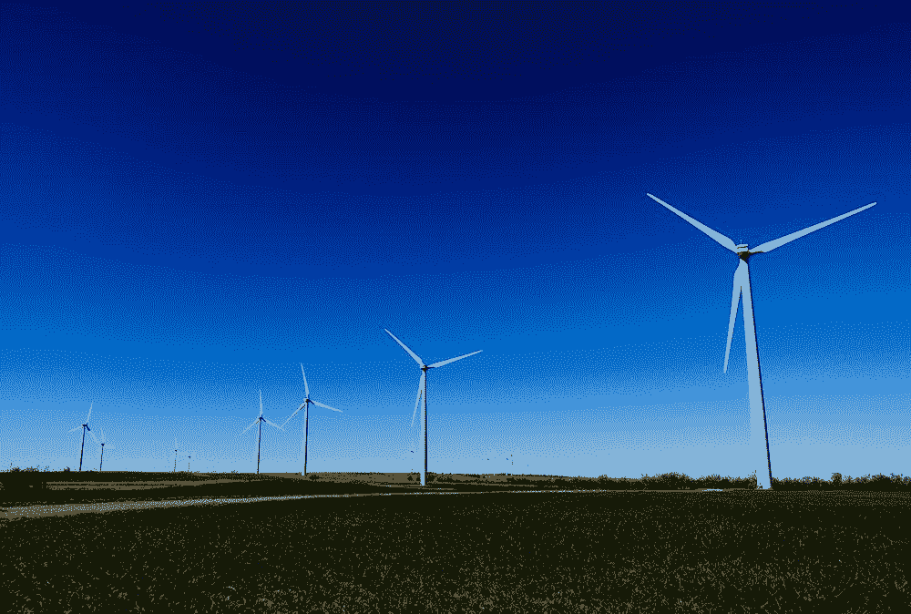

# 本周在谷歌云平台——“Grafeas、Istio 0.2、GDPR、Dialogflow 和 100%可再生能源”

> 原文：<https://medium.com/google-cloud/this-week-in-google-cloud-platform-grafeas-istio-0-2-1ac9a68e3e12?source=collection_archive---------3----------------------->

和现在通常的情况一样，过去一周的公告数量众多，涉及范围广泛:

*   [介绍 **Grafeas** :一个开源 API 来**审计和管理你的软件供应链**](http://goo.gl/ERZFNL) 。JFrog、Red Hat、IBM、Black Duck、Twistlock、Aqua Security 和 CoreOS 在另一个以希腊语命名的项目上合作。GitHub 项目这里是[这里是](http://goo.gl/yeQmAF)。
*   [**控制和粒度**云上有 Spark 和 Hadoop**data proc**](http://goo.gl/1tqBW1)。包括计划删除、每秒计费和更精细的 IAM。更多详情请参见[发行说明](http://goo.gl/tGKQPp)。
*   保持更好的控制和粒度，“ [GCP 增加了对**多网络接口**](http://goo.gl/u1NEH9) 的支持”。每个虚拟机最多八个接口，适用于各种使用情形。
*   [**App 引擎防火墙**现在普遍可用](http://goo.gl/PJW7TW)。通过简单的防火墙拒绝规则帮助防止 DoS 攻击，无需修改任何应用程序。
*   [宣布 **Istio 0.2** :改进的网格和对多种环境的支持](http://goo.gl/CVykRy)。包括自动边车注射，自动 TLS/政策。全部功能和**路线图**都在[这里](http://goo.gl/faaB2k)。
*   [**tensor flow 1 . 4 . 0**的首个发布候选在此](http://goo.gl/ESW6KZ)。tf.data 是新的 tf.contrib.data。
*   "[介绍**对话流**，API 的新名称。AI](http://goo.gl/M9BzHd)(dialog flow . com)。现在有了内置的代码编辑器。
*   [谷歌云推出数据处理术语寻址 **GDPR** 变化](http://goo.gl/wgRBt5)。我们的数据处理和安全术语的 2.0 版本已经过专门更新，以反映 GDPR。您现在可以选择加入此版本。
*   [**谷歌环境报告**](http://goo.gl/mu3ksH) 。我们的运营使用 100%的可再生能源。

来自“它的构建方式和重要性”部门:

*   [将 ASP.NET 核心应用部署到 GCP 的 4 种方式](http://goo.gl/SN8ous)。
*   [我的暑期项目:一个基于 TensorFlow 的石头剪刀布机器](http://goo.gl/cgjmme)。
*   [使用 Spinnaker、容器引擎和容器生成器构建可靠的部署](http://goo.gl/h8ic3d)
*   [Google big query 和云数据流中计算和状态的分离](http://goo.gl/gARUCb)。
*   全能的暂停容器(ianlewis.com)

来自“GCP 社区保险”部门:

*   [2017 年谷歌云 vs AWS(巨头对比)](http://goo.gl/hHbySk)(kinsta.com)
*   [谷歌应用引擎的托管 SSL](http://goo.gl/yGE4Xw)(medium.com)
*   [GCloud —容器优化图像](http://goo.gl/YNEZhX)(andresteingress.com)
*   [使用 NLP 自动分析调查反馈中的情感【wootric.com ](http://goo.gl/LoLqtf)
*   我们如何使用 gRPC 在 Go(medium.com)中构建一个客户机/服务器系统
*   在节点&MongoDB(medium.com)的 GKE 上快速启动

来自“以防你错过(ICYMI)”部门:

*   [将计费数据导出到 BigQuery](http://goo.gl/YnSTng) 。
*   [为托管实例组应用规模调整建议](http://goo.gl/1rq5mq)。
*   [Kapitan](http://goo.gl/bZLCKY) —来自 deepmind 的一款工具，用于使用 jsonnet 模板管理 kubernetes 配置(github.com)
*   [#gRPC-Java 1.7.0 在此](http://goo.gl/D9hWQU)。大量改进，包括 protobuf 3.4.0、netty 4.1.16、客户端入站 gzipped 流、改进的报告和跟踪、内存减少等等。

GCP 播客的最新一集(#0098)是“[悉尼地区与安迪·沃克和格雷汉姆·波利](http://goo.gl/64n5Hf)”。马克和弗朗西丝克很兴奋能在即将到来的第 100 集里主持[温顿·瑟夫](http://goo.gl/gGojUe)，并收集带有#askvint 标签的问题。

本周图片强调了谷歌运营的 100%可再生能源，正如最新的[环境报告](http://goo.gl/mu3ksH)中所讨论的。

这星期到此为止！亚历克西斯