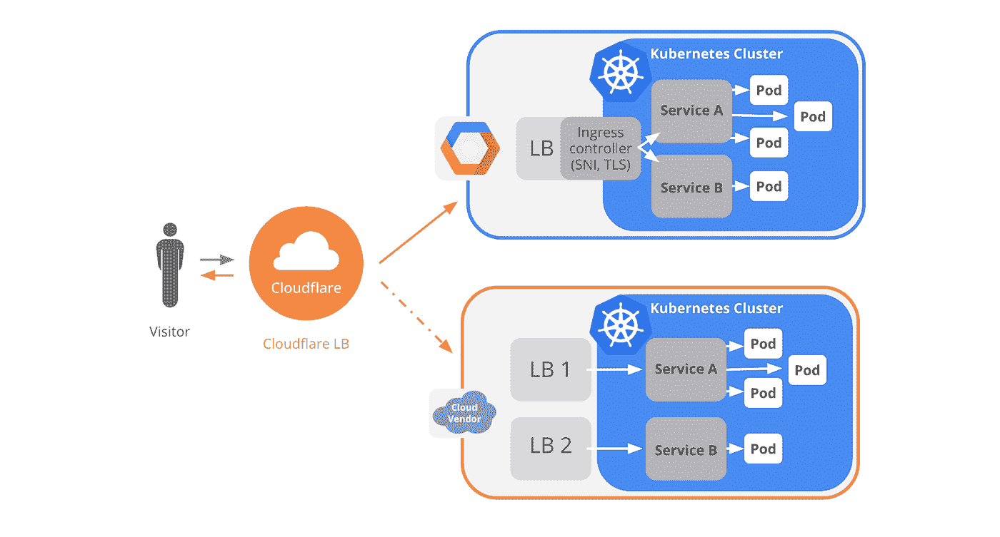

# 本周在谷歌云平台——“谷歌如何通过 Coursera 实现 ML，物联网核心走向 GA，多云部署，以及使用 Cloud Spanner 实现 10x”

> 原文：<https://medium.com/google-cloud/this-week-in-google-cloud-platform-how-google-does-ml-by-coursera-iot-core-goes-ga-multi-cloud-13bfc8a5a42a?source=collection_archive---------0----------------------->

一门“[谷歌如何做 ML](http://goo.gl/39HJvm) ”课程现在可以通过 Coursera 点播。这是两个 5 门课程专业的第一门课程。已经有很多开源的示例 ML 应用程序在[这里](http://goo.gl/3b2hHE)可用。

[嘎] [事情是这样的。。。云物联网核心现已全面上市](http://goo.gl/B2Zs2Y)(与合作伙伴和客户)(谷歌博客)。现在，您可以将来自物联网核心协议桥的数据流发布到多个云发布/订阅主题。

增强型计算引擎实例模板允许您从现有实例模板创建实例，并基于现有虚拟机实例创建实例模板。参见“[管理您的计算引擎实例变得更加容易](http://goo.gl/e5s6AR)”(谷歌博客)了解详情。额外的好处:你现在可以保护你的虚拟机不被意外删除。

来自“全方位云扳手”部门:

*   Spanner 在许多谷歌消费产品中使用，但也作为一些 GCP 产品(如云存储)的底层技术。阅读更多关于它的重要性及其使用案例:“[Google 云存储如何通过 Spanner](http://goo.gl/yuEoqE) 提供高度一致的对象列表”(Google 博客)
*   Optiva 正在利用 Cloud Spanner 提供全球一致的关系数据库的独特能力，现在运行其电信收费系统，与之前的技术相比，性能提高了 10 倍，成本降低了 10 倍—“[转向 Google Cloud Spanner](http://goo.gl/2qPFSq)”(zdnet.com)

来自“云计算是真实的”部门:

*   GCP 的合作伙伴 Cloudflare 有一篇相当详细的帖子，介绍了如何使用 Google Kubernetes 引擎和亚马逊 Web 服务实现 Kubernetes 工作负载的多云部署—“[使用 Cloudflare 为您的多云 Kubernetes 工作负载创建单一平台](http://goo.gl/knftLm)”(Google Cloud)
*   仅用了 30 天，HubSpot 就实现了在 GCP 的部署，只需修改一行配置文件。"[基础设施即代码:利用 AWS 和谷歌云平台实现两全其美](http://goo.gl/YacMvE) " (product.hubspot.com)。

来自“how-to { Kubernetes | tensor flow | Istio }”部门:

*   使用 Kubernetes，基于 Scratch 的图像并非完全不可调试——在 Kubernetes(Ahmet . im)上“从零开始”调试
*   [一个使用云视觉 API](http://goo.gl/Ugx8HJ) (新技术解决方案)的图片搜索应用(谷歌文档)
*   【谷歌云平台上 TensorFlow 的机器学习:代码样本(towardsdatascience.com)
*   [Istio 101 codelab](http://goo.gl/WR9HVr) ，0.5.1 修复更新。(codelabs.developers.google.com)

来自“以防你错过(ICYMI)”部门:

*   [Apache Beam 2.3.0 在这里](http://goo.gl/bDCVUk) — Java 8，增加了对 Spark 2.2、Flink 1.4、Kafka 1.0 等的支持！
*   [medium.com GCP 的标准层网络性能](http://goo.gl/mzr3vZ)
*   [Codelabs 管理&托管工具](http://goo.gl/65iEzH)(g.co/codelabs 使用的)——(github.com)
*   [GA] [数据流服务 GA](http://goo.gl/RYg63U) 中的区域端点(Google 文档)
*   【Beta】[服务使用情况。为项目发现、启用和禁用服务及其 API](http://goo.gl/LrVvTu)(Google 文档)
*   [新的 NCAA 竞赛在 Kaggle 上启动——预测今年美国男女组的结果](http://goo.gl/b6p8WF)(kaggle.com)
*   利用视网膜图像和计算机视觉准确评估心血管危险因素【research.googleblog.com 
*   多姆·埃利奥特和斯图尔特·布赖森在 gcppodcast.com 的 GCP 播客#115 Google Play 营销

本周图片摘自 [Cloudflare 多云 Kubernetes 部署博文](http://goo.gl/knftLm):

这星期到此为止！亚历克西斯