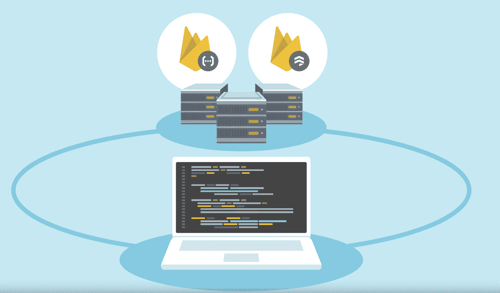

# 本周在谷歌云平台——“介绍云商店、海量虚拟机、自定义角色和 GCP 厨师食谱”

> 原文：<https://medium.com/google-cloud/this-week-in-google-cloud-platform-introducing-cloud-firestore-humongous-vms-custom-roles-and-a5381e39365a?source=collection_archive---------3----------------------->

过去一周的大新闻是发布了**云 Firestore—**“[介绍云 Firestore:我们新的应用程序文档数据库](http://goo.gl/Nf3PAq)”。

发布会附带[一个视频](http://goo.gl/HhcWM5) (youtube.com)，一个[与 Firebase 实时数据库的比较](http://goo.gl/CiDkwh)(Firebase 博客)，一个[与产品经理的播客采访](http://goo.gl/eB6F8j)(gcppodcast . com)，以及[三个代码实验室](http://goo.gl/KTt9dj) (g.co/codelabs)。

上周发布的另一个公告是:“[引入**自定义角色**，这是一个使云 IAM 策略更加精确的强大方法](http://goo.gl/snFK2y)”。对于一些企业客户来说，这是一件大事。文档在这里是。

如果你认为越大越好，我们"[现在推出:计算引擎机器类型，最高可配 **96 个虚拟 CPU 和 624GB 内存**](http://goo.gl/i6wfUo) (目前在四个地区处于测试阶段)。此外，该团队正在为高达 4TB 的机器寻找早期测试人员(点击链接了解更多)。

我们还为 GCP 发布了五本**厨师食谱——《与开源合作[:与厨师](http://goo.gl/gq62Be)一起管理谷歌云平台》。这些烹饪书是厨师认证的，这仅仅是个开始。**

不是每说一个公告，但这个最新的“可教机器”人工智能实验真的值得一看。

本周来自“如何做”部分:

*   【Keras 文本分类简介:自动标记堆栈溢出文章(谷歌博客)
*   [剖析 Kubernetes 初始化时间:谷歌云性能图谱](http://goo.gl/1rsfsm)(谷歌博客)
*   [为专用游戏服务器实例使用 Stackdriver 日志:新教程](http://goo.gl/NmFmh2)(谷歌博客)
*   [云中训练模型的大数据](http://goo.gl/irzQA9)(medium.com)

来自“GCP 百宝箱”部门:

*   【medium.com 技术星期五:DataPrep 完成谷歌云数据科学管道
*   【apievangelist.com】API 设计行业指南:gRPC，开源 RPC 框架
*   [无服务器超级英雄:林恩·朗吉特谈大数据，NoSQL，谷歌对 AWS](http://goo.gl/mjAtcp)
*   [罗尔斯·罗伊斯和谷歌云合作，试图让无人驾驶船只成为现实](http://goo.gl/weL8QS)(seatrade-maritime.com)

本周图片实际上是一个视频——“介绍云 Firestore[”:](http://goo.gl/HhcWM5)

这星期到此为止！

-亚历克西斯