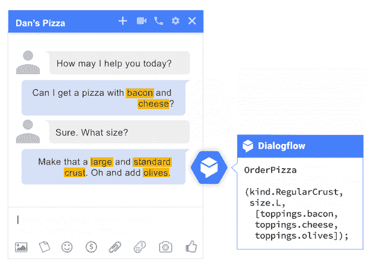

# 本周在谷歌云平台——“K 是为了 Kubernetes，Dialogflow 走向企业，多区域云扳手在这里”

> 原文：<https://medium.com/google-cloud/this-week-in-google-cloud-platform-k-is-for-kubernetes-dialogflow-goes-enterprise-and-multi-563a6a6bd67e?source=collection_archive---------0----------------------->

谷歌的**对话流** (né API。AI)现在提供了一个**企业版** ，以一种新的方式构建语音和文本对话应用。Dialogflow V2 测试版 API[也可用于测试。](http://goo.gl/Y5Xdnp)

[**云扳手**现在提供五个 9，带**多区域**支持](http://goo.gl/ei82m5)。数据库事务和同步复制现在跨地区和大洲！直接来自帖子— *“在谷歌，Spanner 为每天处理数十亿次谷歌服务交易的应用提供支持。事实上，它已经成为各种规模应用程序的内部默认数据库。”*

来自“您今天将把云扳手带到哪里”部门:

*   [使用谷歌云扳手衡量社交媒体对股市的影响](http://goo.gl/mrFE5V)(chmarny.com)
*   云扳手 C # ADO.NET 提供商正在测试中(谷歌教程)

来自“虚拟容器所有东西”部门:

*   过去一周，CNCF 推出了 [**认证的 Kubernetes 计划**](http://goo.gl/7rnc4K) (cncf.io)，谷歌(重新)推出了 [**谷歌 Kubernetes 引擎(GKE)** ，其认证的 Kubernetes 产品](http://goo.gl/rnPq1V)(谷歌博客)
*   谷歌发布了关于在 GKE 上部署 **Memcached 的[新教程，介绍了](http://goo.gl/f465We)[**container-diff**](https://goo.gl/iubDfi)，一个快速比较容器映像的工具，以及[**kube MCI**](http://goo.gl/FbNLCW)——一个在 GCP 上跨多个集群进行 Kubernetes L7 负载平衡的早期访问命令行工具。**

来自“数据重力和成本”部门:

*   您现在可以"[使用云平台**监控和管理您的成本，计费导出到 BigQuery**](http://goo.gl/MPm9PQ) "(谷歌博客)
*   想和全世界分享一些谷歌云存储数据？在存储桶上设置 [**请求者支付**标志](http://goo.gl/GzMPX4)，并且仅支付存储费用。
*   在 **BigQuery** 方面， [**数据传输服务**现在已经普遍可用](http://goo.gl/7kRc9d)，这是将 AdWords、DoubleClick 和 YouTube 数据导入 BigQuery 的最简单、最可靠的方式。
*   [从 **Teradata** 中的数据仓库过渡到 GCP 大数据](http://goo.gl/9J9wmo)(谷歌解决方案)

来自“可移植性流”部门:

*   [IBMCloud 现在支持 Apache**Beam**pipelines](http://goo.gl/szdLzu)(ibm.com)
*   [使用 Apache Beam 和 Cloud 数据流集成 **SAP HANA 和 BigQuery**](http://goo.gl/i8JvTK) (谷歌博客)
*   Spotify 分享了更多他们的工具— [Apache Beam pipeline 用于提取 DB 表(**DBeam**)](http://goo.gl/wd19TM)(github.com)
*   [首先看一下 **Scio** ，一个 Apache Beam](http://goo.gl/uMpmrk)——(datanami.com)的 Scala API

来自“张量流，从微小到巨大”部门:

*   [介绍**tensor flow Lite**](http://goo.gl/bxBqgQ)——一款面向移动和嵌入式设备的轻量级解决方案(包括设备上的对话模型和演示应用程序)(谷歌博客)
*   [一对解决方案，帮助解决自动创建 TensorFlow 模型并将其部署到边缘计算物联网设备的常见挑战](http://goo.gl/Dqphyt)(谷歌博客)
*   [**Kaggle** 将数据集大小限制提高了 20 倍，现在高达 10gb](http://goo.gl/ZH6NyD)(kaggle.com)
*   成千上万的 YouTube 浏览量之后“ [**没有博士学位的 tensor flow**](http://goo.gl/KdpbMn)”系列继续着闪亮的新内容(YouTube.com)

随着最近**云数据准备**的更新，用户现在可以[访问预加载的样本数据集、产品内的逐步演练和指导视频](http://goo.gl/Ke5WaQ)(谷歌博客)

来自“客户和合作伙伴对 GCP 的最佳评价”部门:

*   [量子比特和 GCP 如何帮助育碧创造个性化的客户体验](http://goo.gl/bRRspC)(谷歌博客)
*   [劳斯莱斯、谷歌和航运业的未来](http://goo.gl/1AUN6X)(redmonk.com)
*   [宣布 Altair HPC 应用与谷歌云的集成](http://goo.gl/oetuCW)(谷歌博客)

和 GCP 在一起的 Istio 长什么样？答案就在[这个新页面](http://goo.gl/vMt5gF) (cloud.google.com)，Ray Tsang (youtube.com)最近的一个[演示，以及这个](http://goo.gl/y28nfM)[免费的 codelab](http://goo.gl/bUjwhh) (g.co/codelabs)。

你可能想将[**Cloud on air**](http://goo.gl/M9G6D1)**添加到你的议程中，这是一个关于从大数据到人工智能之旅的在线会议。**

**本周的 [GCP 播客#103 报道了柯尔特·麦坎利斯](http://goo.gl/eAFpfa)的表演图集。如果你只看过视频，只看过预告片，一定要看看柯尔特在媒体(medium.com)上的详细帖子**

**本周图片来自 [Dialogflow 企业公告](http://goo.gl/btmGAR):**

****

**这星期到此为止！亚历克西斯**