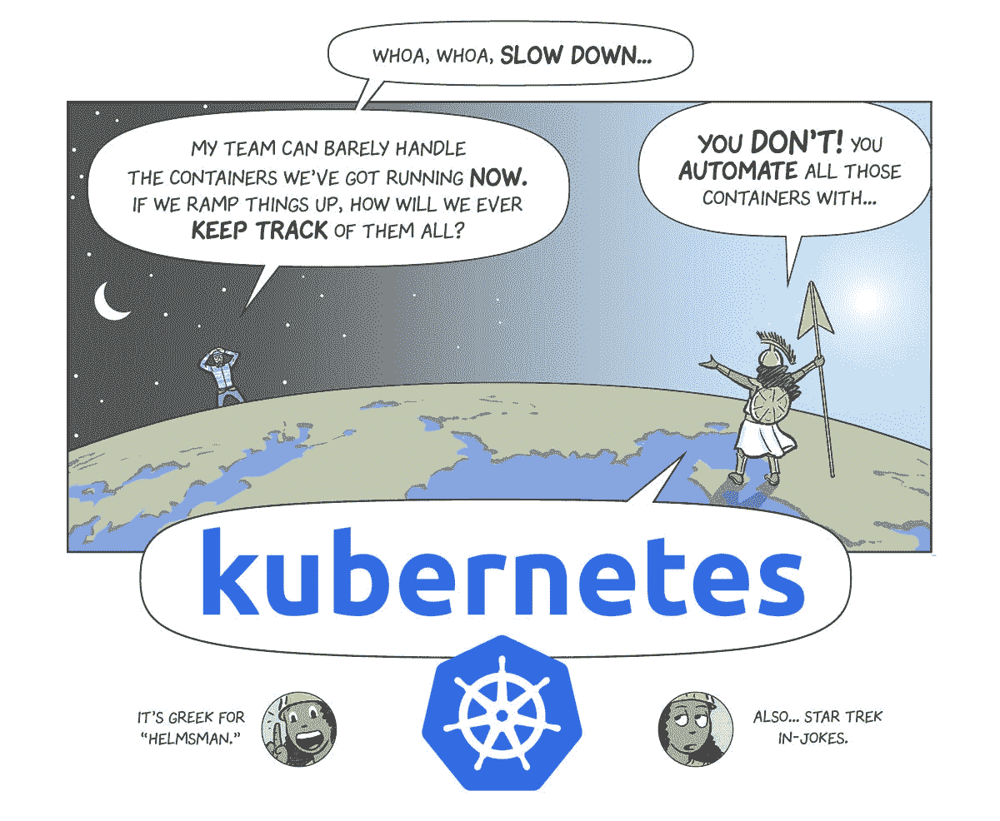

# 本周在谷歌云平台——“Next ' 18，一个 k8s 漫画，还有@JeffDean”

> 原文：<https://medium.com/google-cloud/this-week-in-google-cloud-platform-next-18-a-k8s-comic-and-jeffdean-98dec4302062?source=collection_archive---------0----------------------->

2 万名与会者预计将于明年 7 月在三藩市—“[宣布谷歌 **Cloud Next 2018**](http://goo.gl/FWuJn9) ”。保存日期！

一些 **GKE** (谷歌 Kubernetes 引擎)公告将与 KubeCon 一起发布:

*   [从云控制台仪表板管理 Google Kubernetes 引擎，现已正式推出](http://goo.gl/UxHp2S)。可视 Kubernetes 仪表板。
*   [借助 Google Kubernetes 引擎区域集群，主节点现在高度可用](http://goo.gl/xgbWQL)。不只是哈主，还有哈簇！

…还有一部有点出乎意料的漫画:

*   [与库本内特一帆风顺](http://goo.gl/vdeQ23)(库本内特漫画)。查看交互式 shell 并在 CloudShell 中进行测试！

更多 GCP 公告:

*   [**BigQuery** 宣布支持客户管理的**加密密钥**以及身份访问和管理的自定义角色](http://goo.gl/u3BgCY)
*   [云**视频智能**和云**自然语言**内容分类现在普遍可用](http://goo.gl/Y53XGV)。查看 Sara 在 Google Next 2017 上更新的[主题演示](http://goo.gl/f8HZTv)
*   新的解决方案— [在一个 HPC 集群中同时使用 **MPI 和 R** ，并在 Google 计算引擎](http://goo.gl/q8qCBt)上运行 **Slurm**

更多云、大数据和 ML 新闻:

*   [宣布在 tensor flow Lite](http://goo.gl/n6UvXG)(developers.google.com)中支持 **Core ML**
*   [宣布**集装箱**1.0](http://goo.gl/f5bDzr)(blog.docker.com)全面上市
*   [Apache **Beam** ，版本 2.2.0](http://goo.gl/M8D3i2) (beam.apache.org)，现已推出，具有新的 IOs、实验性 SQL 支持和其他改进
*   [**编织云**现已在谷歌云平台](http://goo.gl/LNHtWL) (go.weave.works)免费提供
*   [云**扳手**被评为 CRN 年度产品](http://goo.gl/gzjKCj)(crn.com)

来自“坏女人公司”部门:

*   [黛安·格林入围彭博 50 强](http://goo.gl/rbZdu6)
*   [欢迎黛安·布莱恩特来到谷歌云](http://goo.gl/76mAjX)
*   [微软首席财务官认为谷歌的云是一种威胁，并称赞其首席财务官:“她一直是赢家”](http://goo.gl/dphz7T)

来自“顾客对 GCP 的最佳评价”部门:

*   [用谷歌云的机器学习工具构建更好的 GIPHY】(谷歌博客)](http://goo.gl/MnPfPL)
*   Spotify 的机器学习:你就是你流的东西(oreilly.com)
*   [Pokemon Go 如何需要 Kubernetes 驱动的 Java 云](http://goo.gl/f553pg) (theserverside.com)。还提到了数据流和其他数据工具。
*   [如何通过 Looker 和 BigQuery 从你的快速日志中获得实时、可操作的见解](http://goo.gl/ogGXVb)(谷歌博客)
*   [谷歌云中的大数据分析](http://goo.gl/roGVE5) (linkedin.com)，由汇丰全球银行首席数据办公室负责
*   METRO AG、Viessmann 和 BOTfriends 迁移到谷歌云(谷歌网站)
*   [一步一步来:零停机时间将 NYT 游戏平台迁移到 GCP](http://goo.gl/jftFVr)(open.nytimes.com)

上周的 [GCP 播客(#000106)](http://goo.gl/oYpSa2) 是与《纽约时报》的迪普·卡帕迪亚和 JP·罗宾逊的讨论。

来自 FOMO 部门:

*   [spring one 2017 上的谷歌云平台](http://goo.gl/sG34kv)
*   [在 KubeCon 2017 上体验谷歌云](http://goo.gl/1QjHPP)

来自“操作方法”部门:

*   [使用云数据流管道模板分析推文](http://goo.gl/GYKcCF)(谷歌博客)
*   [在谷歌云平台上快速安装凡赛堤安全](http://goo.gl/YTVc7x)(medium.com)
*   丹·伯格和扎克·布彻的《伊斯蒂奥深潜》(YouTube.com)
*   【YouTube.com】卡格尔内核简介

来自“以防你错过(ICYMI)”部门:

*   [别名 IP 范围概述](http://goo.gl/Rzbxn7)。多区域 GKE 集群和无缝升级
*   [Beta] [从实例模板创建虚拟机实例](http://goo.gl/P8KeBr)
*   【GA】[谷歌云 SDK 182.0.0](http://goo.gl/ZKEHJ1)
*   [GA] [Dataproc 可重启作业](http://goo.gl/6a6mJy)
*   [GA] Dataflow SDK 2.2.0 发行说明— [Java](http://goo.gl/3udnSk) ， [Python](http://goo.gl/Xb6R9L)

[@JeffDean](https://twitter.com/JeffDean) ('nuff 说)

本周的照片必须是库伯内特的漫画:

这星期到此为止！亚历克西斯