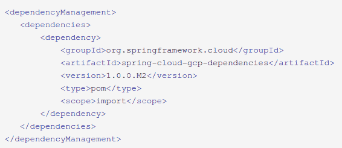

# 本周在谷歌云平台——“大阪地区，GCP 的春天，以及比特币公共数据集”

> 原文：<https://medium.com/google-cloud/this-week-in-google-cloud-platform-osaka-region-spring-on-gcp-and-a-bitcoin-public-dataset-b90ea5203b6a?source=collection_archive---------0----------------------->

GCP 将很快达到 19 个地区，因为它是“ [*在大阪*](http://goo.gl/JocWoq) 建立其第二个日本地区”(谷歌博客)

Spring Framework 5 和 Spring Boot 2 用户欢欣鼓舞，你现在可以[使用你最喜欢的技术，并访问 GCP](http://goo.gl/6YBw3W) (谷歌博客)的全部功能。另请参见 Pivotal 对此的看法—“[*Spring Cloud for Google Cloud Platform 1.0 Milestone 2 Available*](http://goo.gl/zuRTwb)”(Spring . io)

Qwiklabs 发布了两个新的“基线”任务，一个针对 Kubernetes 引擎，一个针对数据、ML 和 AI。[从这里开始](http://goo.gl/TG8QpZ)(qwiklabs.com)

来自“GCP 用户对技术的最佳评价”部门:

*   [为什么我们在 GCP 使用 Elastifile 云文件系统来推动药物研发](http://goo.gl/rRWpqh)(谷歌博客)
*   迈克·福蒂纳基斯(gcppodcast.com)GCP 播客#112 Percy.io

来自“没有 BigQuery 的一周是浪费的一周”部门:

*   [比特币在 BigQuery:区块链公共数据分析](http://goo.gl/z9UNjS)
*   [在 Kaggle 上学习使用 Python 分析巨大的 BigQuery 数据集](http://goo.gl/cibzeE)(medium.com)

从“测试 TensorFlow 多功能性”部门:

*   [在云 ML 引擎上使用 TF . estimator . train _ and _ evaluate 使用 TensorFlow 进行简单的分布式训练](http://goo.gl/qkkw71)(谷歌博客)

来自“它实际上不属于任何其他类别”部门:

*   [领先的云提供商与 NSF 联手支持数据科学前沿](http://goo.gl/6D7cWW)(nsf.gov)
*   [Cloudreach 点击率 120+ GCP 认证专家](http://goo.gl/hczorh)(cloudreach.com)
*   不完全与云相关，但仍然影响着这里的每一个人—“[*一个安全的网络已经存在*](http://goo.gl/HUUhik) ”(谷歌安全博客)

来自“以防你错过(ICYMI)”部门:

*   [Shamash 自动缩放 Google Dataproc 集群](http://goo.gl/dHLPyz)(github.com)
*   " [Kubernetes 安全最佳实践](http://goo.gl/uzinFD)" Ian Lewis 的幻灯片(FOSDEM)
*   [GA]应用引擎配置查看器:[控制台>应用引擎>版本>“配置”栏](http://goo.gl/3xdeue)(谷歌云控制台)
*   [Beta] [BigQuery —创建和使用分区表](http://goo.gl/Zc1yE8) (Google 文档)

如果你在 twitter 上，这里有一些谷歌云的更新:

*   [@googlecloud](http://goo.gl/NNYpXM) (新)
*   [@GCPcloud](http://goo.gl/mFnpdV) (更新)

GCP 播客这一集讲述了谷歌如何在 TensorFlow 上与社区合作——第 113 集与冯一非一起开源 tensor flow。

本周截图摘自[GCP 的春天博客文章](http://goo.gl/6YBw3W)

这星期到此为止！亚历克西斯