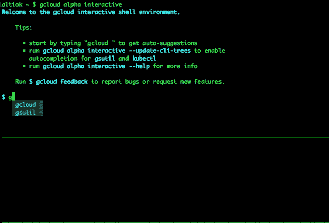

# 本周在谷歌云平台——“量子刚毛锥、交互式 CLI 和云医疗 API”

> 原文：<https://medium.com/google-cloud/this-week-in-google-cloud-platform-quantum-bristlecone-interactive-clis-and-a-cloud-healthcare-e9ca40d3be01?source=collection_archive---------0----------------------->

[宣布 Bristlecone](http://goo.gl/G1EXLz) (谷歌博客)，这是谷歌量子人工智能实验室为研究和测试谷歌量子位技术而建造的新量子处理器

[Alpha] gcloud 和其他 CLI 变得更加智能—“[介绍 GCP 新的交互式 CLI](http://goo.gl/ssQqxN) ”(谷歌博客)。

[用于医疗保健的谷歌云:新的 API、客户、合作伙伴和安全更新](http://goo.gl/TuRS1H)(谷歌博客)。这包括一个新的 API，用于接收和管理 HL7、FHIR 和 DICOM 格式，以便通过 GCP 进行进一步的分析和 ML 处理。另请阅读 HIMSS 2018 上宣布的客户和合作伙伴发展势头的帖子。

来自“顾客对 GCP 的最佳评价”部门:

*   【Color 如何通过 BigQuery 使用新的变体转换工具实现突破性的临床数据科学(谷歌博客)
*   [我们在 big query](http://goo.gl/QAbNPL)(globalfishingwatch . io)中的数据
*   [使用谷歌云和机器学习改进欺诈检测](http://goo.gl/h3BvWg)(ocadotechnology.com)
*   [使用谷歌云平台获得“雅”音乐推荐服务！第三部分](http://goo.gl/CLMUcq)(shinesolutions.com)
*   [引入 Dialogflow 案例研究](http://goo.gl/JW3c2K)(blog.dialogflow.com)

来自“关于基金会如何运作的一些见解”部分:

*   [从开源到可持续成功:Kubernetes 毕业故事](http://goo.gl/i1Qg5i)(谷歌博客)
*   [介绍云原生景观 2.0 —互动版](http://goo.gl/ZhE4FU) (cncf.io)

来自“以防你错过(ICYMI)”部门:

*   [Beta] [Cloud Dataproc 自定义图片](http://goo.gl/vypAvi)(谷歌文档)
*   [Beta] [导入虚拟磁盘](http://goo.gl/hgs6du) (Google 文档)
*   [GA] [为虚拟机实例创建 PTR 记录](http://goo.gl/Acua3t) (Google 文档)
*   【测试版】[子账户计费 API](http://goo.gl/8GgU2j) (谷歌文档)
*   BigQuery:使用 DDL 从查询结果创建一个表/在分区表上使用 DML(Google 文档)
*   [github] [Skaffold —简单且可重复的 Kubernetes 开发](http://goo.gl/6e1caZ)(github.com)

来自“如何”部门:

*   [了解云 IAM](http://goo.gl/DNKRqK) (谷歌博客)。提供简洁的决策和层次结构图。另外，不要忘记文件夹！
*   [使用谷歌云扳手的第一步](http://goo.gl/jsSzZW) (medium.com)。附带代码示例、文档和视频。
*   [通过本教程](http://goo.gl/sWiHbi)(谷歌博客)，学习在谷歌 Kubernetes 引擎上原生运行 Apache Spark
*   [在谷歌 Kubernetes 引擎上运行一个科特林 Spring Boot 应用](http://goo.gl/GwVtYN)(谷歌教程)
*   [教程:基于谷歌云功能的 Flutter 应用](http://goo.gl/hFYmFs)(rominirani.com)

来自“观察、倾听和学习”部门:

*   [阿帕奇光束会议|伦敦| 2018 年 1 月 11 日](http://goo.gl/8fp3gx)(youtube.com)
*   飞博士与播客 [#117 云人工智能](http://goo.gl/f98g4R)(gcppodcast.com)

来自“后退一步”部门:

*   费·著《如何制作对人们有益的人工智能》
*   密码术、云与平等:谷歌安全专家玛雅·卡佐罗夫斯基的问答
*   [为你的应用选择 Firebase 数据库:实时数据库与云 Firestore](http://goo.gl/bszPuu)(savvyapps.com)
*   [谷歌如何在内部使用人口普查](http://goo.gl/jJ1RvT)(谷歌博客)

本周图片中可爱的终端颜色是为了庆祝交互式 CLI 工具的[发布:](http://goo.gl/ssQqxN)

这星期到此为止！亚历克西斯