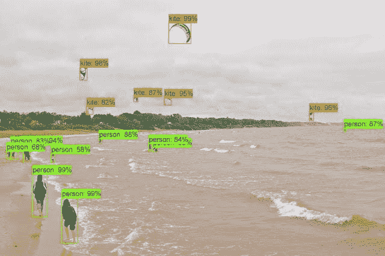

# 本周在谷歌云平台——“调度 Dataprep，PostgreSQL HA，perf 提示，以及所有关于教程和代码实验室的内容”

> 原文：<https://medium.com/google-cloud/this-week-in-google-cloud-platform-scheduling-dataprep-postgresql-ha-perf-tips-and-all-about-e0c9c1c4832f?source=collection_archive---------2----------------------->

在产品方面，过去一周，我们在 Cloud Dataprep、Cloud SQL for PostgreSQL 和 Cloud DNS 中添加了重要的新功能:

*   “[谷歌**云数据准备**](http://goo.gl/vPLKLp) 的调度和采样到达”(当然是一些经常被请求的功能)
*   "[云 SQL for **PostgreSQL 增加了高可用性和复制**](http://goo.gl/3cQnBp) "(在测试期间，每个人都可以获得 100%的持续使用折扣)
*   " [**DNSSEC 现已在云 DNS**](http://goo.gl/4hkUi3) "(全面管理的 DNS 服务中内置更多安全性)

我们还宣布与 Commvault 建立新的 [**合作伙伴关系，将现有工作负载提升并转移到 GCP。这包括备份到云存储 Coldline，使用 Commvault 和 G Suite 备份保护计算引擎工作负载。**](http://goo.gl/Yaa5tK)

基于 CloudShell 的受欢迎程度，我们“[在 Cloud Shell 中引入 **Open，一种创建无摩擦教程**](http://goo.gl/EoBxf1)的新方法”。期待在文档、教程和代码实验室中看到一些这样的按钮。

说到这个…你知道 [104+ GCP **社区教程**](http://goo.gl/vMpqYB) 吗？请求一个教程，修复一个现有的，或者创建一个全新的，所有这些都基于 github 工作流。

继续学习 GCP 的材料，[**Google Cloud Codelabs**](http://goo.gl/866FnW)在过去的 60 天里有 90 个新的或更新的 Codelabs，包括 Istio、gRPC Java 和相当多的 Spring Boot 材料(w/ App Engine standard、Pub/Sub、云存储、Cloud SQL、Sleuth/stack driver……)。

Colt MacAnlis 关注**云性能**带我们了解“[提高 GCP 网络性能的 5 个步骤](http://goo.gl/8AD3wR)”(谷歌博客)。

Colt 也在 Medium 上贴了这一块— [Google 云存储:什么桶类性能最好？](http://goo.gl/Pz8tWF)(medium.com)

来自“ML 是炒作、快速发展的，也是关于人的”部门:

*   梅勒妮·沃里克[“人工智能”在 m3 会议上的主题演讲](http://goo.gl/ykXcsT)，探索人工智能影响的炒作和现实(youtube.com)
*   [用于大规模图像分类和目标检测的 AutoML](http://goo.gl/LhThkY)(谷歌博客)
*   [见见我们的几个机器学习制造者](http://goo.gl/o4pCQ3)(谷歌博客)

来自“你真的应该在 Medium.com 上看看 GCP”部门:

*   [使用 Stackdriver、云函数、Firebase 和 Pub/Sub](http://goo.gl/NsLghf) 可视化 BigQuery 作业(blog.doit-intl.com)
*   [如何在 Docker](http://goo.gl/kuaw3Y)(medium.com)本地测试谷歌云服务
*   谷歌应用引擎有什么不可爱的？goo.gl/eYMeLD(3wks.com.au)
*   [Medium.com 社区 GCP 空间](http://goo.gl/PybcHr)(medium.com)

本周的播客有许多关于物联网核心、发布/订阅、数据存储、BigQuery(数据和美元)的数据，并且是#102 " [智能停车和 Brian Granatir 的物联网核心](http://goo.gl/MD9G2L)。

本周图片来自[“AutoML 应用于大数据集”文章](http://goo.gl/LhThkY):

这星期到此为止！亚历克西斯