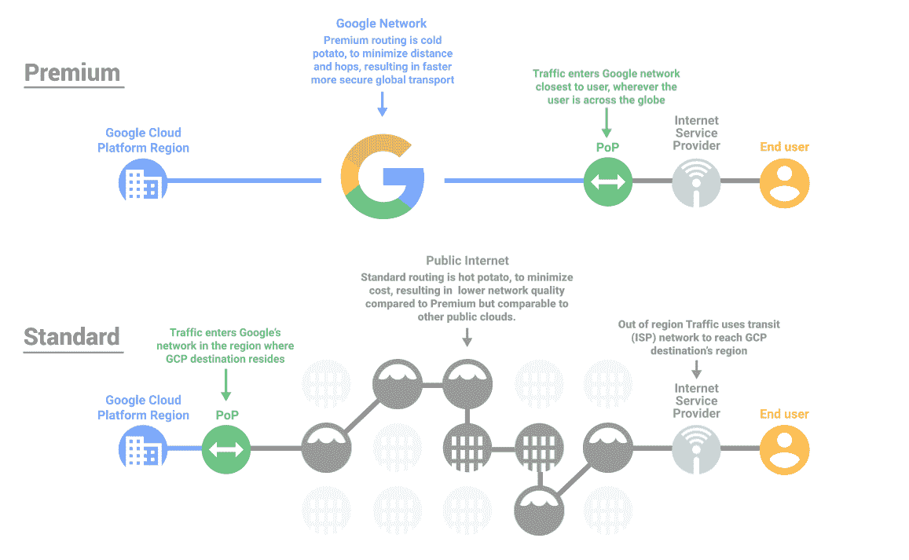

# 本周在谷歌云——“高级和标准网络层，应用引擎上的 NYT 游戏，GCP 的木偶，以及应用引擎的防火墙”

> 原文：<https://medium.com/google-cloud/this-week-in-google-cloud-premium-and-standard-networking-tiers-nyt-games-on-app-engine-puppet-dafdad45cb69?source=collection_archive---------0----------------------->

以下是上周 GCP 发布的消息:

*   [高级层、标准层。选择适合您的 GCP 全球**网络性能**特征](http://goo.gl/9FrRHr)
*   [介绍**应用引擎防火墙**，一种控制访问您的应用](http://goo.gl/tg5kh4)的简单方法
*   [PowerShell **大查询的 cmdlet**！](http://goo.gl/vyBGdP)
*   [介绍**对谷歌云平台的傀儡支持**](http://goo.gl/7Tzz72)
*   [在谷歌云平台](http://goo.gl/gYAEN3)上滚动你自己的私有 **Ruby gem 服务器**

我们还了解了更多关于泰坦的细节，并欢迎了一位新的合作伙伴/客户:

*   [**深度泰坦**明文安全](http://goo.gl/DJoHbH)
*   [欢迎来到我们最新的联盟和 GCP 客户:**Marketo**](http://goo.gl/6hWCsF)

来自"**云数据流**上周投入工作"部门:

*   [使用 Stackdriver 错误报告分析云数据流中的错误](http://goo.gl/R5jyzU)
*   [常见云数据流用例模式指南，第 2 部分](http://goo.gl/SihXd5)

来自“要学的东西太多了”部门:

*   [从数据到洞察:预览新的谷歌云 SQL 分析培训课程](http://goo.gl/xr861c)(谷歌博客)
*   100k+参加了琳达·GCP 的课程，看看吧(lynda.com)

来自“我们不喜欢吹牛，但是这些用户对 Google 感知 API 的基准测试看起来很棒”部门:

*   [你不该说话:聊天机器人著名语音识别 API 基准测试](http://goo.gl/548WdT) (blog.recast.ai)
*   [比较图像标签服务:谷歌视觉、微软认知服务、亚马逊 Rekognition 和 clari fai](http://goo.gl/jyNWHq)(blog.filestack.com)

来自专家部门的" **Kubernetes 和 Istio** :

*   【Kubernetes 初始化器如何工作——一个新的扩展模型，让你为你的集群编写插件(ahmet.im)
*   凯尔西·海塔尔最新教程:【github.com】在 Kubernetes 上运行基于 Istio Pilot 和 Envoy 的入口控制器

来自“**GCP GPU**dope”部门:

*   [启动一个 GPU 支持的谷歌计算引擎实例，并设置 Tensorflow、Keras 和 Jupyter](http://goo.gl/zH1EWu)(hackernoon.com)
*   [在谷歌云的 GPU 上运行 Jupyter 笔记本](http://goo.gl/bzsjsK)(medium.com)

来自“ **Apache Bean** 2.1 和 IO 连接器”部门:

*   [Apache Beam，版本 2.1.0，现已推出](http://goo.gl/QBHVUn)新的 IOs，一些 Python 流等…(beam.apache.org)
*   [强大的模块化 IO 连接器，在 Apache Beam 中带有可拆分 DoFn](http://goo.gl/in8S8X)(谷歌博客)

来自我们最喜欢的"**网友最谈 GCP** "部门:

*   将纽约时报游戏平台转移到谷歌应用引擎【open.nytimes.com 
*   [利用物联网和机器学习进行工业预测性维护](http://goo.gl/amxkYN)(内置云 ML 引擎)(losant.com)
*   [使用 Google Cloud Dataproc 简化大数据](http://goo.gl/ZrbDjM)(medium.com)
*   [谷歌云 SQL — 4 种方式(Spring)](http://goo.gl/fPxCSG)(medium.com)
*   [通过部署简单应用了解公共/私有子网的教程](http://goo.gl/tfE9j9)(medium.com)

来自“谷歌**机器学习**解决方案和新视频系列”部门:

*   [在谷歌计算引擎上运行分布式 TensorFlow 集群](http://goo.gl/Ufykf3)(谷歌云)
*   [通过云 ML 引擎和云数据实验室使用分布式 TensorFlow】(谷歌云)](http://goo.gl/NqHQ9Q)
*   《AI 历险记》，玉峰(medium.com)的新系列

对于 Visual Studio 的用户来说:

*   [用 **Stackdriver** 日志查看器](http://goo.gl/ynFzZC)查看日志(谷歌云)
*   在 Stackdriver 中查看错误报告(谷歌云)

本周的 GCP 播客(#00091)是[“阿米·潘德机器学习的媒体未来”](http://goo.gl/KVaPSS)。

本周图片对比了[高级和标准网络层](http://goo.gl/9FrRHr):

这星期到此为止！