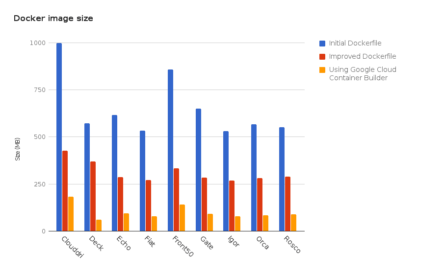

# 本周在 Google Cloud—“Shazam、NL API 语言、数据工程师认证和下一届 17 WW”

> 原文：<https://medium.com/google-cloud/this-week-in-google-cloud-shazam-nl-api-languages-data-engineer-certification-and-next-17-ww-687ae5471341?source=collection_archive---------0----------------------->

**Shazam 即将来到 GCP**GPU 是他们转向云计算的一个重要原因。阅读 Shazam 博客上的[详情。](http://goo.gl/V8wkAz)

随着 Cloud Next’17 在过去一周在伦敦的停留，我们宣布:

*   云**自然语言 API** 现在提供了[新特性，包括扩展的语言支持](http://goo.gl/q4hcxc)
*   **云扳手将于 2017 年 5 月 16 日成为 GA** (正式上市)。这是将于生效的 [SLA。](http://goo.gl/XaGnlr)

请务必查看主**Next’17**网站，了解即将到来的**巡演日期**—[cloudnext.withgoogle.com](https://goo.gl/chJCif)(特拉维夫、马德里、阿姆斯特丹、米兰和东京，2017 年还有更多日期有待宣布)。

[这篇关于使用**应用引擎和云数据流**](http://goo.gl/JEfPa2) 进行数据处理和分析的文章提供了许多细节和一个示例应用。说到大数据，报名 [**Google** **数据工程师认证**现在开放](http://goo.gl/QCi27d)。

阅读 [Spinnaker 团队如何应用 Dockerfile 优化，并使用**Google Container Builder**](http://goo.gl/VDJANa)将构建应用程序与构建其运行时容器分开，导致**将容器映像**减少了 85%。

继续使用容器，现在有了 16 个映像，我们将由 Google 维护的 [**容器运行时基础映像的数量增加了一倍多(最新的应用程序和安全更新)。它们也都记录在 GitHub 上。**](http://goo.gl/YPcp33)

再往下一层，我们现在有了新的解决方案指南:[迁移虚拟机的最佳实践](http://goo.gl/5dMWvF)**(涵盖了 Google VM 迁移服务和 cloud bearing)。**

**谷歌云平台已经通过了欧盟隐私保护条例的认证，谷歌全力支持将于 12 个月后生效的 T2 通用数据保护条例(GDPR)。更多[详情在此](http://goo.gl/Vo6KIS)。**

**ICYMI(以防你错过) :**

*   **[**私有谷歌访问**](http://goo.gl/BDEp7J) 为子网中的虚拟机实例提供无需外部 IP 地址即可访问谷歌 API 和 GCP 的能力**
*   **所有**道琼斯 DNA 数据**和其他数据集可通过 [GCP 商业数据集](http://goo.gl/DFiFnt)获得**

**Spotify 有[开源的 **Spydra**](http://goo.gl/W6L5rl) ，一个使用 **Google Cloud Dataproc** 运行短暂 Hadoop 集群的项目。同理你可能想读读这个*[*那个巨大的吸吮声？Hadoop 移入云端*](http://goo.gl/P4o2MW)*片由 Redmonk 分析师。****

****RealMassive 通过应用引擎、云存储和计算引擎，仅在 3 个月内就实现了 1360%的数据增长，[下面是如何实现的](http://goo.gl/OGiqtY)。****

****Kinsta 将他们的整个基础设施搬到了 GCP，并在博客上发布了[为什么谷歌是云托管的最佳目的地的七个理由](http://goo.gl/ISYtjx)。这七个你都能猜出来吗？****

****随着 **TensorFlow 1.1** 的[到来，Estimator 走向核心，Keras 到达 contrib，Java & Go 绑定开始成型。](http://goo.gl/iuJLp1)****

****最近的 GCP 播客片段:****

*   ****GCP 播客#74 [**云视频智能 API** 与莎拉·罗宾逊](http://goo.gl/3qe05c)****
*   ****播客#75 [**集装箱发动机【GCP】与陈**](http://goo.gl/TqAwSy)****

****互联网上的 GCP:****

*   ****[为什么谷歌的新扳手可能是你未来的数据库](http://goo.gl/1HlQtD)(simplilearn.com)****
*   ****[GCP+GPU💙Kubernetes(和 tensor flow)](http://goo.gl/kgkZu3)(medium.com)****
*   ****[LunaMetrics 谷歌大查询菜谱](http://goo.gl/4nLjB0)(针对谷歌分析数据)(lunametrics.com)****
*   ****【medium.com】谷歌云 IAP 和 GKE****
*   ****[BigQuery —一店之主](http://goo.gl/FHpmcf)(大队工程)****
*   ****用于 BigQuery 的 Matillion ETL 现在在云启动器(console.cloud.google.com)上可用****
*   ****[谷歌云壳，免费游乐场](http://goo.gl/uq9WC0)(medium.com)****
*   ****【BigQuery、Google Cloud APIs、Looker 和 fluent d(medium.com)的商业智能开发是什么样子的****
*   ****[下一个‘17 倒带播放列表](http://goo.gl/mY3JH1)(youtube.com)****
*   ****[应用引擎、调度程序设置和实例计数](http://goo.gl/1nRvIx)(medium.com)****
*   ****[表情符号深度学习(不是数学)](http://goo.gl/SWsvtR)(tech.instacart.com)****

****本周图片来自于 [Spinnaker/ContainerBuilder 博客文章](http://goo.gl/VDJANa)，强调了优化 Dockerfiles 后图像尺寸的减小以及使用 ContainerBuilder 的额外改进。****

********

****这星期到此为止！****

****-亚历克西斯****