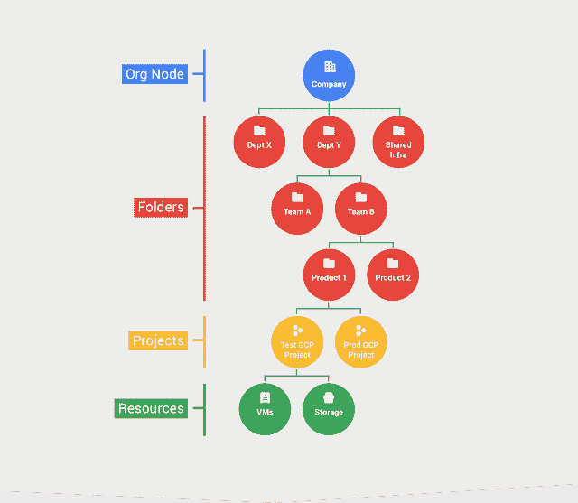

# 本周在 Google Cloud —“欢迎来到 us-east4，用于 ML 的 GPU，inside TPUs，以及通过客户端库的数据”

> 原文：<https://medium.com/google-cloud/this-week-in-google-cloud-welcome-to-us-east4-gpus-for-ml-inside-tpus-and-your-data-via-5dbdb599fe1e?source=collection_archive---------0----------------------->

继之前的一篇量化张量处理单元(TPU)性能的帖子之后，过去的一周提供了对谷歌第一台 TPU **的 [**深度观察。**](http://goo.gl/p8XGFJ)**

本周，我们还忙于发布一系列公告:

*   文件夹 的 [**beta 发布，Organization 下的附加 IAM 层，用于安排 GCP 资源以匹配您公司的结构。**](http://goo.gl/bZQAJf)
*   [新地区！3 个区域。**北弗吉尼亚**](http://goo.gl/OyC87k) (美东 4)。还会有更多！
*   [**64 种 vCPU** 机器类型](http://goo.gl/51x5n2)(自定义和预定义)现已对所有(GA)可用
*   [**面向云机器学习引擎**](http://goo.gl/tQJwBp) 的 GPU 现已面向所有拥有 SLA 的用户开放
*   使用 Google Cloud [**客户端库**存储文件、保存实体、记录数据](http://goo.gl/oQqjhg)。这些通常以七种服务器端语言提供(GA):c#、Go、Java、Node.js、PHP、Python 和 Ruby。

克里斯·塞尔在 GCP 上为 **Windows 做了一个[更新(提示:它做得非常好)。](http://goo.gl/ZJWMcu)**

对于 GCP 来说，**云原生 ETL** 架构是什么样的？这里有一个[解决方案](http://goo.gl/4N6trl)使用了 Google BigQuery、云数据流、发布/订阅和应用引擎(Cron)

云数据流背后的核心工程师之一鲁文·拉克斯(Reuven Lax)在谷歌云数据流第 1 部分的中开始了一系列— [“在 Lambda: **之后恰好一次处理**](http://goo.gl/FPYMWf)

互联网上的 GCP:

*   [谷歌副总裁埃里克·布鲁尔谈开源、创新和云经济学](http://goo.gl/EtEX3p)
*   谷歌云平台不会把你困在(networkworld.com)
*   谷歌的上升潜力(redmonk.com)
*   [用深度学习和街景更新谷歌地图](http://goo.gl/mdwvE8)(research.googleblog.com)
*   【fedramp.gov】fed ramp 宣布 GCP 将参与 JAB-FedRAMP 授权流程
*   【medium.com】stack driver 监听和 Ruby
*   [用 Google Genomics 和 BigQuery 解读 23andme 原始基因组数据](http://goo.gl/gNKaK8)(medium.com)
*   [Ocado](http://goo.gl/dBHBVl)(redmonk.com)的数据文化经验
*   [用 Chrome DevTools 调试 node . js](http://goo.gl/ZtWvDM)(medium.com)
*   [谷歌云如何将人工智能、机器学习带入企业软件](http://goo.gl/vmFkBt)(medium.com)
*   [汇丰为 Hadoop 开发谷歌计算平台，是 ML 和大数据的“云优先”](http://goo.gl/YQliQx) (451research.com，paywall)
*   [tensor flow 团队如何处理开源支持](http://goo.gl/wirmxv)(oreilly.com)
*   美国国家海洋和大气管理局首席数据官埃德·卡恩斯的 5 个问题(datainnovation.org)

基督教青年会

*   [HTTP(S)、SSL 代理和 TCP 代理负载平衡的 IPv6 终止](http://goo.gl/9K4Riv)
*   [使用云 CDN 缓存密钥](http://goo.gl/6kU5Jh)

本周的 GCP 播客第 00076 集是与丹尼尔·史密斯关于 Kubernetes 1.6 的对话

到目前为止，下一个 17 年倒带(下一个 17 年会话的简短摘要):

*   [用应用引擎拓展你的 DevOps 美元](http://goo.gl/Bmvvja)
*   [使用谷歌云将您的 ASP.NET 应用提升到一个新的水平](http://goo.gl/uLPjD2)
*   [将现有应用迁移至谷歌云平台](http://goo.gl/52WW4W)

成长播放列表这里是[这里是](http://goo.gl/g5c5dt)。

最后，本周图片来自文件夹的 [beta 发布:](http://goo.gl/bZQAJf)

这星期到此为止！

-亚历克西斯