# 我对谷歌云顶点人工智能模型注册表感到兴奋的三个原因

> 原文：<https://medium.com/google-cloud/three-reasons-why-im-excited-about-google-cloud-vertex-ai-model-registry-c088e6bbbf3b?source=collection_archive---------0----------------------->

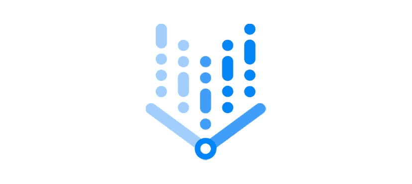

## 好吧，你说，我听！

关于如何在 Google Cloud 上使用[数据科学，你有什么想法或问题吗？请通过填写](https://cloud.google.com/data-science)[这张表格](https://forms.gle/H89eNLTVtCdpP1ro6)让我知道。这对我以后的博文会有帮助=)

## 你需要知道的是

本文有以下公告的[后续内容](https://github.com/GoogleCloudPlatform/vertex-ai-samples/blob/main/notebooks/official/pipelines/google_cloud_pipelines_dataproc_tabular/google_cloud_pipeline_components_dataproc_tabular.ipynb):

*   [宣布顶点 AI 管道的 BigQuery 和 BigQuery ML 操作符](https://cloud.google.com/blog/topics/developers-practitioners/announcing-bigquery-and-bigquery-ml-operators-vertex-ai-pipelines)
*   [带有顶点 AI 模型注册表的 BigQuery ML 中的 MLOps |谷歌云博客](https://cloud.google.com/blog/topics/developers-practitioners/mlops-bigquery-ml-vertex-ai-model-registry)

本文假设您熟悉 BigQuery ML、顶点 AI 管道和顶点 AI 模型注册。如果没有，请使用来自 Google Cloud[Data Summit 2022](https://cloudonair.withgoogle.com/events/summit-data-cloud)的 Vertex AI 视频查看 BigQuery ML 中的 [MLOps。](https://www.youtube.com/watch?v=TOIcrG0DGe8)

最近 [Google Cloud 在预览中公布了 Vertex AI 模型注册表](https://cloud.google.com/blog/products/ai-machine-learning/new-features-for-google-clouds-unified-data-and-ai-platform)。它旨在提供一个可搜索的存储库，您可以在其中管理您的 ML 模型的生命周期。我有一些时间来玩它，这里有三个原因让我对它感到兴奋。

## 原因#1:我可以注册一个 BQML 模型，即使是在用顶点 AI 管道训练的时候

在推出 Vertex AI 模型注册表之前，数据科学家和 ML 工程师必须导出他们的 BigQuery ML 模型，并将其部署在 Vertex AI 上。这需要多个步骤，尤其是在尝试自动化 ML 部署时。

虽然导出和部署的过程仍然是可能的，但是科学家和工程师需要实现数据库触发器(BigQuery ML 事件),这可能会引入操作开销。此外，该过程不会跟踪特定于 ML 的元数据和沿袭功能，为了保证它们在生产中的质量，这些功能是管理 ML 模型的 MLOps 生命周期所必需的

感谢 [**顶点 AI 模型注册表**](https://cloud.google.com/bigquery-ml/docs/managing-models-vertex)

> *你现在可以直接注册 BQML 模型(和其他)到用 Vertex AI 管道* s 训练的 Vertex AI

下面是 Vertex AI BQML 训练管道的示例以及查询的样子。

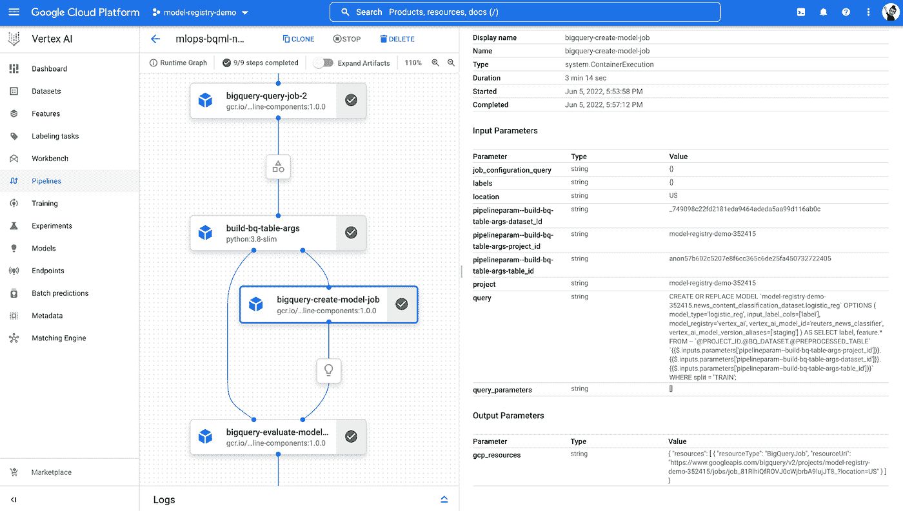

图一。顶点 AI BQML 训练管道和查询注册模型

正如您所看到的，您只需要使用 **BigqueryCreateModelJobOp，**定义一个顶点 AI 管道组件，它允许您训练一个通过相关查询的双查询 ML 模型。在这种情况下，查询是:

```
CREATE OR REPLACE MODEL `{MY_PROJECT_ID}.{MY_BQ_DATASET}.logistic_reg`
 OPTIONS (
     model_type='logistic_reg',
     input_label_cols=['label'],
     max_iterations=20,
     learn_rate=0.3,
     model_registry='vertex_ai',
     vertex_ai_model_id='bqml_text_classifier', 
     vertex_ai_model_version_aliases=['staging']) AS
 SELECT
     label,
     feature.*
 FROM
   `{MY_PROJECT_ID}.{MY_BQ_DATASET}.{MY_TRAINING_TABLE}`
 WHERE split = 'TRAIN';
```

在哪里

*   *model _ registry = ' Vertex _ ai '*表示注册到顶点 AI
*   *vertex _ ai _ model _ id = ' bqml _ text _ classifier '*在注册表中唯一标识模型
*   *vertex _ ai _ model _ version _ aliases*添加上下文元数据，例如模型的状态和任何种类的模型管理注释

这是曾经在 Vertex AI 模型注册表中注册的模型。

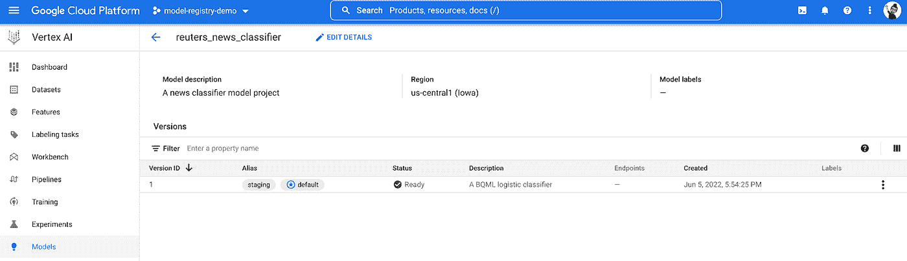

图二。顶点人工智能模型注册中的 BQML 模型

## 原因#2:我可以组织新版本，而不管模型类型

用 [**顶点注册 AI 模型**](https://cloud.google.com/vertex-ai/docs/model-registry)

> *您可以通过创建版本、别名和标签来组织您的所有 ML 模型(BQML、AutoML 和定制模型)。*

事实上，在 Vertex AI 模型注册表中，您可以创建现有模型的新版本。例如，我通过使用顶点 AI 训练训练一个自定义挑战者 XGB 来训练新版本的模型。

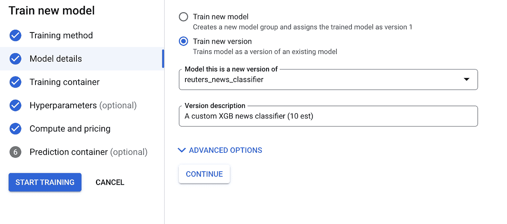

图 3。在 Vertex AI 训练控制台中创建一个新版本

培训成功完成后，您可以看到新版本的模型以及 BQML 模型。图 4 显示了几次训练运行后您会得到什么。

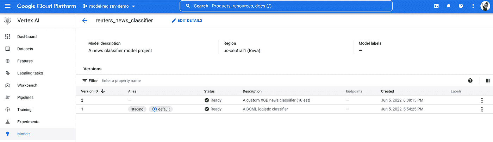

图 4。BQML 和顶点人工智能模型注册表中的自定义模型

请注意，您还可以注册 Vertex AI AutoML 模型，并导入您在另一个环境中训练的模型，甚至是在 Google Cloud 之外(参见图 5)

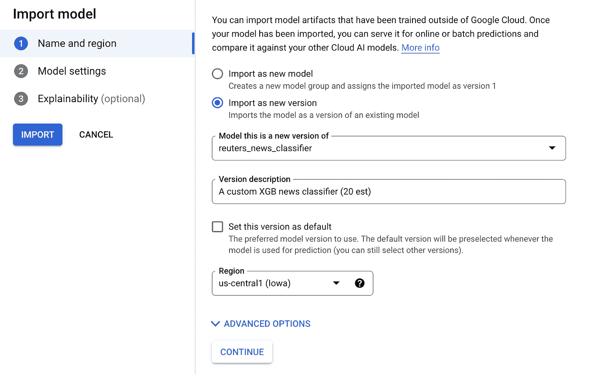

图 5。导入新的模型版本

下面你可以看到导入新的自定义模型后的 reuters_news_classifier 模型项目。

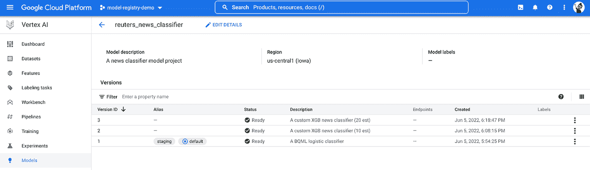

图 6。带有自定义和 BQML 模型的 Vertex AI 模型注册控制台

随着注册模型数量的不断增长，您将需要设置一些标记来指示模型的类型、模型的状态以及任何其他有助于模型管理的信息。

为了满足这些需求，Vertex AI 模型注册中心提供了模型别名和标签。

使用模型别名，您可以将可变的、命名的引用分配给特定的模型版本，这样您就可以指向它，而不需要知道特定版本的 ID。例如，您可以定义一个状态别名来表明该模型是可以部署的稳定版本。

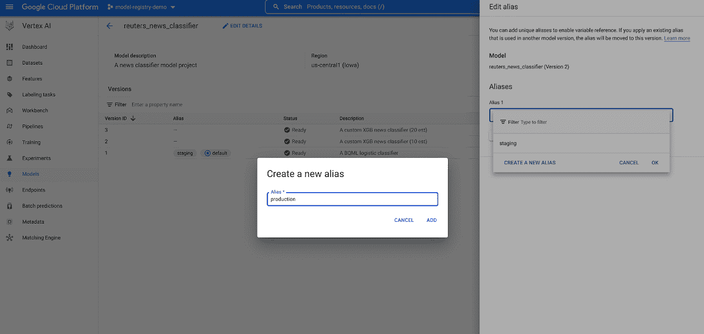

图 7。创建新别名

默认情况下，当您在 Vertex AI Model Registry 中创建新模型时，第一个版本会自动分配默认别名，并指示用户在模型上运行命令而没有指定特定版本时将使用的模型版本。但是您可以很容易地将别名重新分配给不同的模型版本，如图 7 所示。

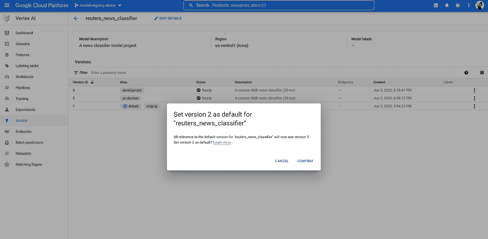

图 8。将模型版本设置为默认值

使用模型标签，您可以添加额外的元数据来帮助识别和组织注册表中的模型。您可以为模型或模型版本分配标签。例如，添加团队和模型构建器，如图 8 所示。

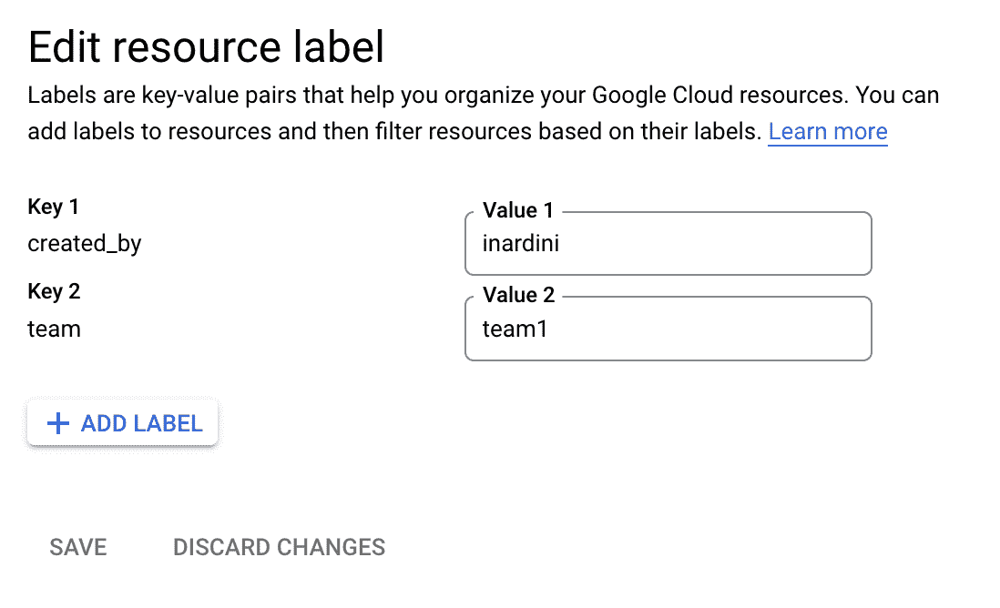

图 9。设置模型标签

## 原因 3:我只需点击几下鼠标就可以部署一个注册的模型 a

一旦通过验证，

> *您只需点击几下鼠标即可部署注册的模型*

从顶点人工智能模型注册表。

您只需要定义端点，指定一些模型设置，并在需要时启用模型监控。下面您可以看到如何部署我们之前培训的一个模型。

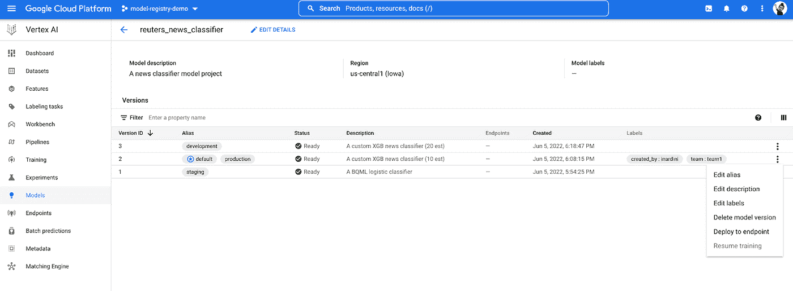

图 10。从顶点人工智能模型注册表部署模型

模型成功部署后，模型状态会相应地更新，您可以发送在线和批量预测请求来对新新闻文章的内容进行分类。在图 9 中，您可以在 Vertex AI 模型注册控制台中看到模型状态。

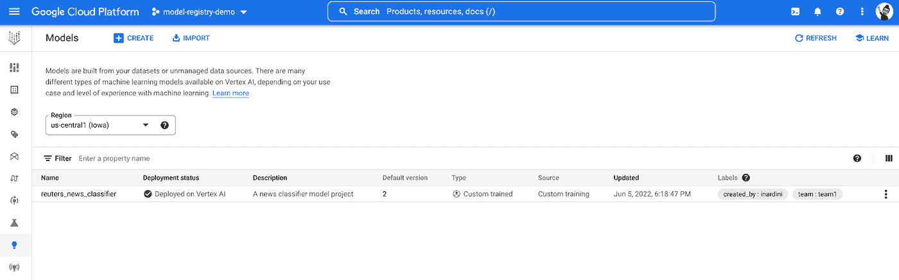

图 11。顶点人工智能模型注册控制台中的模型状态。

还有在线预测请求的例子:

```
# Libraries
import json
import tensorflow_hub as hub
import google.cloud.aiplatform as vertex_ai

# Provide the text of the article
ARTICLE_CONTENT = 'Qtr ended Dec 31 Oper shr loss two cts vs loss 92 cts Oper net loss 28,045 vs loss 1,040,700 Sales 4,943,584 vs 5,613,400 Nine mths Oper shr profit 11 cts vs loss 93 cts Oper net profit 124,434, vs loss 1,054,000 Sales 22.6 mln vs 26.3 mln (Mouduline International Inc) Note: oper data does not include 1986 gains from tax benefit carryforwards of 30,000 dlrs, or three cts per shr, in qtr and 110,000 dlrs, or ten cts per shr, in nine mths.' 

# Load the embeddings model
swivel_model = hub.load("https://tfhub.dev/google/tf2-preview/gnews-swivel-20dim/1")

# Generate embeddings
embeddings = [{f'content_embed_{idx}': e for idx, e in enumerate(swivel_model([ARTICLE_CONTENT]).numpy().tolist()[0])}]
embeddings_instances = json.dumps({'instances' : embeddings})# Provide the endpoint name
ENDPOINT_NAME = 'test-bqml-logit'

# Generate prediction using SDK
endpoint  = vertex_ai.Endpoint.list(filter=f'display_name="{ENDPOINT_NAME}"')[0]
predictions = endpoint.predict(instances=embeddings)
```

预测会在哪里

```
Prediction(predictions=[{'label_values': ['1', '0'], 'predicted_label': ['0'], 'label_probs': [0.002182106126688358, 0.9978178938733117]}], deployed_model_id='1471555576289820672', explanations=None)
```

## 下一步是什么

在这篇文章中，我列出了我对 Vertex AI 模型注册表感到兴奋的三个原因。

总结一下，顶点人工智能模型注册表:

*   您可以注册任何类型的模型(BQML、AutoML 和定制模型)
*   您可以跟踪和组织新的模型版本
*   您只需点击几下鼠标就可以部署一个注册的模型

Vertex AI 模型注册代表了在 Vertex AI 上更接近模型治理的一步。作为一名开发人员，我很期待看到接下来会发生什么。你不是吗？

我希望你喜欢这篇文章，直到下一个帖子…

*感谢萨拉·杜根、安·法默和·陈对*的巨大反馈。