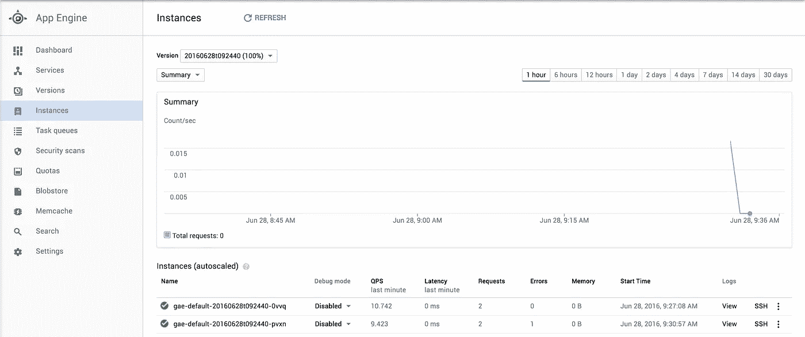

# 使用 App Engine 灵活环境构建原型时，节省成本的三个简单步骤

> 原文：<https://medium.com/google-cloud/three-simple-steps-to-save-costs-when-prototyping-with-app-engine-flexible-environment-104fc6736495?source=collection_archive---------0----------------------->

如果你曾经使用过谷歌应用引擎，你会知道这是从想法到工作原型最快的方法之一。只要您遵守沙盒限制，您就不需要设置服务器、安装软件包或执行任何会降低您速度的繁琐的 DevOps 任务。

随着[App Engine Flexible Environment](https://cloud.google.com/appengine/docs/flexible/)(以前称为托管虚拟机)的推出，谷歌取消了许多沙盒限制，并添加了更多内置运行时，包括 Node.js 和 Ruby。您甚至可以通过指定自己的 docker 文件来定制一切！

[参见这里的对比。](https://cloud.google.com/appengine/docs/the-appengine-environments#comparing_environments)

然而，这种灵活性是有代价的。灵活环境的部署速度较慢，并且不能像标准环境那样快速扩展。默认部署对于原型来说也是多余的。

在我看来最大的不同是没有“规模到零”。与应用引擎标准，如果没有人在使用你的应用程序，它会关闭一切。当用户访问时，App Engine 会在几毫秒内启动一个实例来服务新的请求。结合慷慨的免费层，你真的不必担心原型的基础设施成本。目前，灵活环境需要至少运行一个实例来处理流量，并且没有空闲层。

让我们来看看一些使用灵活环境构建原型的最佳实践，它们可以将成本降至最低。

> ***2019 更新*** *:我强烈推荐使用* [*云运行*](https://cloud.google.com/run/) *来代替 App Engine Flex 完成大部分任务。在我看来，它融合了 App Engine 标准(按使用付费，扩展到零)和 App Engine Flex(灵活性，Dockerfiles)的优点。Flex 唯一的主要优势是实例规模更大。*

# 默认部署

让我们在 App Engine Flexible Environment 上推出一个 Node.js app。默认的 app.yaml 如下所示:

```
runtime: nodejs
env: flex
```

使用 gcloud 命令部署它:

```
$ gcloud app deploy
```

部署应用程序后，我们可以查看应用程序引擎的“实例”部分，了解以下内容:



默认情况下，它启动两个[n1-标准-1](https://cloud.google.com/appengine/docs/flexible/nodejs/configuring-your-app-with-app-yaml#resource-settings) 虚拟机。这是为了提供更高的可靠性。

让我们看看这次部署的每月成本。我已经在谷歌云定价计算器[中配置了这个默认部署，这里是](https://cloud.google.com/products/calculator/#id=aaf0c51a-4f50-4c03-8e30-cbc5dde4e4fb)。

**一个月 80 多美元！**

虽然这个价格对生产流量来说是不错的，但是在原型开发阶段是非常荒谬的。

# 第一步:减少实例数量

通过启动一个实例而不是两个实例，我们可以将成本削减一半。通过启用手动缩放(原型不需要自动缩放)并将实例设置为 1 来实现这一点。[你可以在这里阅读更多关于缩放的信息](https://cloud.google.com/appengine/docs/flexible/nodejs/configuring-your-app-with-app-yaml#services)。

修改 app.yaml:

```
runtime: nodejs
env: flex
manual_scaling:
  instances: 1
```

这将把我们的成本从大约 80 美元**削减到 40 美元**！不错！

尽管如此，这是非常昂贵的原型。通常，原型只需要最少的资源就可以运行，所以我们可以进一步优化。

# 第二步:使用较小的实例

## 不幸的是，这一步在此时是不可能的！希望这种选择在将来会被恢复。

#虽然 g1-small 已经很小了，但我们还可以做得更小。

# f1-micro 是原型的完美范例。它有足够的 RAM 和#CPU 来运行大多数原型级别的工作负载，因此您不会在未使用的资源上花费#金钱。

```
runtime: nodejs
env: flexmanual_scaling:
  instances: 1#resources:
#  cpu: .5
#  memory_gb: 0.18
#  disk_size_gb: 10
```

#现在价格从 40 美元降到 15 美元！非常好！

# 第三步:关闭开发实例

如果您正在开发一个原型，那么您可能不需要它全天候运行。默认情况下，App Engine 每次都会部署新版本。这使得回滚到旧版本或流量分流和 A/B 测试变得非常容易，但原型并不需要。

将您的部署命令修改为:

```
$ gcloud app deploy --version dev
```

当您完成一天的工作后，您可以使用以下命令降低实例的速度:

```
$ gcloud app versions stop dev
```

您可以同样轻松地重新启动它:

```
$ gcloud app versions start dev
```

假设你一周工作 6 天，每天工作 10 小时，因为你是 10 倍的工程师。如果你回家后关闭 App Engine，总费用会下降到每月 15-20 美元。

# 结论

通过遵循这三个步骤，我们已经将 App Engine Flexible 的成本从**80 美元降至 20 美元**。

价格下降了 85%!

虽然它仍然不像 App Engine 标准那样免费，但我觉得它更合理。

最好的部分:*你不需要修改任何代码或操作就可以将你的原型投入生产*。只需切换回自动缩放，并在 app.yaml 中更改您的 CPU 和 RAM 要求，您就可以开始了！

所以请记住:在构建原型时，使用一个小实例并关闭它！

# 附录

## app.yaml:

```
runtime: nodejs
env: flexmanual_scaling:
  instances: 1#resources:
#  cpu: .5
#  memory_gb: 0.18
#  disk_size_gb: 10
```

## 部署:

```
$ gcloud app deploy --version dev
```

## 停止:

```
$ gcloud app versions stop dev
```

## 开始:

```
$ gcloud app versions start dev
```