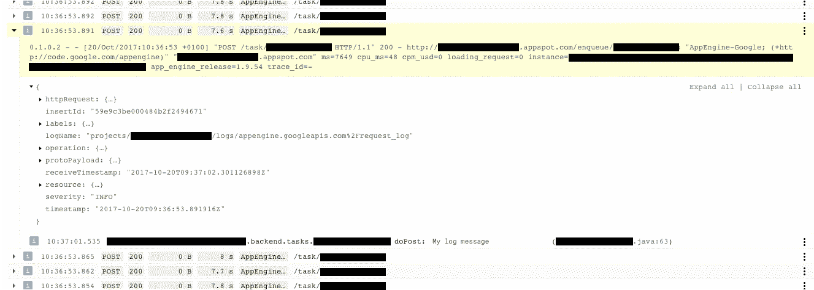

# 使用谷歌应用引擎的三个技巧

> 原文：<https://medium.com/google-cloud/three-tricks-for-working-with-google-app-engine-38f6ef4d6941?source=collection_archive---------3----------------------->


## 使用谷歌应用引擎并寻找一些有用的提示？然后继续读下去…

我们已经在几个项目中深入研究了 Google App Engine 和云端点，并在这里写了很多关于这个主题的文章，但是我也想分享一些我在这个过程中学到的可能对你有用的技巧。

## 番石榴

如果你在一个 Android 项目中编写你的应用引擎代码，你会遇到一个关于番石榴依赖的问题。Android 项目和 App Engine 项目之间会有冲突。要解决这个问题，请在至少 19.0 的根 gradle 文件中包含一个 guava 依赖项:

## 多个 API

如果您希望在 App Engine 项目中有多个云端点 API，只需将第二个 API 类添加到 web.xml 配置中:

## 记录

要在 App Engine 中登录，请执行以下操作:

起初，查看日志可能会有点混乱。



但是，要查看日志，您只需展开您想要查看的任务的行。在那里你会找到你的自定义日志。

【https://console.cloud.google.com/logs/viewer 号

您可能需要更改 WEB-INF 文件夹中的 logging.properties 文件。

```
.level = INFO
```

此变量定义了将日志输出到应用程序引擎所需的最低级别。

还要注意，后台线程中的日志记录不会出现在云控制台中。

## 更多提示

我们将继续探索应用引擎和端点以及其他云平台产品，但现在我们希望这些提示是有帮助的。

完整的故事

## [编写 API——一个移动开发者的故事](/@alistairsykes/writing-an-api-a-mobile-developers-story-8f43ec4df075)

以前的帖子

## [在谷歌应用引擎上缩放](/google-cloud/scaling-on-google-app-engine-903a2635f6a0)

*最初发表于*[*www.brightec.co.uk*](https://www.brightec.co.uk/ideas/three-tricks-working-google-app-engine)*。*