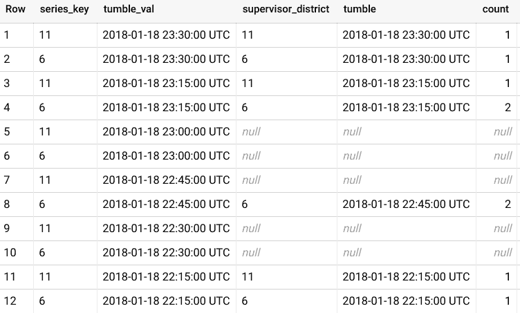

# 使用 BigQuery 进行时间序列分析

> 原文：<https://medium.com/google-cloud/time-series-analytics-with-bigquery-f65867c1ce74?source=collection_archive---------0----------------------->

## 翻转、填充和线性插值技术

(2020 年 12 月 1 日更新:本文中的用户定义函数已被添加到 [BigQuery 社区 UDF](https://github.com/GoogleCloudPlatform/bigquery-utils/tree/master/udfs/community)中，并略有改动。例如，可以用`bqutil.fn.ts_tumble()`调用[翻转功能](https://github.com/GoogleCloudPlatform/bigquery-utils/tree/master/udfs/community#ts_tumbleinput_ts-timestamp-tumble_seconds-int64)

随着 BigQuery 越来越多地被用作 web 事件和物联网等实时分析数据的存储；许多用户要求使用[时间序列](https://en.wikipedia.org/wiki/Time_series)函数，类似于在像 [OpenTSDB](http://opentsdb.net/docs/build/html/user_guide/query/index.html) 这样的专用产品中发现的那些函数。虽然 BigQuery 目前没有专门的时间序列函数，但是有一些简单的函数和技术可以用来直接在 BigQuery 中执行时间序列分析。

出于演示目的，本指南中的示例使用公共的[旧金山 311](https://pantheon.corp.google.com/marketplace/product/san-francisco-public-data/sf-311?project=billing-test-271515) 数据集，分别使用 created_date 和 supervisor_district 作为时间戳和序列键来执行时间序列分析。这些例子可以应用于常见的时间序列问题，如日志分析或物联网监控。

*本指南要求您创建新的 UDF，并假设您将在名为“timeseries”的数据集中创建它们。*

## 通过翻转功能创建和分组

有时称为时段或时间片，一个[翻转](https://ci.apache.org/projects/flink/flink-docs-stable/dev/stream/operators/windows.html#tumbling-windows)代表数据可能落入的非重叠时间窗口。这不同于`timestamp_trunc()`函数，因为它可以在任意秒数的窗口上聚合。

这个函数相当简单，它按翻转大小向下舍入，允许值对齐并聚合到同一个时间组中。

```
CREATE OR REPLACE FUNCTION timeseries.tumble_interval(
 val TIMESTAMP, tumble_seconds INT64)
AS (
 timestamp_seconds(div(UNIX_SECONDS(val), tumble_seconds) *  tumble_seconds))
);
```

测试该功能时，显示了向下舍入到 15 分钟(900 秒)间隔的翻转列。

```
SELECT
 unique_key,
 supervisor_district,
 created_date,
 timeseries.tumble_interval(created_date, 900) tumble
FROM `bigquery-public-data.san_francisco.311_service_requests`
WHERE supervisor_district in (6, 11)
ORDER BY supervisor_district, tumble desc
```


向下舍入的滚动窗口可用于聚集该时间段的数据，例如，在该时间窗口期间发生的事件的计数。

```
SELECT
 supervisor_district,
 timeseries.tumble_interval(created_date, 900) tumble,
 count(*) as count
FROM `bigquery-public-data.san_francisco.311_service_requests`
WHERE supervisor_district in (6, 11)
GROUP BY supervisor_district, tumble
order by tumble desc
```


**处理缺失值**

看查询结果，有问题。没有任何事件的时间范围显示为完全缺失的记录。这在物联网场景中尤其成问题，在这种场景中，在两个或更多传感器值之间计算重要指标。

处理缺失值最常用的技术是:用默认值填充时间窗口，如“0”，最接近的前一个有效值，或使用[线性插值](https://en.wikipedia.org/wiki/Linear_interpolation)绘制估计值。

**生成候选时间戳**

为了在 BigQuery 中创建合成行，我们将依赖于 [UNNEST](https://cloud.google.com/bigquery/docs/reference/standard-sql/arrays#flattening_arrays) 操作，该操作将值数组转换为行，以及 [generate timestamp array](https://cloud.google.com/bigquery/docs/reference/standard-sql/array_functions#generate_timestamp_array) 函数来创建候选值数组以填充空白。然后，可以将合成行留在原始时间序列聚合的外部，以填充空白。

为了简化任务，我们将创建`gen_ts_candidates(..)`函数，该函数返回包含时间戳和系列键的结构值数组。

```
CREATE OR REPLACE FUNCTION
timeseries.gen_ts_candidates(keys ARRAY<STRING>, tumble_seconds INT64, min_ts TIMESTAMP, max_ts Timestamp)
AS ((
 SELECT ARRAY_AGG(x)
 FROM (
   SELECT series_key, tumble_val
   FROM UNNEST(
     GENERATE_TIMESTAMP_ARRAY(
       timeseries.tumble_interval(min_ts, tumble_seconds),
       timeseries.tumble_interval(max_ts, tumble_seconds),
       INTERVAL tumble_seconds SECOND
     )
   ) AS tumble_val
   CROSS JOIN UNNEST(keys) AS series_key
 ) x
));
```

**用连接填充记录间隙**

下面显示的复杂 SQL 展示了一种填充值的技术。

1.  命名子查询`requests`表示原始的聚合时间窗口查询。
2.  命名子查询`args`为`gen_ts_candidates`函数创建参数。或者，您可以直接在查询中输入您的参数。
3.  然后，生成的候选时间序列被[左外连接](https://cloud.google.com/bigquery/docs/reference/standard-sql/query-syntax#left_outer_join)到原始表，以填充缺失的行。

```
WITH requests as (
 SELECT
   cast(supervisor_district as STRING) supervisor_district,
   timeseries.tumble_interval(created_date, 900) as tumble,
   count(*) as count
 FROM `bigquery-public-data.san_francisco.311_service_requests` a
 WHERE supervisor_district in (6, 11)
 AND CAST(created_date as DATE) = '2018-01-18'
 GROUP BY supervisor_district, tumble
),
args AS (
 SELECT
   array_agg(DISTINCT supervisor_district) as key,
   min(tumble) as min_ts,
   max(tumble) as max_ts
 FROM requests
)
SELECT *
FROM UNNEST(
  (SELECT
     timeseries.gen_ts_candidates(key, 900, min_ts, max_ts)
   FROM args)
) a
LEFT OUTER JOIN requests b
 ON a.series_key = b.supervisor_district
 AND a.tumble_val = b.tumble
ORDER BY tumble_val DESC
```



## 用最后一个值或默认值填充

一旦每个时间窗口都有记录，就可以使用 LAST_VALUE 窗口函数或默认值来填充这些新记录的缺失值。LAST_VALUE 函数将获取[窗口规范](https://cloud.google.com/bigquery/docs/reference/standard-sql/analytic-function-concepts#def_window_spec)的最后一个非空值，包括行的当前值；而缺省值将会用一个常数替换当前值，如果它是 null 的话。

在前一个示例的基础上，您现在可以看到这些空窗口填充了有效值。此示例还按系列关键字 supervisor district 进行排序，以使 LAST_VALUE 功能更加明显。

```
**...**
SELECT 
 series_key as supervisor_district,
 tumble_val as tumble,
 **LAST_VALUE(count IGNORE NULLS)
   OVER (PARTITION BY series_key
         ORDER BY tumble_val ASC
         RANGE BETWEEN UNBOUNDED PRECEDING AND CURRENT ROW)
 AS last_value,
 coalesce(count, 0) AS def,**
 count as unfilled
FROM UNNEST(
  (SELECT
     timeseries.gen_ts_candidates(key, 900, min_ts, max_ts)
   FROM args)
) a
LEFT OUTER JOIN requests b
 ON a.series_key = b.supervisor_district
 AND a.tumble_val = b.tumble
ORDER BY supervisor_district, tumble_val DESC
```


**有效值之间的线性插值**

[线性插值](https://en.wikipedia.org/wiki/Linear_interpolation)是一个简单的概念，它的数学原理很容易理解。该函数求出前一个值和后一个值之间的斜率，您使用一个直线方程(y=mx + b)来确定当前位置的值。诀窍在于提供所用值的相对坐标。BigQuery [struct](https://cloud.google.com/bigquery/docs/reference/standard-sql/data-types#struct_type) 可以用作包含(x，y)坐标的复杂类型；时间戳秒数可用于 x 轴上的相对位置。

创建`linear_interpolation`函数和一个便利函数`interpolate_ts_val_or_fill()`来翻译时间戳和处理错误情况。

```
CREATE OR REPLACE function
timeseries.linear_interpolate(pos INT64,
        prev STRUCT<x INT64,y FLOAT64>,
        next STRUCT<x INT64,y FLOAT64>)
AS (
CASE
  WHEN prev IS NULL OR next IS NULL THEN null
  ELSE
  *--y = m * x + b*
  (next.y - prev.y)/(next.x - prev.x) * (pos - prev.x) + prev.y
END
);CREATE OR REPLACE FUNCTION
timeseries.interpolate_ts_val_or_fill(value FLOAT64,
        pos TIMESTAMP,
        prev STRUCT<x TIMESTAMP, y FLOAT64>,
        next STRUCT<x TIMESTAMP, y FLOAT64>,
        def FLOAT64)
AS (
 CASE
   WHEN value IS NOT NULL THEN value
   WHEN prev IS NULL OR next IS NULL THEN def
   ELSE
     timeseries.linear_interpolate(
       unix_seconds(pos),
       STRUCT(unix_seconds(prev.x) AS x, prev.y AS y),
       STRUCT(unix_seconds(next.x) AS x, next.y AS y)
     )
 END
);
```

对坐标使用结构非常重要，因为它们允许以可被 LAST_VALUE 和 FIRST_VALUE 窗口函数选取的方式打包多个值。

重写用于插值时间序列间隙的完整 SQL 显著的变化用**粗体**标出。

```
WITH requests as (
 **SELECT *,
   IF(count is null, null,
     STRUCT(tumble as x, count as y)
   ) AS coord
 FROM (**
   SELECT
     cast(supervisor_district as STRING) supervisor_district,
     timeseries.tumble_interval(created_date, 900) as tumble,
     count(*) as count
   FROM `bigquery-public-data.san_francisco.311_service_requests` a
   WHERE supervisor_district in (6, 11)
   AND CAST(created_date as DATE) = '2018-01-18'
   AND created_date < '2018-01-18 08:30:00'
   GROUP BY supervisor_district, tumble
 **)**
),
args AS (
 SELECT
   array_agg(DISTINCT supervisor_district) as key,
   min(tumble) as min_ts,
   max(tumble) as max_ts
 FROM requests
)
SELECT 
   series_key as supervisor_district,
   tumble_val as tumble,
   **timeseries.interpolate_ts_val_or_fill(
     count,
     tumble_val,
     LAST_VALUE(coord IGNORE NULLS)
         OVER (PARTITION BY series_key
           ORDER BY unix_seconds(tumble_val) ASC
           RANGE BETWEEN UNBOUNDED PRECEDING AND 1 PRECEDING),
     FIRST_VALUE(coord IGNORE NULLS)
         OVER (PARTITION BY series_key
           ORDER BY unix_seconds(tumble_val) ASC
           RANGE BETWEEN 1 FOLLOWING AND UNBOUNDED FOLLOWING),
     0
 ) as intrp,**
 count as unfilled
FROM UNNEST(
  (SELECT
     timeseries.gen_ts_candidates(key, 900, min_ts, max_ts)
   FROM args)
) a
LEFT OUTER JOIN requests b
 ON a.series_key = b.supervisor_district
 AND a.tumble_val = b.tumble
ORDER BY supervisor_district, tumble_val DESC
```


第 5 行和第 9 行之间的线性插值清晰可见

**比较两个系列**

乍一看，即使有函数，这也是太多的 SQL 来排列和比较两个系列。视图可以使查询更易于管理。

```
CREATE OR REPLACE VIEW timeseries.311_req_series
AS (
  WITH requests AS (
    SELECT *,
    IF(count, null, null,
      STRUCT(tumble as x, count as y)
    ) AS coord
...
);
```

现在可以用一个简单的连接来比较两个系列。

```
SELECT
  ABS(a.intrp - b.intrp) AS difference,
  *
FROM timeseries.311_req_series a
LEFT OUTER JOIN (
  SELECT * FROM timeseries.311_req_series
  WHERE supervisor_district = '6'
) b
ON a.tumble = b.tumble
WHERE a.supervisor_district = '11';
```


系列 6 和 11 的插值之间的差异

# 额外资源

在以后的文章中，我计划探索滑动窗口和替代插值函数。

*   BigQuery 的标准 SQL [引用](https://cloud.google.com/bigquery/docs/reference/standard-sql/functions-and-operators)
*   数据流 SQL 中的[窗口](https://cloud.google.com/dataflow/docs/reference/sql/streaming-extensions)
*   [插补技术](https://en.wikipedia.org/wiki/Interpolation)
*   [在 BigQuery 中展平数组](https://cloud.google.com/bigquery/docs/reference/standard-sql/arrays#flattening_arrays)