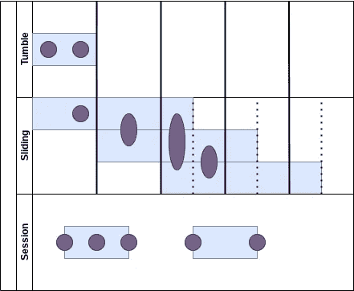
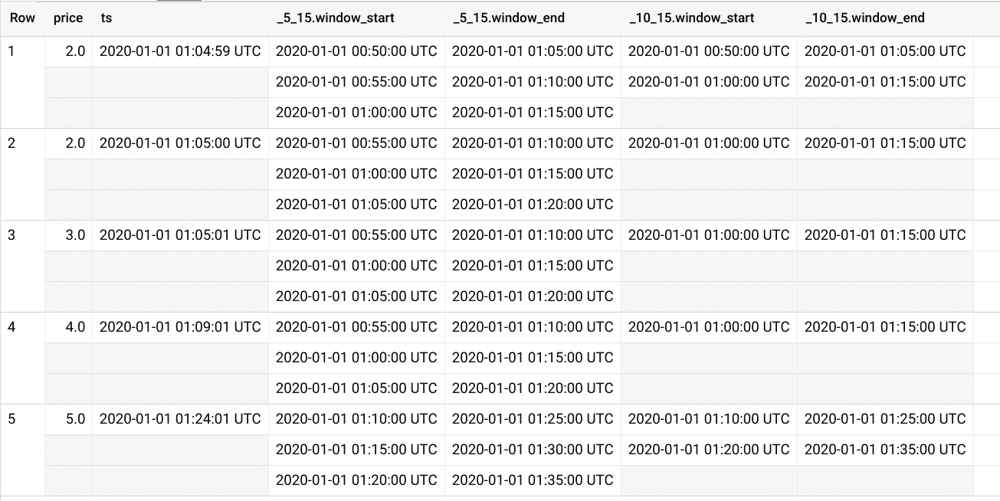
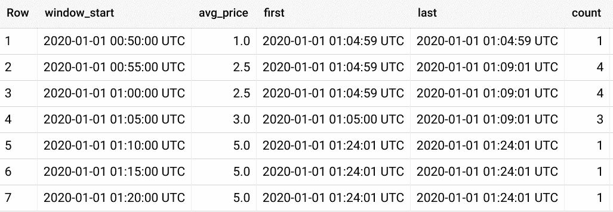
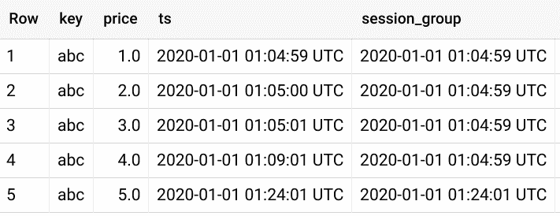
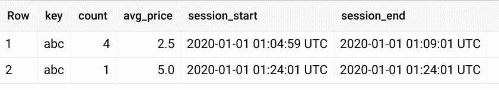
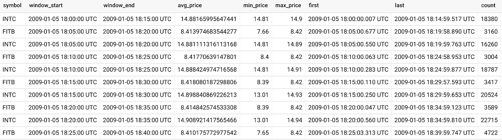
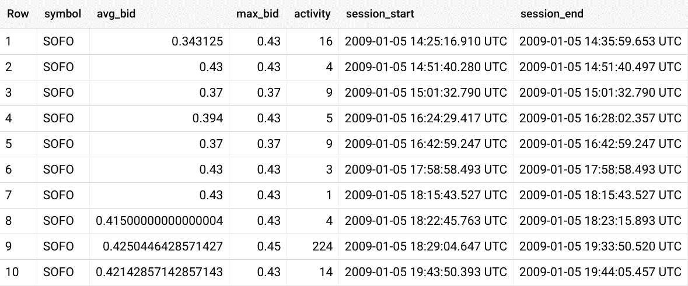

# 使用 BigQuery 的时间序列分析第 2 部分

> 原文：<https://medium.com/google-cloud/time-series-analytics-with-bigquery-part-2-b143a34102b5?source=collection_archive---------2----------------------->

## 定义滑动窗口和会话窗口

*这是关于在 BigQuery 上实现时间序列分析功能的系列文章中的第二篇。*

[**用 BigQuery 进行时间序列分析**](/google-cloud/time-series-analytics-with-bigquery-f65867c1ce74)

(2021 年 1 月 7 日更新:本文中的用户定义函数已被添加到 [BigQuery 社区 UDF](https://github.com/GoogleCloudPlatform/bigquery-utils/tree/master/udfs/community)中，并略有改动。例如，[滑动时间窗口功能](https://github.com/GoogleCloudPlatform/bigquery-utils/tree/master/udfs/community#ts_slidets-timestamp-period-int64-duration-int64)可通过`bqutil.fn.ts_slide()`调用

在第一篇文章中，您使用现在的[开源](https://github.com/GoogleCloudPlatform/bigquery-utils/blob/master/udfs/community/ts_tumble.sql)翻转函数在[固定时间窗口](https://cloud.google.com/dataflow/docs/reference/sql/streaming-extensions#tumble)上执行了时间聚合。在之前工作的基础上，我们现在来看看如何实现[滑动](https://ci.apache.org/projects/flink/flink-docs-stable/dev/stream/operators/windows.html#sliding-windows) ( [跳跃](https://cloud.google.com/dataflow/docs/reference/sql/streaming-extensions#hop))窗口和[会话](https://ci.apache.org/projects/flink/flink-docs-stable/dev/stream/operators/windows.html#session-windows)窗口。

**创建滑动窗口功能**

与固定窗不同，推拉窗的设计是重叠的；例如，你可以每分钟查看股票价格的 15 分钟移动平均值。因此，一些数据点可能存在于多个窗口中。

要实现该功能，必须知道多长时间(周期)启动一个新窗口，以及多长时间(持续时间)保持该窗口打开。此外，该函数需要返回一个数组来捕获数据点所属的每个窗口。

在 BigQuery 控制台中创建`ts_slide()`函数。注意翻转功能的重用，`bqutil.fn.ts_tumble()`来对齐每个窗口的开始。

**使用滑动窗**

直接使用时,`ts_slide()`将创建一个数组，代表该行所属的每个窗口。在这个例子中，对照两个滑动窗口计算来检查每一行；第一个每 5 分钟触发一个 15 分钟窗口，另一个每 10 分钟触发一个 15 分钟窗口。

然后，这些窗口可以被[展平](https://cloud.google.com/bigquery/docs/reference/standard-sql/arrays#flattening_arrays)并按窗口开始时间分组，以创建滚动指标。

**创建会话窗口**

会话窗口代表任意长的一系列活动，并通过一系列称为会话间隙的不活动来定义边界。然后，会话边界不是由窗口函数定义的，而是由数据点本身定义的。

然后，应用的技术需要将每一行与其相邻行进行比较，以确定该行是在前一行的会话中，还是新会话的开始。那么每一行都可以被赋予适当的会话标识符，作为另一个分析函数的一部分。

如果某行属于现有会话，下面的便利函数将返回 null，如果该行是新会话的开始，将返回时间戳。

现在可以将`ts_session_group()`函数与解析的`LAG()`函数进行比较，以识别每个会话的开始，并将`LAST_VALUE()`函数与每个记录与其所属的会话窗口相关联。

按会话组分组，您现在可以在会话窗口中聚合活动。

**使用更大的时间序列数据集**

到目前为止，示例已经查看了一个只有几行的人造数据集。BigQuery 包含 2009 年的 Nasdaq 样本数据，可用于测试时间序列窗口。

你现在可以计算股票活动的滑动窗口。为了使结果更加清晰，查询将结果限制在`INTC`和`FITB`股票报价机。

现在来看看由 5 分钟活动间隙定义的交易时段的活动。低活性库存用于展示可变长度窗口。

**下一步是什么**

在以后的文章中，我将介绍近似连接，在不使用滚动窗口的情况下匹配时间戳。此外，我希望这篇文章中的函数能够很快添加到 [BigQuery 社区 UDF](https://github.com/GoogleCloudPlatform/bigquery-utils/tree/master/udfs/community)中。