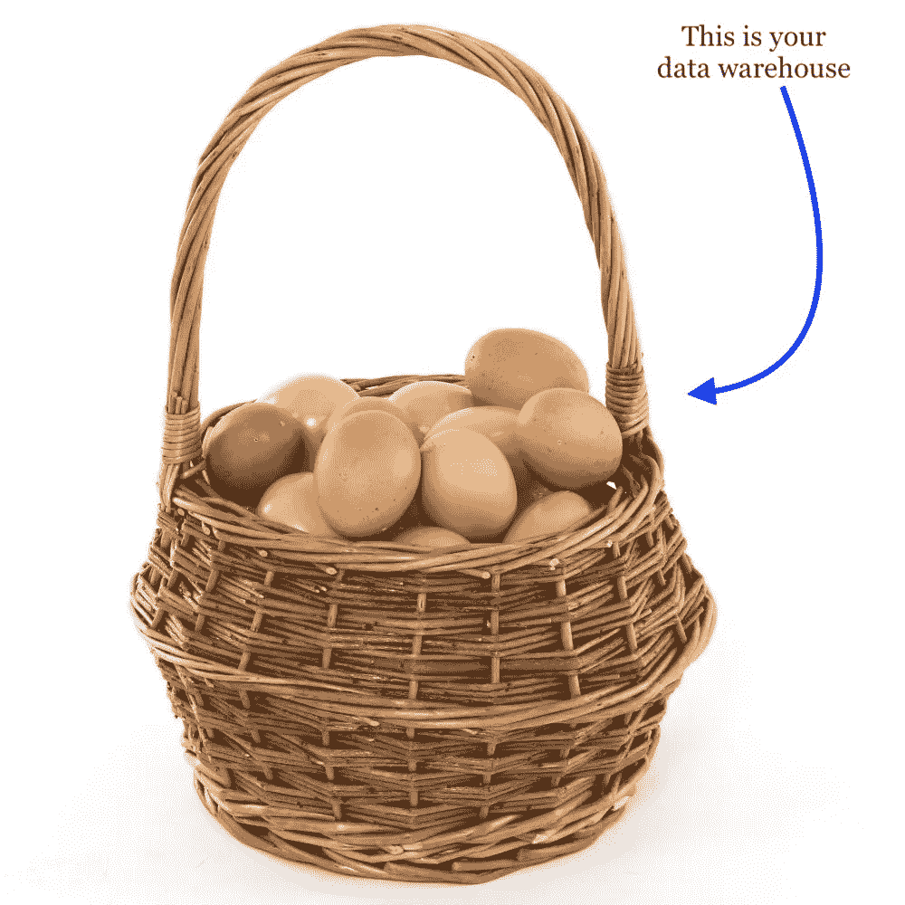
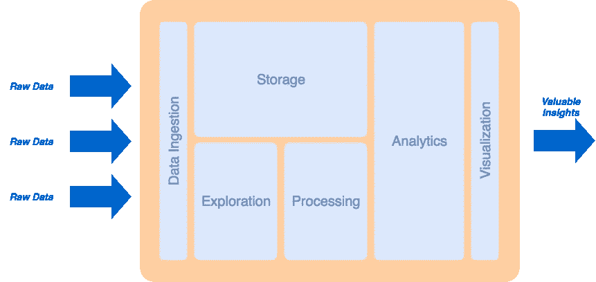
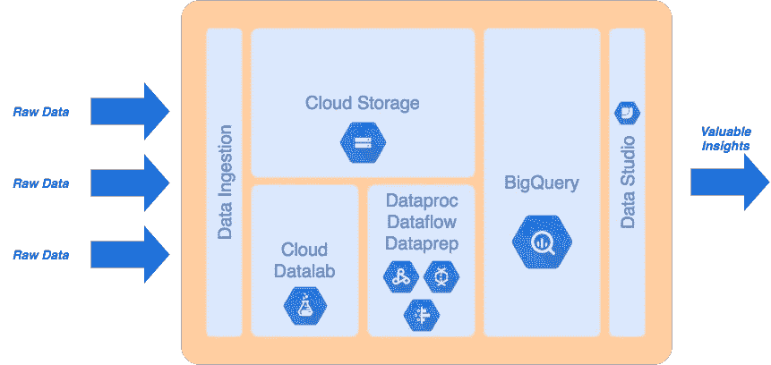

# 尝试在 GCP 建立一个分析平台

> 原文：<https://medium.com/google-cloud/tipping-your-toes-into-building-a-data-analytics-platform-on-gcp-2641926bc923?source=collection_archive---------1----------------------->

“我们有许多不同的数据源，我们很难获得整个组织所有数据的全局视图。”

*“我们的数据目前都在<中，在这里输入数据仓库名称>，我们希望将它迁移到谷歌云。”*

*“我们希望将 X 仓库的数据提升并转移到 BigQuery 中。”*

这些是我在与(潜在)客户交谈时每周(有时是每天)听到的一些陈述。我一次又一次地看到，关于在 GCP(以及一般的云平台)上构建数据分析环境与更传统的方法有何不同，存在一些相当大的误解。传统上，它更倾向于将所有内容转储到企业数据仓库中，然后使用一些 ETL 工具来清理/转换/处理您的数据，以便为分析工作负载做好准备。因此，对于一些人来说,*数据管道*是一个陌生的概念，而对于另一些人来说，BigQuery 不仅仅是另一个通用数据仓库的想法是不合理的…

澄清一下，这不一定局限于 GCP，实际上可以普遍应用于基于云的数据分析平台。我关注 GCP 的原因有两个。

首先，我是谷歌大数据服务产品及其提供的所有价值的粉丝。其次，我认为 GCP 是部署的便利性、流动性和速度方面的先驱平台之一，尤其是在大数据架构方面。

因此，尽管 BigQuery 是金童玉女，拥有其提供的所有价格和性能优势，但在 GCP 构建数据平台时，我们不能忘记围绕它的丰富的托管数据服务生态系统。这是我真正看到谷歌在大数据领域大放异彩的地方。

# 从哪里开始

作为一个解决方案架构师，我也是一个强迫性的规划者，这意味着我总是喜欢在我们放在一起的解决方案中看到某种形式的结构；话虽如此，但“*因为那是有效的*”的答案很难令人满意。我是分层架构的倡导者，这种架构通常映射到相应的服务分配。同样，当处理数据分析平台问题时，认为数据仓库是一个大机器，所有的东西都放在那里是非常可怕的想法；直译就是把所有的鸡蛋放在一个篮子里。

因此，让我们后退一步，通过一个示例方法来构建一个现代数据分析平台，该平台利用了在 Google Cloud 上运行的灵活性和优势。

# 分层架构

## 层，层，层…

回到基础，每个系统的定义都是由它的功能和它的输入与某些(期望的)输出的关系来定义的。一般来说，如果我们能够构建一个系统，当分配给我们相应的输入时，它给出我们想要的输出，那么我们就成功地实现了所需的功能。但这就够了吗？当然*不是*！

**功能**:当我们开始添加更多/不同的输入时会发生什么？我们还能得到正确的/预期的输出吗？

**模块化**:当我们需要修复或升级这个系统的一个子组件时会发生什么？我们是不是把它扔掉，然后从头开始造新的东西？

可伸缩性:当系统需求增加时会发生什么？它能否扩展以满足这一增长的需求？或者我们抛弃它，构建一个更高性能的版本？

可扩展性:当我们需要引入一种新的功能或者一个新的特性的时候怎么办？它是否足够模块化和可插拔，可以增加新功能？或者它是如此的单一，以至于建立一个全新的系统是更容易的途径？

这些都是工程师在设计任何系统之前通常会问自己的一些基本问题。

## 那么，我们如何将此应用于数据分析平台问题呢？

运行在云平台上的数据分析平台本身就是一个系统。这意味着它有输入和输出，并期望某些输入映射到某些输出。然而，这个系统只是在引擎盖下执行单一任务吗？不不是的！(*如果那是真的，我晚上会睡得更好)*

澄清一下，在设计这样一个平台时，我们的目标是实现一组通用的功能特性。这些特征和特性可以是:

*   摄取
*   储存；储备
*   处理
*   分析学
*   探测
*   形象化

这些特征中的每一个都扮演着重要的角色，以便实现一个平台，该平台通常在从多个源获得数据时能够向终端用户提供数据分析。

## 好吧，现在怎么办？

现在，我们可以采用分层架构的概念，并将其应用于数据分析平台的多功能定义，并制定功能性、模块化、可伸缩和可扩展的面向功能的架构。为此，我们可以为每个特定特征分配一个层。然后，我们根据这些特性如何相互作用来定义不同层之间的关系。

例如，不言而喻，数据接收将是从外部来源接收原始数据的第一个接触点。下一个数据将需要到达一个商店，在那里它可以被探索和处理。最后，处理后的数据需要暴露给最终用户用来与整个系统交互的可视化工具。

*注意:我意识到这是以一种过于简单的方式写出来的，然而，这只是为了提供总体主题的背景。实际的设计过程要复杂得多，需要考虑大量的其他因素。*

我们得到的是一个分层的平台架构，将不同的层安排如下。

高级大数据平台架构

使用这样的高级方法，我们可以清楚地描述不同层之间的界限、角色和职责。我们还可以确保每一层都服务于实现功能角色的目的。通过选择合适的技术来构建每一层，我们就可以构建一个功能强大、模块化、可扩展的数据分析平台。

# 进入谷歌云平台

正如我之前所说的，在我离开在云环境中开发分层大数据平台设计的话题之前，Google Cloud 提供了一个丰富的托管和无服务器大数据服务生态系统，包括 BigQuery，它与这种分层设计方法非常吻合。以至于如果你拿着上面的图表，选择谷歌在每一个角色中提供的相应服务，你可能会得到类似这样的结果。

谷歌云平台上的高层大数据平台架构

这并不是说，这是唯一的架构，也是唯一正确的服务选择，我会推荐给任何希望在 GCP 上构建企业级数据平台的人。其他组合也是可能的，并且总是值得尝试，但是我试图让这篇博文尽可能的简洁。

因此，肯定有其他服务选项和组合，每个组织都有自己的要求和特殊性，甚至有可能对特定服务选择产生影响的限制。更不用说我甚至根本没有涉及数据及时性方面(即批处理、微批处理和流)以及对上述服务选择及其集成要求的影响。重要的是要注意，尽管有不同的及时性选项，上面的分层架构仍然是适用的，可以服务于它要达到的目的。

## 谷歌云的附加值

最棒的是，上面确定的每一项服务要么是托管服务，Google 负责自动化底层基础设施和部署(即 Datalab 和 Dataproc)，要么是纯粹的无服务器服务，Google 完全为您管理整个服务，只提供一个(有点漂亮的)UI 和一个与之交互的 API(即 Storage、BigQuery 和 Data Studio)；还有云数据流和云数据准备，介于这两个类别之间，但你明白了。

总而言之，正如你所看到的，Google 使得即插即用(这是一个我已经几十年没有听到或使用的术语)服务变得非常方便，并且与良好的架构设计实践保持一致。这使得任何组织都可以构建一个企业级和生产就绪型数据分析平台，该平台可以支持其需求，并以极快的速度实现价值。

*注意:我没有故意指定数据摄取服务，因为有许多不同的选项可以使用，所有选项都取决于被摄取的数据源的性质。我最喜欢的工具之一是 Apache NiFi，原因很简单，因为它功能多样，而且它主要是作为数据摄取工具构建的。然而到目前为止，据我所知，在 GCP 和其他任何云平台上都没有托管的 Apache NiFi 服务。如果您更喜欢 PaaS 部署，另一个很好的数据摄取候选是 Google App Engine。*

# 关键要点—TL；速度三角形定位法(dead reckoning)

*   对于一些人来说，接近企业数据分析平台的概念可能看起来有点像从将所有鸡蛋放入一个篮子中的传统方法的范式转变。
*   建立一个现代化的数据平台不应是一项临时性的活动；慢慢来，定义您的功能，开发分层的面向功能的体系结构，为每一层定义相应的功能角色(根据最初的功能需求)，并选择与每一层的角色最匹配的技术。
*   谷歌提供了丰富的托管和无服务器大数据和分析服务产品套件，使任何人在 GCP 构建数据分析平台时都可以轻松地利用和集成高性能组件。