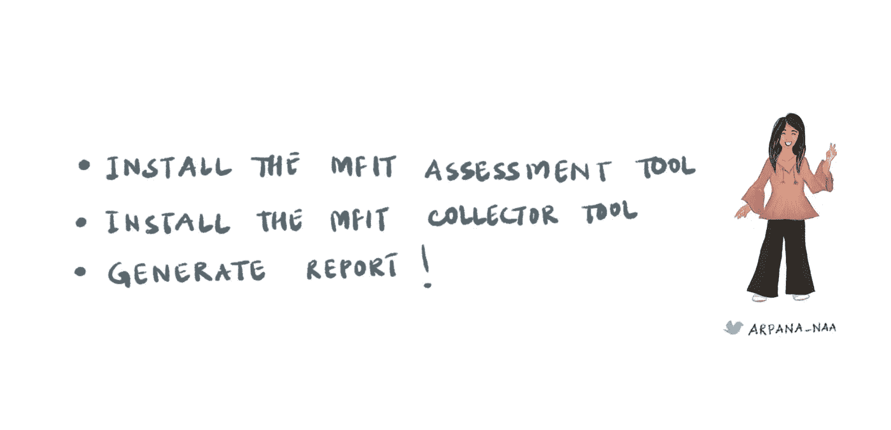
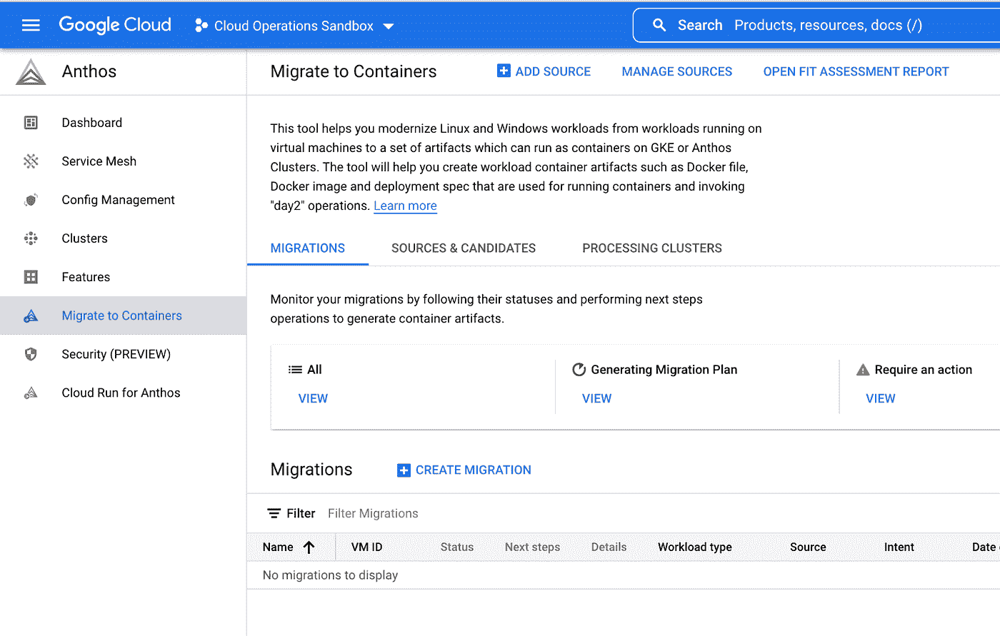
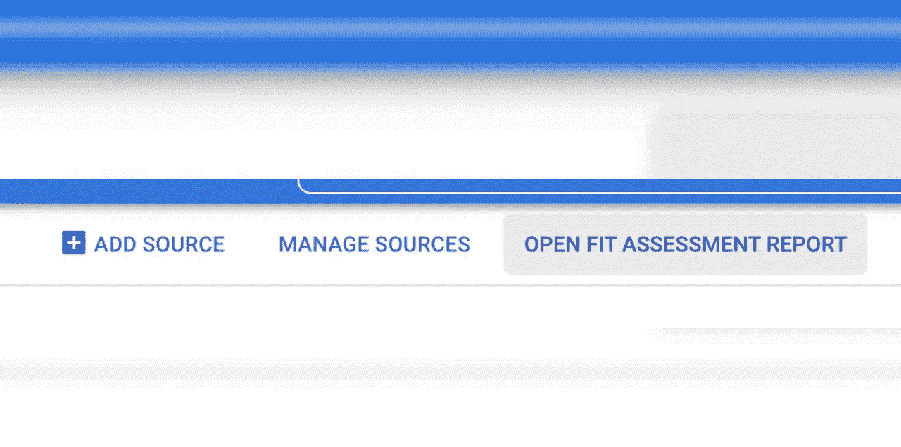
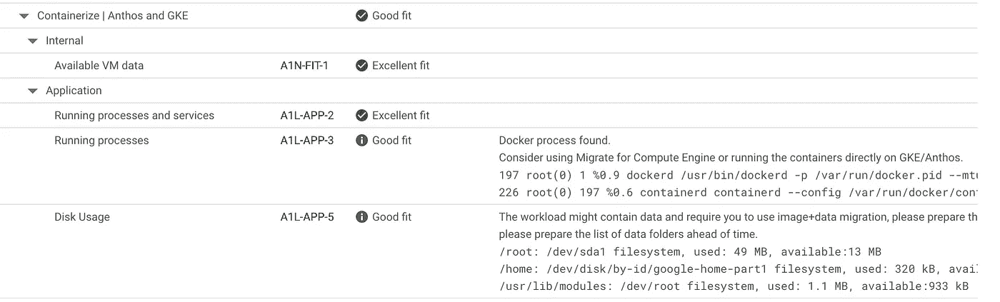

# 要不要集装箱化——这是个问题

> 原文：<https://medium.com/google-cloud/to-containerize-or-not-c3366c55f0b?source=collection_archive---------1----------------------->

## Google Cloud 给你带来了一个免费的工具来确定你的应用程序有多“适合”移动到容器。

集装箱|图片由 [Unsplash](https://unsplash.com/s/photos/container?utm_source=unsplash&utm_medium=referral&utm_content=creditCopyText) 上的通风视图拍摄

Mmicro services 更小&更简单的服务导致更快的创新，更好的产品。还有很多其他很酷的东西！
尽管知道好处，但有时很难决定是否准备好将应用程序容器化。如果是的话，你会怎么做？你需要从头开始写东西吗？很少甚至没有重构本身能完成这项工作吗？这些问题可能有主观的答案，人们可能最终会长时间思考这个决定。

如果你不想像我一样拖拖拉拉，你可以简单地使用 Google Cloud 提供的'**modernization fit**'工具。该工具生成一份报告，顾名思义,**确定您的应用程序是否准备好迁移到现代平台**。根据结果，您可以决定是否可以进行少量更改或不做更改，是否应该重构，或者完全重写。这是一种快速、自由、客观的方法。

> 在这篇博客中，我们将看到如何为运行在虚拟机上的应用程序使用这个工具来检查我们是否应该将它移动到运行在 GKE 上的容器中。

生成的评估报告描述了在迁移之前必须解决的任何问题，以及以下任一项的总体适合性评估:

*   非常合身。
*   很适合，有些发现可能需要注意。
*   迁移前需要最少的工作。
*   迁移前需要**适度的**工作。
*   迁移前需要**专业**工作。
*   不合适。
*   数据不足。

如果你想知道工具是如何确定配合的，看看这个[文档](https://cloud.google.com/migrate/containers/docs/mfit-how-it-works)。

# 那么，怎么用呢？

概览|作者图片

## **生成可读报告** —

在 GCP 控制台搜索栏中搜索 [Anthos](https://cloud.google.com/anthos) ，并转到[迁移到容器](https:/console.cloud.google.com/anthos/migrate/migrations)部分。

Anthos >迁移到容器|作者截图

点击“开放健身评估报告”。它会要求一个 json 文件。浏览下载的文件并上传您从 cloudshell 下载的文件，在我的例子中是 *app-mfit-report.json* 。将出现一个新屏幕，并在“我的报告>评估的虚拟机”部分生成一份报告。

上传 json，点击报告名称并通读详细信息！| GIF 作者 arpana_naa👩🏻‍💻

单击报告的名称进行查看。通读细节。你可以看到应用程序判断什么是一个很好的适合与否，并建议所需的变化。
这是一个免费的工具，所以即使你对自己的应用好奇，也可以尝试一下。

报告的一部分。|作者截图

这里的规则像' ***ATL1APP-x*** '等暗示了什么是 fit 平台。例如，'***' A1L-APP-3 '***意味着你有 docker 在 VM 上运行，考虑直接在 GKE 上运行它。

你可以在这里阅读其他规则推论[。这个工具能做的事情让我非常惊讶！要了解更多关于 mFit 工具的信息，或者检查您可以为哪些其他平台做好准备，请前往谷歌云文档中的](https://cloud.google.com/migrate/containers/docs/mfit-rules)[这一部分](https://cloud.google.com/migrate/containers/docs/mfit-about#modernization_journeys)。

如果您有任何问题，请随时发表评论，或者通过[Linkedin](https://www.linkedin.com/in/arpana11/)/[Twitter](https://twitter.com/arpana_naa)联系我！💁🏽‍♀️