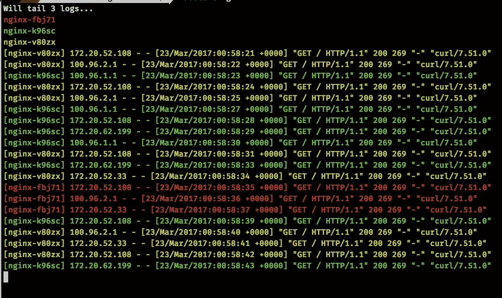

# 使用 kubernetes，让我的生活变得更轻松的工具

> 原文：<https://medium.com/google-cloud/tools-that-make-my-life-easier-to-work-with-kubernetes-fce3801086c0?source=collection_archive---------0----------------------->

我经常在 kubernetes 上工作，这里列出了一些工具，让我的生活更容易构建和管理。

*   shell 中的自动补全功能 —我用的是 [oh-myzsh](https://github.com/robbyrussell/oh-my-zsh) ，我想不出键入或复制粘贴每一个 podname。所以我用 kubectl 插件进行自动补全[https://github . com/robbyrussell/oh-my-zsh/blob/master/plugins/kubectl/kubectl . plugin . zsh](https://github.com/robbyrussell/oh-my-zsh/blob/master/plugins/kubectl/kubectl.plugin.zsh)



库贝泰尔

*   *跟踪日志* —这是关于在一个窗口中跟踪来自多个窗格的日志的游戏规则改变者——[https://github.com/johanhaleby/kubetail](https://github.com/johanhaleby/kubetail)。

```
kubetail nginx# filter by containers with in pods 
kubetail l5d -c l5d
```


库伯内特语境

*   *皮条客我的背景* —我与多个 k8s 环境合作，我必须知道我在与哪个环境合作，并且有人在推特上发布了这个脚本。我把它放在我的。哦，我的天啊/themes/agnoster.zsh-theme。该上下文显示了 *k8s 上下文*和当前的*名称空间*。

```
prompt_kubecontext() {
        prompt_segment white black "k8s-`kubectl config current-context`/`kubectl config get-contexts --no-headers | grep '*' | awk '{print $5}'`"
}
## Main prompt
build_prompt() {
  RETVAL=$?
  prompt_status
  prompt_dir
  prompt_git
  prompt_kubecontext
  prompt_end

}PROMPT='%{%f%b%k%}$(build_prompt) '
```

*   管理秘密——这是一个在 k8s[https://github.com/dtan4/k8sec](https://github.com/dtan4/k8sec)中管理秘密的便利工具，它总是方便地解码秘密，而不是做 bunch *jq* 或 *jsonpath。*
*   端口转发——一些服务/pods 是内部的，不能通过 LB 获得，我真的不记得 kubectl 端口转发命令了。这是我的脚本，它使端口转发变得简单。

```
#Port forward to linkerd
l5admin(){ kportforward l5d admin app=l5d 9000}#clean up l5d admin port forwarding
l5clean(){lsof -t -i tcp:9000 | xargs kill}#Port forward k8s
# $1 servicename
# $2 portname
# $3 pod selector
# $4 local port
kportforward() {
ADMINPORT=$(kubectl get svc $1  -o json |jq '.spec.ports[]| select(.name=="'$2'").port')
POD=$(kubectl get pods  --selector $3 \
  -o template --template '{{range .items}}{{.metadata.name}} {{.status.phase}}{{"\n"}}{{end}}' \
  | grep Running | head -1 | cut -f1 -d' ')
kubectl port-forward  $POD $4:$ADMINPORT &
sleep 2
open [http://localhost:9000](http://localhost:9000)
}
```

*   kubectl hacks——一些让生活更简单的 kubectl hacks

```
#copy remote file locally
kubectl cp pod:/remote-file /local/file#verbose kubectl
kubectl  --v=8 version
```