# 13 大谷歌云参考架构

> 原文：<https://medium.com/google-cloud/top-13-google-cloud-reference-architectures-c8a697546505?source=collection_archive---------0----------------------->

## #BuildonGCP 架构系列综述

👋嗨，云开发者！！去年我在推特上创作了你们都喜欢的 [#13DaysOfGCP 迷你系列](/google-cloud/13-most-common-google-cloud-reference-architectures-23630b46326d)。所以，在这里我整理了 13 个比较常见的谷歌云参考架构。如果你没能抓住它，或者如果你错过了几天，在这里我给你带来了总结！

## [0:基于 GCP 系列介绍](https://twitter.com/pvergadia/status/1402309846184214536)

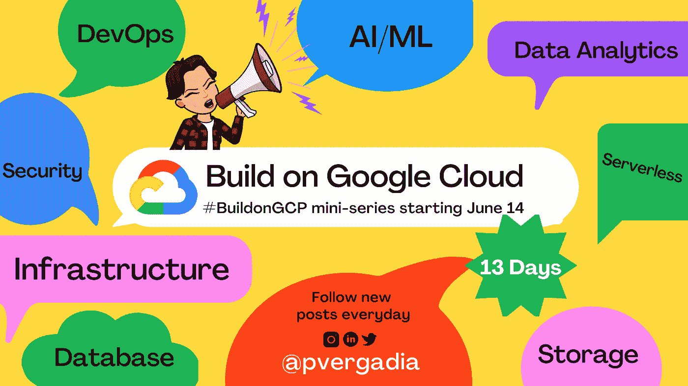

#BuildonGCP

## 1: [使用谷歌云构建流媒体视频分析管道](https://twitter.com/pvergadia/status/1404469266439675908)

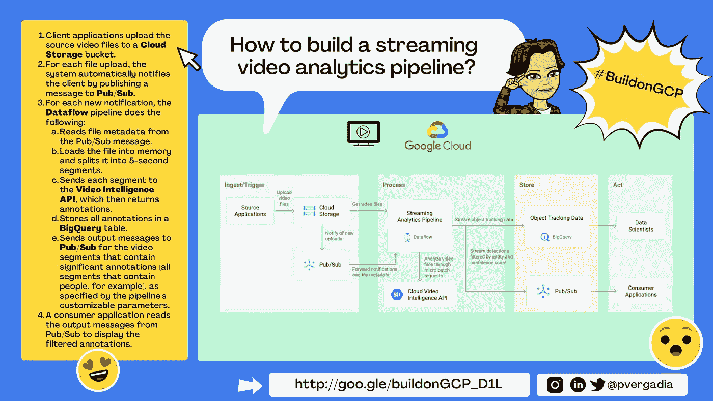

使用 Google Cloud 构建流媒体视频分析管道

## [2:在 Google Cloud 上使用数据流和云视觉 API 构建 ML 视觉分析解决方案](https://twitter.com/pvergadia/status/1404891668126519302)

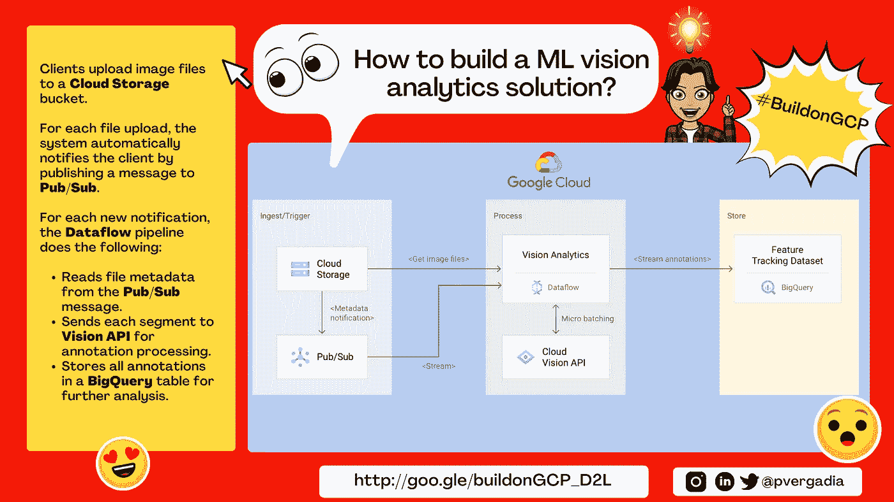

[在 Google Cloud](https://twitter.com/pvergadia/status/1404891668126519302) 上使用数据流和云视觉 API 构建 ML 视觉分析解决方案，作者@pvergadia

## [3:在 Google Cloud & AWS](https://twitter.com/pvergadia/status/1405194061963800579) 之间建立 HA VPN 连接

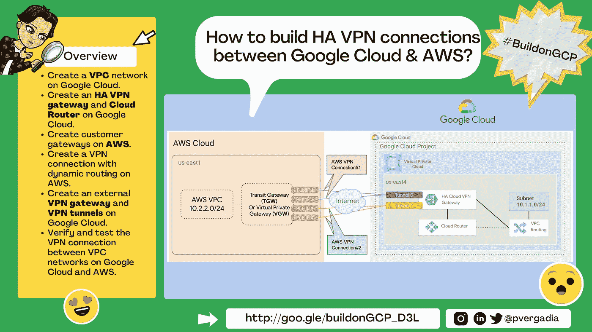

[在 Google Cloud & AWS](https://twitter.com/pvergadia/status/1405194061963800579) 之间建立 HA VPN 连接

## [4:如何将微软 SQL Server 从 AWS 迁移到谷歌云计算引擎](https://twitter.com/pvergadia/status/1405571407363313671)

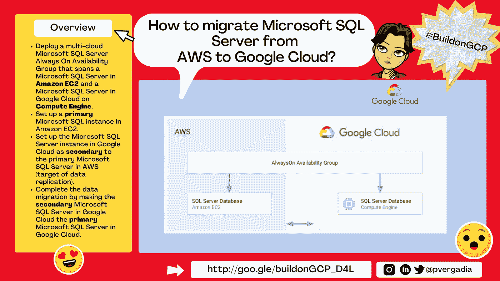

[如何将微软 SQL Server 从 AWS 迁移到谷歌云计算引擎](https://twitter.com/pvergadia/status/1405571407363313671)

## [5:如何从 Oracle OLTP 系统迁移到 Cloud Spanner](https://twitter.com/pvergadia/status/1405933808378077186)

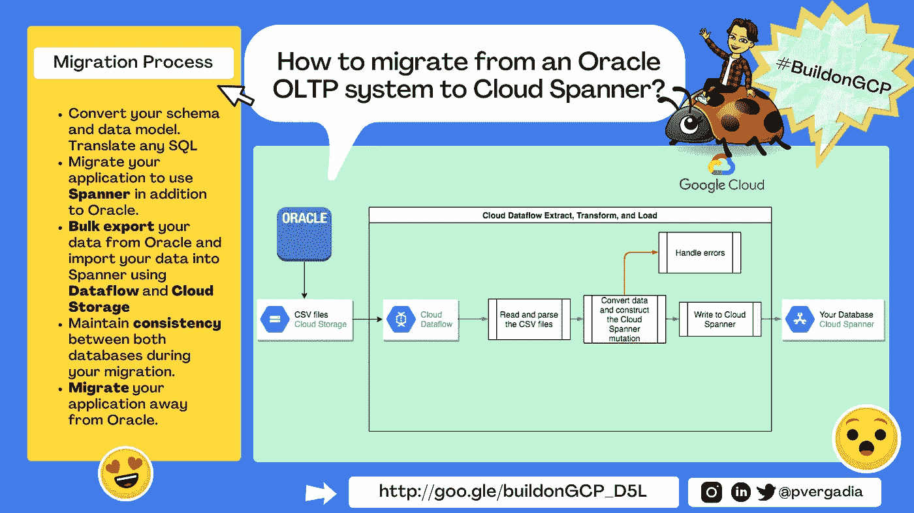

[如何从 Oracle OLTP 系统迁移到 Cloud Spanner](https://twitter.com/pvergadia/status/1405933808378077186)

## [6:如何使用 Terraform、云构建、& GitOps](https://twitter.com/pvergadia/status/1406295981583441932) 将基础设施作为代码进行管理

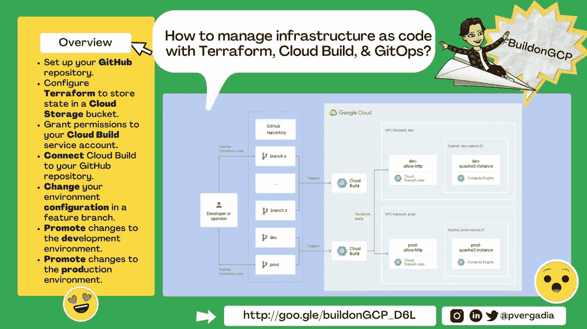

[如何使用 Terraform、云构建、& GitOps](https://twitter.com/pvergadia/status/1406295981583441932) 将基础设施作为代码进行管理

## [7:端到端 MLOps 工作流程](https://twitter.com/pvergadia/status/1406703531793453061)

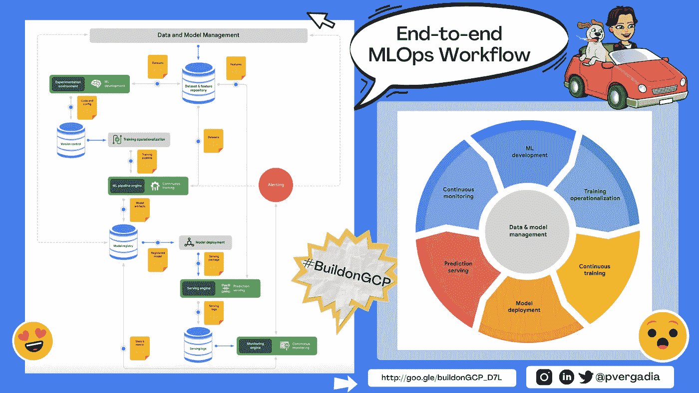

[端到端 MLOps 工作流程](https://twitter.com/pvergadia/status/1406703531793453061)

## [8:如何在 Google Cloud 上“无服务器”的用云运行](https://twitter.com/pvergadia/status/1407005927312707593)

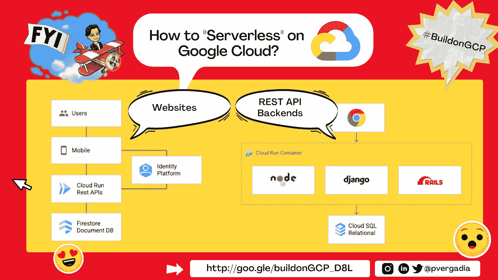

[如何用云运行在 Google Cloud 上“无服务器”](https://twitter.com/pvergadia/status/1407005927312707593)

## [9:如何从雪花迁移到 BigQuery](https://twitter.com/pvergadia/status/1407383318971179009)

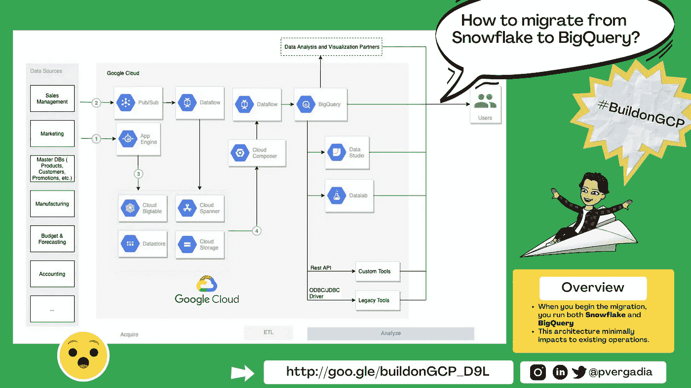

[如何从雪花迁移到 BigQuery](https://twitter.com/pvergadia/status/1407383318971179009)

## [10:如何为 GKE 工作负载构建持续交付渠道](https://twitter.com/pvergadia/status/1407730741836910596)

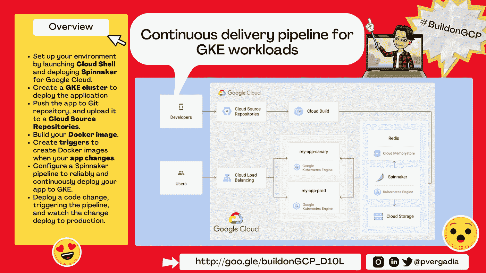

[如何为 GKE 工作负载构建持续交付渠道](https://twitter.com/pvergadia/status/1407730741836910596)

## [11:如何将虚拟机迁移到计算引擎](https://twitter.com/pvergadia/status/1408108101316796418)

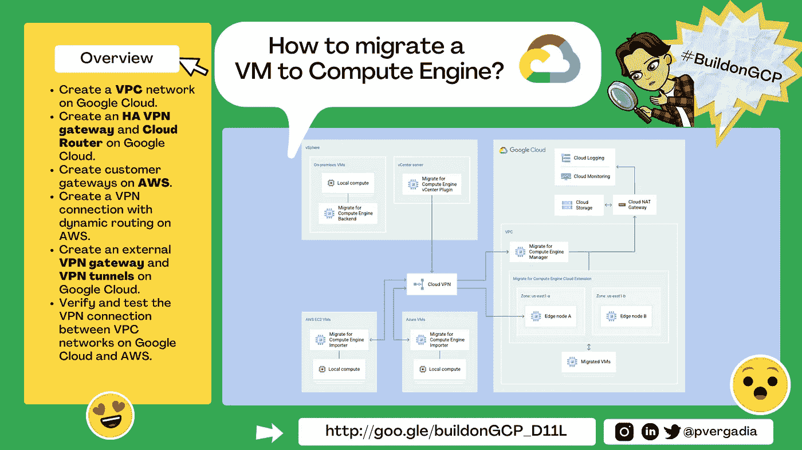

[如何将虚拟机迁移到计算引擎](https://twitter.com/pvergadia/status/1408108101316796418)

## [12:如何使用数据流将数据实时复制到 big query](https://twitter.com/pvergadia/status/1408470485155909638)

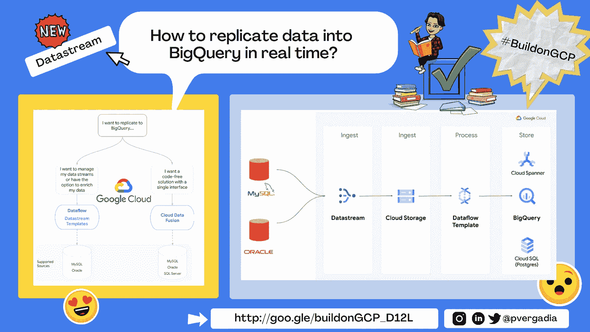

[如何使用数据流将数据实时复制到 BigQuery 中](https://twitter.com/pvergadia/status/1408470485155909638)

## [13:顶点人工智能概述](https://twitter.com/pvergadia/status/1408892959219662850)

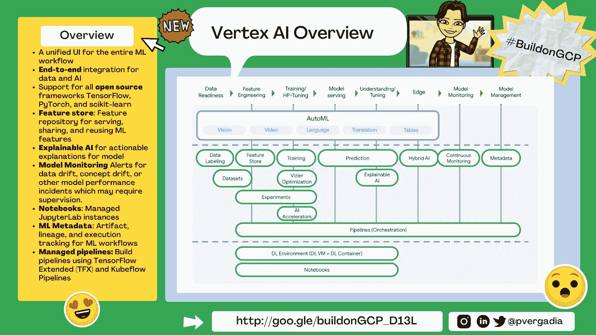

[顶点 AI 概述](https://twitter.com/pvergadia/status/1408892959219662850)

这是 13 位亲手挑选的谷歌云架构。我非常感谢你的参与和主题建议，它们让这个系列变得如此有趣，不仅对我，对 Google Cloud 社区的其他成员也是如此！

再次感谢👋直到后来🙂