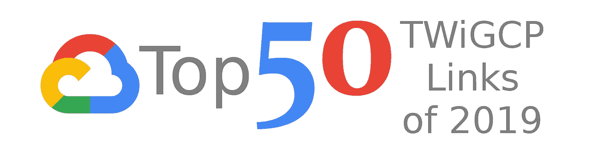

# 2019 年 50 大 TWiGCP 链接

> 原文：<https://medium.com/google-cloud/top-50-twigcp-links-of-2019-af2d2bccd83e?source=collection_archive---------1----------------------->

我(几乎)在 2019 年的每个周一早上，在 GCP 整理一份“ [*”的本周回顾。有 49 个版本，超过 2000 个链接。以下是点击量最高的前 50 个链接。*](https://medium.com/google-cloud/weekly/home)

这些链接显然包含重大发布(许多来自 4 月份的 Cloud Next’19)，但也包含许多开发人员、云原生、大数据、数据库和运营相关的链接。有趣的是，网络也有很好的表现。

毫不奇怪(至少对我来说)，许多流行的行业解决方案也是这些顶级链接的一部分:snowflake、Envoy、Spinnaker、Redis、Kafka 和 Jenkins。

认证仍然是一个强有力的话题，多次出现，而 SRE 也出现了几次。最后，特别提到 GCP 流程图(嗨，格蕾丝！；)

事不宜迟，以下是前 50 名:

1.  [介绍**Anthos**](https://cloud.google.com/blog/topics/hybrid-cloud/new-platform-for-managing-applications-in-todays-multi-cloud-world)
2.  [宣布**云码**](https://cloud.google.com/blog/products/devops-sre/announcing-cloud-code-accelerating-cloud-native-application-development)
3.  [宣布**云运行**](https://cloud.google.com/blog/products/serverless/announcing-cloud-run-the-newest-member-of-our-serverless-compute-stack)
4.  [如何在 Google **云壳**](/google-cloud/354d125d5748) 中运行 **Visual Studio 代码**
5.  [宣布**新 GKE 建筑专业化**](https://cloud.google.com/blog/products/containers-kubernetes/announcing-new-gke-architecture-specialization)
6.  [云学习者](https://inthecloud.withgoogle.com/cloud-certification)，获得谷歌云**认证**
7.  [无服务器:关于谷歌**云功能**](https://thenewstack.io/serverless-everything-you-need-to-know-about-google-cloud-functions/) 你需要知道的一切
8.  [将**开源**的精华带给谷歌云客户](https://cloud.google.com/blog/products/open-source/bringing-the-best-of-open-source-to-google-cloud-customers)
9.  [使用**特使代理**对 GKE 的 gRPC 服务进行负载均衡](https://cloud.google.com/solutions/exposing-grpc-services-on-gke-using-envoy-proxy)
10.  [在谷歌云平台](https://cloud.google.com/blog/products/data-analytics/announcing-snowflake-on-google-cloud-platform)上宣布**雪花**
11.  [有什么比装酷更酷？**冰库**冰库](https://cloud.google.com/blog/products/storage-data-transfer/whats-cooler-than-being-cool-ice-cold-archive-storage)
12.  [扩展**谷歌云人工智能**让开发者更容易构建和部署人工智能](https://cloud.google.com/blog/products/ai-machine-learning/expanding-google-cloud-ai-to-make-it-easier-for-developers-to-build-and-deploy-ai)
13.  你有 SRE 团队了吗？如何开始和评估你的旅程
14.  [在计算引擎](https://cloud.google.com/solutions/chrome-desktop-remote-on-compute-engine)上设置 **Chrome 远程桌面**
15.  [从数据接收到洞察预测](https://cloud.google.com/blog/products/data-analytics/google-cloud-smart-analytics-accelerates-your-business-transformation)(4 月**数据分析**公告)
16.  [连接 **Firebase 和 Unity** 在 mecha 仓鼠](https://cloud.google.com/solutions/connecting-firebase-and-unity-to-create-a-gaming-leaderboard)中创建游戏排行榜
17.  [简化员工、合作伙伴和客户的**身份和访问管理**](https://cloud.google.com/blog/products/identity-security/simplifying-identity-and-access-management-of-your-employees-partners-and-customers)
18.  [让谷歌云成为运行你的**微软视窗**应用](https://cloud.google.com/blog/products/gcp/making-google-cloud-the-best-place-to-run-your-microsoft-windows-applications)的最佳场所
19.  [**zeta SQL**—SQL 的分析器框架](https://github.com/google/zetasql)
20.  [**GKE 用量计量**:到底是谁的行项目？](https://cloud.google.com/blog/products/containers-kubernetes/gke-usage-metering-whose-line-item-is-it-anyway)
21.  [通过按时停止和启动**计算引擎**实例](https://cloud.google.com/blog/products/storage-data-transfer/save-money-by-stopping-and-starting-compute-engine-instances-on-schedule)来节省资金
22.  [使用 **Istio** 对内部 gRPC 服务进行负载平衡](https://cloud.google.com/solutions/using-istio-for-internal-load-balancing-of-grpc-services)
23.  [打造一款**无服务器网络游戏**](https://cloud.google.com/blog/products/application-development/building-a-serverless-online-game-cloud-hero-on-google-cloud-platform)
24.  [为谷歌云平台](https://cloud.google.com/blog/products/devops-sre/introducing-spinnaker-for-google-cloud-platform-continuous-delivery-made-easy)引入 **Spinnaker**
25.  [**Firebase** &谷歌云:与云 Firestore 有什么不同？](/google-developers/firebase-google-cloud-whats-different-with-cloud-firestore-40f1fc3e6d1e)
26.  [在 GCP 上运行 **Redis** :四种部署场景](https://cloud.google.com/blog/products/databases/running-redis-on-gcp-four-deployment-scenarios)
27.  [使用谷歌云功能](https://dev.to/di/using-secrets-in-google-cloud-functions-5aem)中的**秘密**
28.  [SRE**团队是如何组织的**以及如何开始](https://cloud.google.com/blog/products/devops-sre/how-sre-teams-are-organized-and-how-to-get-started)
29.  [使用**云 IAP** 环境感知访问控制](https://cloud.google.com/blog/products/identity-security/protecting-your-cloud-vms-with-cloud-iap-context-aware-access-controls)保护您的云虚拟机
30.  [谷歌专业云安全工程师**认证**](https://www.jhanley.com/google-professional-cloud-security-engineer-certification/)
31.  [Google**云如何运行**结合无服务器和容器](https://thenewstack.io/how-google-cloud-run-combines-serverless-with-containers/)
32.  [Gartner 称谷歌云在其 **IaaS 魔力象限**](https://cloud.google.com/blog/products/gcp/gartner-names-google-cloud-a-leader-in-its-iaas-magic-quadrant) 中处于领先地位
33.  [big query 中的新功能:持久 UDF—feli PE Hoffa](/@hoffa/new-in-bigquery-persistent-udfs-c9ea4100fd83)
34.  [宣布对**谷歌云网络**](https://cloud.google.com/blog/products/networking/powering-enterprise-transformation-announcing-new-additions-to-google-cloud-networking) 的新补充
35.  [**BigQuery** 加密函数](/google-cloud/bigquery-encryption-functions-part-i-data-deletion-retention-with-crypto-shredding-7085ecf6e53f)
36.  [**AutoML** 视觉文档](https://cloud.google.com/vision/automl/docs/)
37.  [HTTPS 与**证书管理员**在 GKE](/@jonbcampos/https-with-cert-manager-on-gke-49a70985d99b)
38.  [谷歌收购 **Looker**](https://cloud.google.com/blog/topics/inside-google-cloud/expanding-our-platform-for-business-intelligence-and-embedded-analytics)
39.  [在 Data Studio](https://www.blog.google/products/marketingplatform/analytics/introducing-bigquery-parameters-data-studio/) 中引入 **BigQuery** 参数
40.  [介绍**詹金斯** GKE 插件](https://cloud.google.com/blog/products/devops-sre/introducing-the-jenkins-gke-plugin-deploy-software-to-your-kubernetes-clusters/)
41.  [在 Kubernetes 上运行还是不运行**数据库:要考虑什么**](https://cloud.google.com/blog/products/databases/to-run-or-not-to-run-a-database-on-kubernetes-what-to-consider)
42.  [使用**云代码**在 Pixelbook](https://cloud.google.com/blog/products/application-development/build-a-dev-workflow-with-cloud-code-on-a-pixelbook) 上构建开发工作流
43.  [企业**数据库**，为您管理](https://cloud.google.com/blog/products/databases/enterprise-databases-managed-for-you)(四月数据库公告)
44.  [GCP **流程图**](https://grumpygrace.dev/posts/gcp-flowcharts/)
45.  [你的**云存储**如何成长？具有可扩展的计划和价格下降](https://cloud.google.com/blog/products/storage-data-transfer/how-does-your-cloud-storage-grow-with-a-scalable-plan-and-a-price-drop)
46.  [**现场可靠性工程**:测量和管理可靠性](https://www.coursera.org/learn/site-reliability-engineering-slos)
47.  [谷歌云平台和融合合作伙伴提供托管 Apache **Kafka** 服务](https://cloud.google.com/blog/products/gcp/google-cloud-platform-and-confluent-partner-to-deliver-a-managed-apache-kafka-service/)
48.  [T21 流量总监如何为开放服务网格提供全局负载平衡](https://cloud.google.com/blog/products/networking/traffic-director-global-traffic-management-for-open-service-mesh)
49.  [使用 **BigQuery**](https://www.coursera.org/learn/gcp-exploring-preparing-data-bigquery?utm_source=googlecloud) 探索和准备您的数据
50.  [宣布云 **Firestore** 正式上市和更新](https://cloud.google.com/blog/products/databases/announcing-cloud-firestore-general-availability-and-updates)

有什么让你惊讶的吗？有什么你认为应该在清单上的吗？添加一条评论，我会告诉你它离前 50 名有多远！