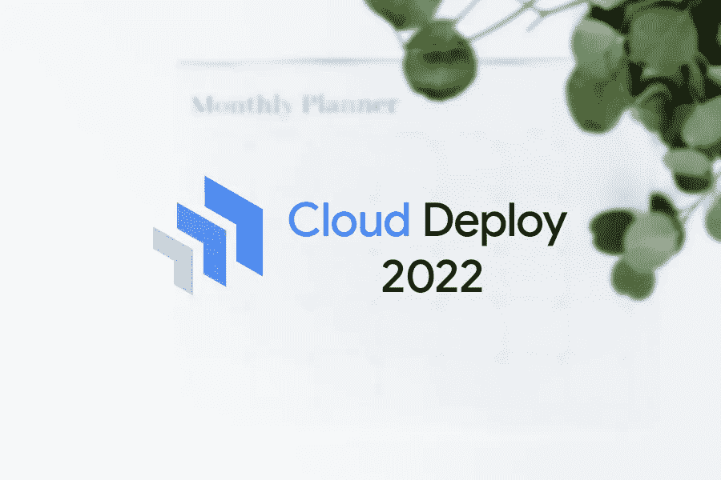
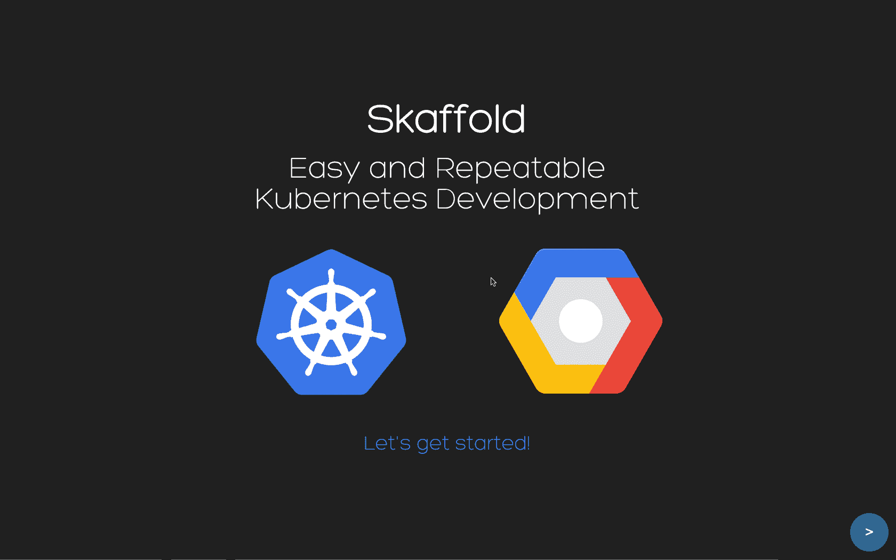

# 2022 年云部署的主要特性

> 原文：<https://medium.com/google-cloud/top-cloud-deploy-features-2022-eeb4721513a3?source=collection_archive---------0----------------------->

Google Cloud Deploy 本身相对于 Google Cloud Platform(GCP)来说是一个新产品。让我们从为什么我们需要 Google Cloud Deploy 以及 Cloud Deploy 可以帮助我们解决哪些问题开始。



> **Google Cloud Deploy 概述(如果您已经熟悉 Cloud Deploy，请跳过此部分)**

您已经编写了代码并将应用程序容器化。现在缺少的是我们如何部署应用程序。 **Cloud Deploy** 是一款面向 GKE /安索斯的全托管持续交付解决方案，可以帮助您。

***“斯卡福德”是什么？***

[ska fold](https://skaffold.dev/docs/)是 Google [开源的](https://github.com/GoogleContainerTools/skaffold)命令行工具，方便了 Kubernetes-native 应用程序的持续开发。Skaffold 处理构建、推送和部署应用程序的工作流，并为创建 CI/CD 管道提供构建块。



> **问题 1:我可以在哪里使用 Cloud Deploy 部署我的应用程序？**

Google Cloud Deploy 让您的应用程序进入您的目标运行时环境。运行时定义了计算资源及其管理方式。您可以使用一个***ska fold . YAML***配置文件来部署您的容器映像和清单。

Google Cloud Deploy 可以将您的应用程序部署到以下任何运行时环境中:

*   [**GKE**](https://cloud.google.com/deploy/docs/gke-targets)*Google Cloud Deploy 允许您将基于容器的工作负载部署到任何* [*Google Kubernetes 引擎*](https://cloud.google.com/kubernetes-engine/docs/concepts/kubernetes-engine-overview) *集群。当您部署到 GKE 目标时，所有 Google Cloud Deploy 功能都受支持。*
*   [**Anthos**](https://cloud.google.com/deploy/docs/anthos-targets)*Google Cloud Deploy 允许您将基于容器的工作负载部署到您可以使用*[*Connect*](https://cloud.google.com/anthos/multicluster-management/gateway/using)*gateway 访问的任何 Anthos 用户集群。*
*   [**云运行**](https://cloud.google.com/deploy/docs/run-targets)**(Pre-GA)** *Google Cloud Deploy 允许您将基于容器的工作负载部署到任何* [*云运行服务*](https://cloud.google.com/run/docs/deploying) *。当您部署到云运行目标时，所有 Google Cloud Deploy 特性都受支持。*

> 问题 2:我如何检查我的部署的合理性？我可以在部署后自动运行测试吗？

现在，您可以使用您自己的测试映像在部署上运行验证测试。在**"***ska ffold apply***"**执行成功完成后，Cloud Deploy 在自己的执行环境中运行 *skaffold verify* 命令。验证步骤应该在"*ska fold . YAML*"中与部署本身一起定义。为 Google Cloud Deploy 目标启用部署验证包括向交付管道进程中的给定目标(或多个目标)添加一个`[verify: true](https://cloud.google.com/deploy/docs/config-files#pipeline_definition_and_progression)` [属性](https://cloud.google.com/deploy/docs/config-files#pipeline_definition_and_progression)。

```
apiVersion: deploy.cloud.google.com/v1
kind: DeliveryPipeline
metadata:
 name: my-demo-app
description: main application pipeline
serialPipeline:
 stages:
 - targetId: dev
   profiles: []
   strategy:
     standard:
       verify: true
 - targetId: prod
   profiles: []
   strategy:
     standard:
       verify: false
```

在这个配置中，部署验证在`dev`目标上启用，但在`prod`目标上不启用。注意，`verify: false`相当于省略了`verify`属性或者整个`strategy`节。

下面是一个包含`verify`节的示例`skaffold.yaml`

```
apiVersion: skaffold/v3alpha1
kind: Config
build:
  artifacts:
    - image: integration-test
      context: integration-test
manifests:
  rawYaml:
  - kubernetes.yaml
deploy:
  kubectl: {}
**verify**:
- name: verify-integration-test
  container:
    name: integration-test
    image: integration-test
    command: ["./test-systems.sh"]
- name: verify-endpoint-test
  container:
    name: alpine
    image: alpine
    command: ["/bin/sh"]
    args: ["-c", "wget $ENDPOINT_URL"]
```

> **问题 3:我可以使用 terraform 来管理云部署服务吗？**

除了控制台和 gcloud 方法，Google Terraform Provider 还添加了云部署资源。

*   **Google _ cloud _ deploy _ delivery _ pipeline** *交付管道定义了 skaffold 配置可以通过其进行的管道。*

```
**resource** "google_cloud_deploy_delivery_pipeline" "pipeline" {
  name          = "dev-${local.name_suffix}"
  description   = "Dev Pipeline"
  serial_pipeline {
    stages {
      target_id = "dev"
    }
  }
  annotations = {
    generated-by = "magic-modules"
  }
  labels = {
    env = "dev"
  }
  region        = "us-central1"
}
```

*   **Google _ cloud _ deploy _ target** 

```
resource "google_cloud_deploy_target" "pipeline" {
  name        = "tf-test-tf-test%{random_suffix}"
  description = "Target Prod Cluster"
  annotations = {
    generated-by = "magic-modules"
    another      = "one"
  }
  labels = {
    env = "prod"
  }
  gke {
    cluster = "projects/%{project}/locations/us-central1/clusters/prod"
  }
  execution_configs {
    usages          = ["RENDER"]
    service_account = data.google_compute_default_service_account.default.email
  }
  execution_configs {
    usages          = ["DEPLOY"]
    service_account = "example@appspot.gserviceaccount.com"
  }
}data "google_compute_default_service_account" "default" {

}
```

> **其他有价值的特性**

*   您可以使用 Cloud Deploy 为云构建操作配置 [**超时**](https://cloud.google.com/deploy/docs/deploying-application#change_the_deployment_timeout) 。
*   如果您使用 Kubernetes 清单为每个发布创建一个发布，那么 Cloud Deploy 可以自动生成一个“ ***skaffold.yaml*** ”文件。
*   现在您可以比较不同的 Kubernetes 和 Skaffold 配置文件之间的差异。
*   现在支持暂停或放弃一个版本。

**参考文献**

 [## 斯卡福德文件

### Skaffold 是一个命令行工具，有助于 Kubernetes 本地应用程序的持续开发。斯卡福德…

斯卡福德开发公司](https://skaffold.dev/docs/) [](https://cloud.google.com/deploy/docs/overview) [## Google Cloud Deploy 概述

### Google Cloud Deploy 是一项托管服务，可以自动将您的应用交付给一系列目标…

cloud.google.com](https://cloud.google.com/deploy/docs/overview) [](https://cloud.google.com/deploy/docs/verify-deployment) [## 验证您的部署|谷歌云部署

### 预览此产品包含在 Google Cloud 服务条款的正式发布前产品条款中。正式上市前的产品…

cloud.google.com](https://cloud.google.com/deploy/docs/verify-deployment)