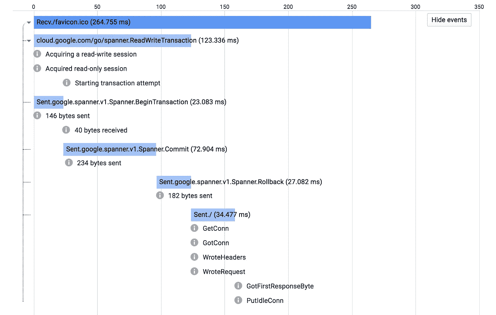
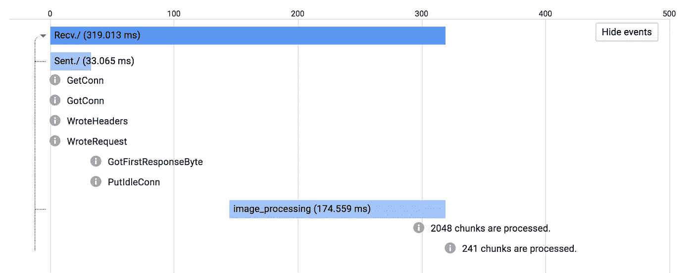
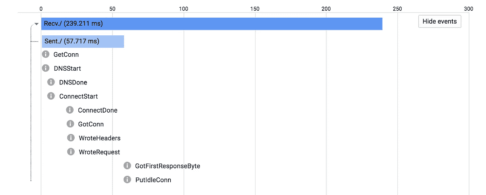
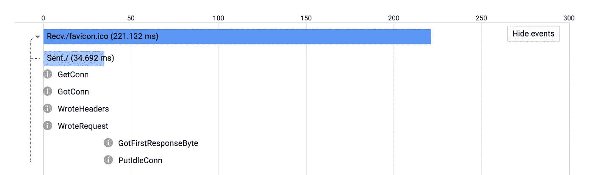

# 追踪谷歌云

> 原文：<https://medium.com/google-cloud/tracing-google-cloud-8f0c8ba8181c?source=collection_archive---------1----------------------->

我们认为调试我们的平台应该更容易。我们认为延迟是衡量服务是否按预期运行的关键指标。我们认为应该更容易理解服务拓扑。我们认为端到端地跟踪用户请求生命周期中的所有重要事件/请求应该是容易的。我们的用户同意。

谷歌云平台上的一个普遍需求是能够更好地调试生产服务。当涉及许多移动部件时，查明停机的根本原因可能会变得复杂。

前阵子我们介绍了 [Stackdriver Trace](https://cloud.google.com/trace/) 。Stackdriver Trace 允许我们端到端地分析用户请求，并跟踪所有内部请求，直到用户得到响应。我们最近还在谷歌开源了我们的仪器堆栈的一部分，叫做 [OpenCensus](https://opensource.googleblog.com/2018/01/opencensus.html) 。OpenCensus 的设计不依赖于任何谷歌技术。它可以向任何提供商或开源工具上传指标和跟踪数据。对我们来说，用户仪器的可移植性是一个核心的基本目标。

尽管发布这些工具有助于我们的生态系统，但我们认为我们可以做得更多。我们最近启动了一些计划，从我们的平台上提供更有吸引力和有用的现成数据，这样我们的用户就可以看到并受益于跟踪数据的可用性，而无需任何工作。总体目标是提供平台可以生成的所有痕迹，并允许用户参与定制检测。

*   Envoy/Istio 正在自动生成 HTTP 和 gRPC 跟踪。
*   对于不喜欢 sidecar 模型的用户，主要针对 HTTP 和 gRPC 的 OpenCensus 框架集成会自动生成 HTTP 和 gRPC 跟踪。
*   我们即将推出的无服务器构建模块配备了 OpenCensus，允许用户使用相同的库参与追踪。
*   谷歌云图书馆配备了 OpenCensus，可以追踪你现有的踪迹。
*   像 [Go Cloud](https://github.com/google/go-cloud) 这样为可移植性而设计和构建的框架正在利用我们的可移植工具栈来收集和报告踪迹。
*   我们正在寻找跟踪我们的数据管道产品的方法，以便让您更深入地了解数据处理基础设施的内部机制。

允许平台级别的可见性有助于我们的用户快速调试和确定意外事件。另一个优点是，判断停机是源于平台还是用户代码变得更加容易。用户跟踪可以在内部被跟踪，这让我们的工程师可以轻松地对客户问题做出反应，并分析对我们基础设施的影响。



云客户端库正在尽力提供底层细节。上图中，你可以看到处理程序试图[应用](https://godoc.org/cloud.google.com/go/spanner#Client.Apply)一些插入。对于我们的大多数用户来说，Apply 是一个黑盒，直到他们看到提交事务所需的跟踪和整个过程。

```
import "cloud.google.com/go/spanner"mux.HandleFunc("/", func(w http.ResponseWriter, r *http.Request) {
    _, err := spannerClient.Apply(**r.Context()**, []*spanner.Mutation{
        spanner.Insert("Users",
            []string{"name", "email"},
            []interface{}{"alice", "[a@example.com](mailto:a@example.com)"})})
    if err != nil {
        // TODO: Handle error.
    }
    // TODO: Handler code.
})
```

我们平滑集成的美妙和简单之处在于，您只需传递当前的上下文，而库正在做它们的工作来保持跟踪。

如果您想添加一些定制的工具，这很好。您只需在当前上下文中使用跟踪库，就可以立即参与当前跟踪。

```
import "go.opencensus.io/trace"mux.HandleFunc("/", func(w http.ResponseWriter, r *http.Request) {
    _, span := trace.StartSpan(**req.Context()**, "image_processing")
    // TODO: Do image processing and add annotations.
    span.End()
})
```



看到 image_processing span 出现在带有用户自定义注释的处理程序跟踪中。

我们正努力从我们依赖的语言运行时和底层组件中收集信息，以丰富我们的跟踪数据。例如，Go 请求可以用网络事件自动注释。



您看到的是服务器冷启动，它一处理`/'就发出请求。您可以获得在传出请求的生命周期中发生的所有低级网络事件的非常精确的数据。



对同一个服务器的同一个端点的第二个请求会给我们一个稍微不同的响应。您可以看到，第二个请求中完全省略了 DNS，因为我们必须从前面的请求中缓存 DNS 结果。

这种粒度级别的数据无疑有助于我们和我们的用户调试意外的网络事件。我们希望尽可能多地增强我们的能力，因为我们所依赖的层允许我们这样做。

## 后续步骤

我们愿意将这种流畅的体验作为默认。我们希望通过提供平台跟踪并允许用户通过使用当前上下文简单地跟踪平台跟踪来使它变得容易。

我们希望利用更多的信息来源，并制定更好的策略来可视化收集的数据。

我们正在显著改善 UX 的堆栈驱动程序跟踪。如果你想私下进行，请随时在这里插话，并在 jbd@google.com 与我联系。

我们希望在监控数据和跟踪、跟踪和配置文件、跟踪和日志以及跟踪和错误之间建立更好的连接。我们希望您能够通过查看跟踪数据来分析系统的拓扑结构。在 [GCP 博客](https://cloudplatform.googleblog.com/2018/07/drilling-down-into-stackdriver-service-monitoring.html)上查看这些功能的评论。

我们需要更好的中间工具来捕获第 95、99 百分位的案例，即使您更喜欢积极地向下采样，并确保我们总是为它们生成轨迹。

我们希望我们的用户能够灵活地将他们的数据上传到他们选择的供应商或工具——而不仅仅是 Stackdriver。

我们希望我们的用户能够高度了解他们自己的系统以及他们所依赖的系统，比如我们的系统。