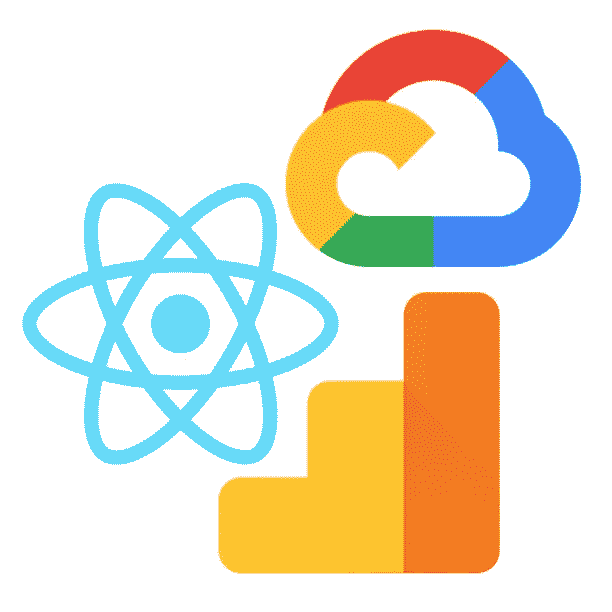

# 设置 Google Analytics 在几分钟内跟踪 React.js 网站。

> 原文：<https://medium.com/google-cloud/tracking-site-visits-on-react-app-hosted-in-google-cloud-using-google-analytics-f49c2411d398?source=collection_archive---------0----------------------->

为了本教程的简单，我将从我上一个教程的[开始，我们创建了一个名为 go-go-cloud 的 React-app，并将其托管在](/@lawrey/hosting-a-react-js-app-on-google-cloud-app-engine-6d1341b75d8c)[谷歌云](https://cloud.google.com/)上。在这里，我们将看看如何使用 Github 的开源库 [React-GA](https://github.com/react-ga/react-ga) 来整合谷歌的分析。