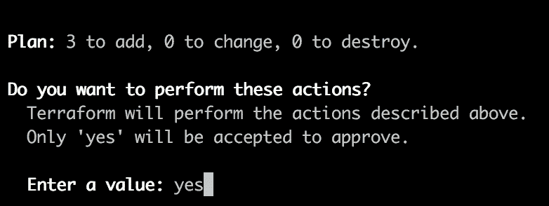

# 由 Terraform 管理的 Google Kubernetes 引擎集群上的 Traefik

> 原文：<https://medium.com/google-cloud/traefik-on-a-google-kubernetes-engine-cluster-managed-by-terraform-ad871be8ee26?source=collection_archive---------0----------------------->

Google Kubernetes 引擎是一个很好的、简单的方法来探索 Kubernetes，而不必担心自己创建一个集群。

在摆弄它的时候，我立即开始问自己如何自动化创建 GKE 集群的过程，以及如何轻松地部署强大的 [Traefik](https://traefik.io/) 作为我的入口控制器。

# 最初的想法

首先，正如已经提到的，我想尽可能自动化。因此，我决定使用以下工具:

*   [gcloud 命令行](https://cloud.google.com/sdk/gcloud/)
*   [地形](https://www.terraform.io/)
*   [库贝克特尔](https://kubernetes.io/docs/reference/kubectl/overview/)

由于 terraform kubernetes 提供程序中缺少修改集群上 RBAC 的功能，我偏离了最初的想法，只通过 terraform 部署 traefik，并决定也使用 kubectl。

# 要求

当然，首先我们需要一个 GCP 项目用于我们的小案例。在那个项目中，我们需要在**计算 API** 处启用**计费**。

此外，我们显然需要安装上面的工具。本文中使用的所有文件都可以在 github 上的这个[示例项目中获得。代码还包括一些行内注释来解释它在做什么；-)](https://github.com/SantoDE/terraform-gcp-kubernetes-traefik)

# 让我们开始吧！

好了，既然一切都解决了，我们终于可以进入正题了。首先，我们需要初始化我们的 gcloud 命令行。


g 云初始化

在我的例子中，我已经有了一个配置，所以我会选择第一个选项。如果你没有任何配置，这个屏幕不会出现。


第一选项

如果你看到这个屏幕，我们正处于重要的一步。请不要用你在这里选择的电子邮件地址(这是来自你的 gcp 帐户)。你以后会需要它的。之后，只需遍历 init 链。这是不言自明的。

完成初始化后，我们现在需要将 sdk 与您的帐户连接起来。


将 gcloud sdk 与您的帐户连接

现在，我们需要将本地 terraform 与我们想要使用的项目连接起来。所以只管跑

```
export GOOGLE_PROJECT=$(gcloud config get-value project)
```

现在，我们的 gcloud sdk 和 terraform 已经蓄势待发。你记得你需要记下来的电子邮件地址吗？现在是使用它的时候了。

正如已经提到的，GKE 有一些强有力的 RBAC 政策，所以我们需要在部署过程中修改它。默认情况下，您的 kubectl 用户没有权限自行修改 RBAC，这需要下一步。

在文件 [permissions.yml](https://github.com/SantoDE/terraform-gcp-kubernetes-traefik/blob/master/services/traefik/01_permissions.yml) 中，我们需要编辑第 12 行，并输入您记下的电子邮件地址。

```
subjects:
- apiGroup: rbac.authorization.k8s.io
  kind: User
  name: <yourgcpaccountemail.com>
```

一旦完成，我们就可以初始化地形了:-)


下一步是应用 terraform 来创建集群。

```
terraform apply
```



地形应用

耐心点，这需要一点时间；-)但最终，你会看到这个


地形应用结果

一旦你看到这个，你会在你的谷歌云控制台上看到一个成熟的集群。


谷歌云控制台

为了能够部署一些服务，我们现在需要将我们的本地 kubectl 与 GKE 上产生的集群连接起来。这可以通过简单地运行


连接 kubectl

现在，我们终于可以部署 traefik 了。使用提供的代码，这只是一个简单的


产卵鱼

生成的 traefik 的配置可以在[她的](https://github.com/SantoDE/terraform-gcp-kubernetes-traefik/blob/master/services/traefik/03_config.yml) e 中找到

最后但同样重要的是，只需应用两个演示服务


应用演示服务

我们完事了。

# 检查结果

现在是时候检查我们做了什么。首先，前往您的 GKE 仪表板，检查衍生的服务


GKE 仪表板

我们可以看到，**trae fik-ingress-controller**有一个外部 ip 和两个开放的端口。我们的 2 个演示服务部署在**whoami . traefikkge**和**nginx . traefikkge .**下。接下来，让我们检查 traefik 仪表板。正如你所猜测的，在公共 IP 和 **8080** 端口下，这是可以到达的。


Traefik 仪表板

要检查这两个服务，最好是将名为**whoami . traefikkge**和**nginx . traefikkge**的本地主机设置为上面的公共 ip。


whoami.traefikgke


nginx.traefikgke

**包装**

如您所见，使用示例项目中的代码，事情变得非常简单。设置 RBAC (ClusterRoleBindings，ServiceAccounts 等)有点棘手，但通过示例代码，它应该是相对不言自明的。

特别感谢丹尼尔·汤姆西在我迷路的时候帮助了我:-)

如果你有问题或反馈，请随时通过 Twitter [@mZapfDE](https://twitter.com/mZapfDE) 联系我，我将非常感谢。